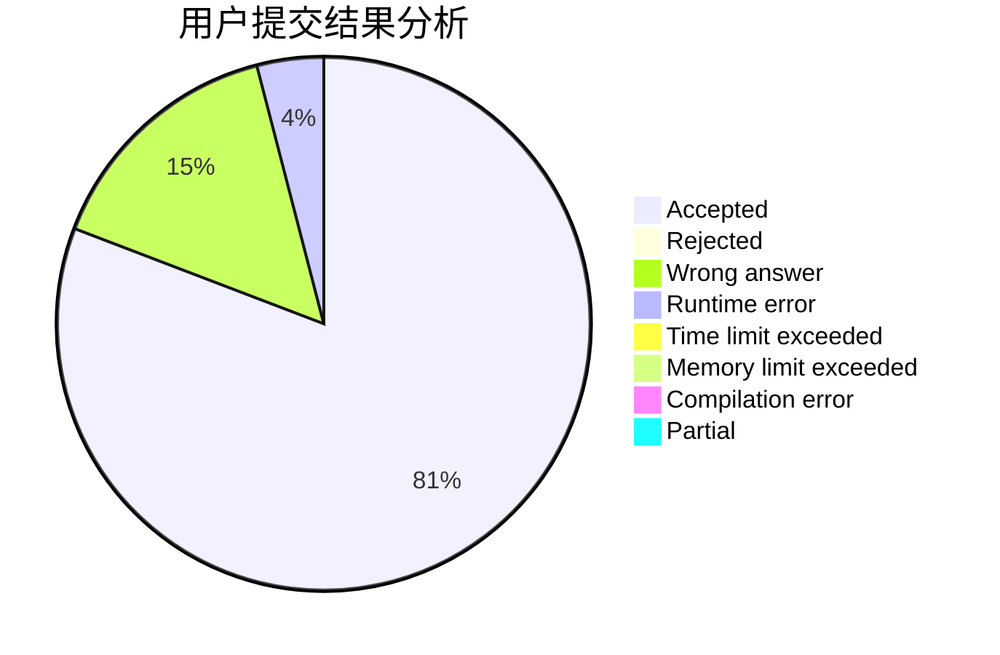
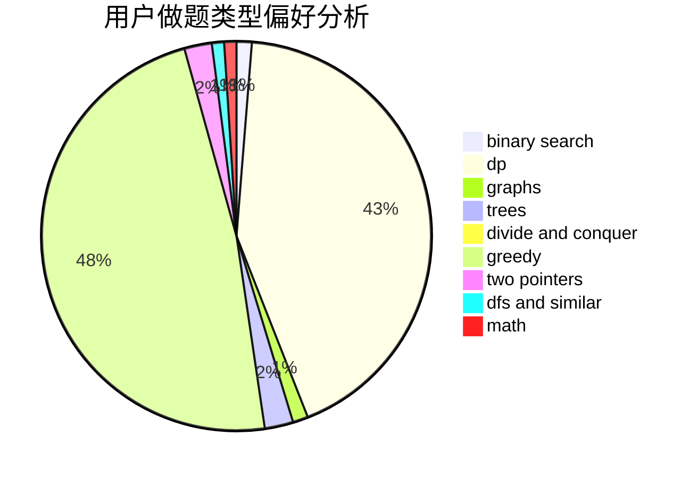

# EternalEpic

<!-- tabs:start -->

#### **用户提交结果分析**

#### **用户做题类型偏好分析**

<!-- tabs:end -->
# 推荐题目
[286A](https://codeforces.com/contest/286/problem/A)
[814C](https://codeforces.com/contest/814/problem/C)
[591A](https://codeforces.com/contest/591/problem/A)
[631D](https://codeforces.com/contest/631/problem/D)
[551C](https://codeforces.com/contest/551/problem/C)
[852E](https://codeforces.com/contest/852/problem/E)
[1133A](https://codeforces.com/contest/1133/problem/A)
[1065G](https://codeforces.com/contest/1065/problem/G)
[461B](https://codeforces.com/contest/461/problem/B)
[386C](https://codeforces.com/contest/386/problem/C)
