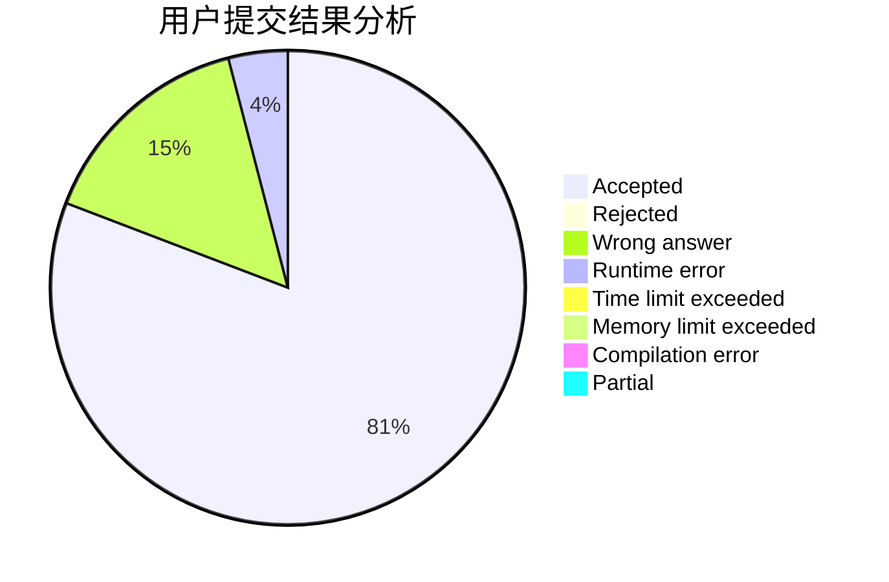
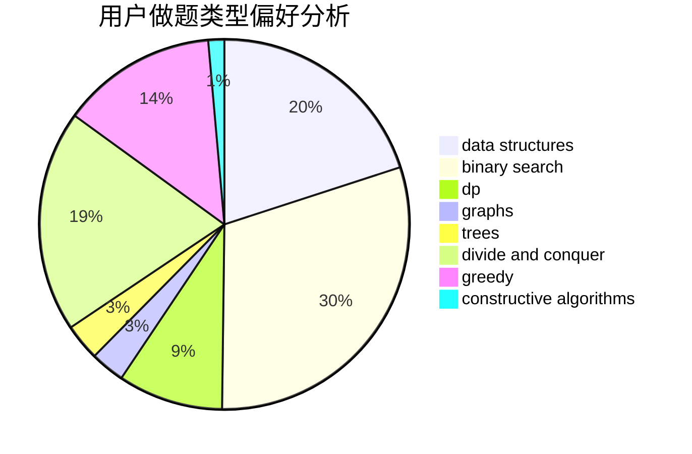
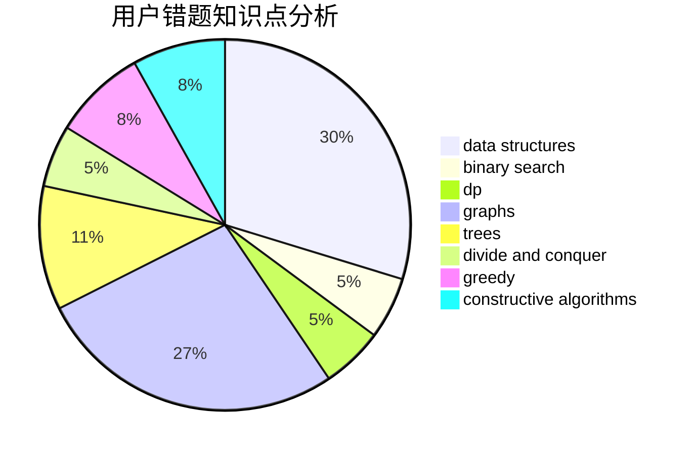

# EternalEpic

<!-- tabs:start -->

#### **用户提交结果分析**

#### **用户做题类型偏好分析**

#### **用户错题知识点分析**

<!-- tabs:end -->
# 推荐题目
[269E](https://codeforces.com/contest/269/problem/E)		nan		  
[7B](https://codeforces.com/contest/7/problem/B)		implementation		  
[570D](https://codeforces.com/contest/570/problem/D)		binary search,
                        bitmasks,
                        constructive algorithms,
                        dfs and similar,
                        graphs,
                        trees		  
[612B](https://codeforces.com/contest/612/problem/B)		implementation,
                        math		  
[527C](https://codeforces.com/contest/527/problem/C)		binary search,
                        data structures,
                        implementation		  
[834D](https://codeforces.com/contest/834/problem/D)		dsu,graphs,sortings,trees		  
[1131D](https://codeforces.com/contest/1131/problem/D)		dfs and similar,
                        dp,
                        dsu,
                        graphs,
                        greedy		  
[1065C](https://codeforces.com/contest/1065/problem/C)		greedy		  
[43A](https://codeforces.com/contest/43/problem/A)		strings		  
[359C](https://codeforces.com/contest/359/problem/C)		math,
                        number theory		  
