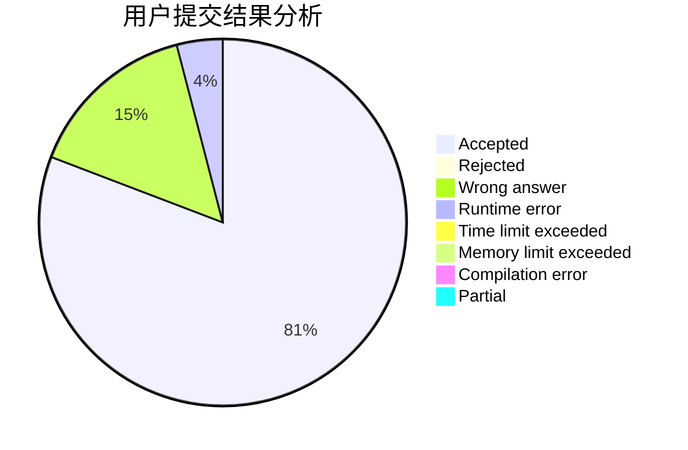
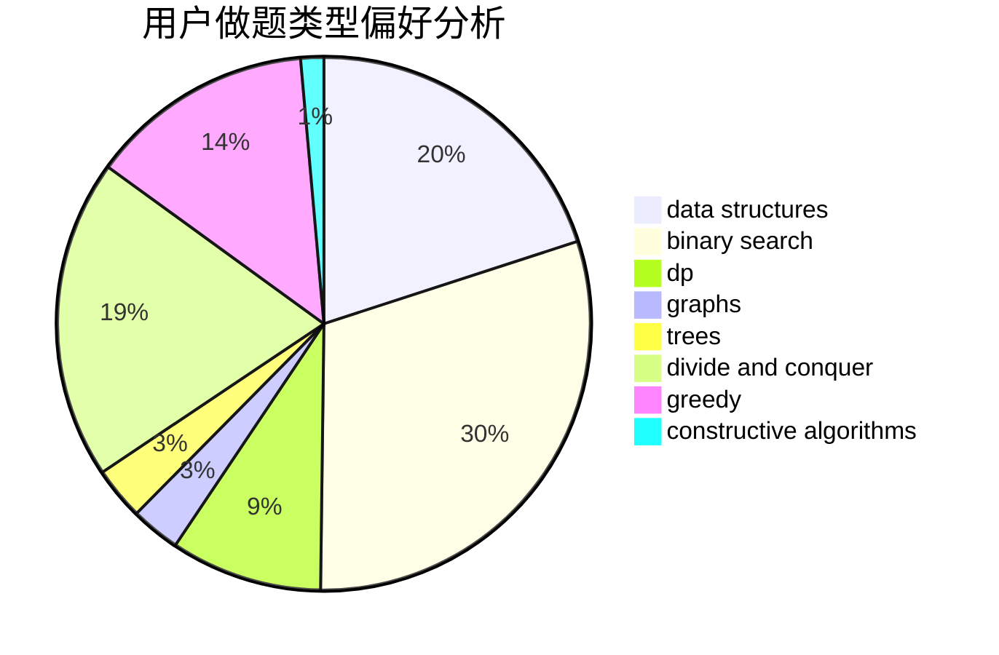
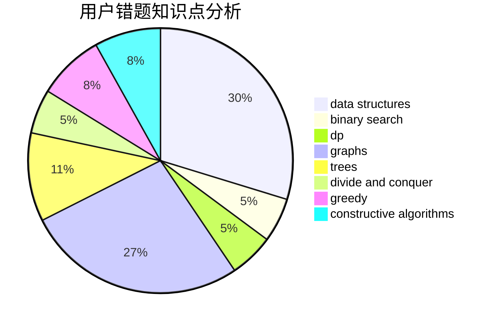

# EternalEpic
<!-- tabs:start -->
#### **用户提交结果分析**

#### **用户做题类型偏好分析**

#### **用户错题知识点分析**

<!-- tabs:end -->
# 推荐题目
[Tree Requests](http://codeforces.com/problemset/problem/570/D)		binary search,
                        bitmasks,
                        constructive algorithms,
                        dfs and similar,
                        graphs,
                        trees		  
[String Theory](http://codeforces.com/problemset/problem/269/E)		nan		  
[Make It Equal](http://codeforces.com/problemset/problem/1065/C)		greedy		  
[Gourmet choice](http://codeforces.com/problemset/problem/1131/D)		dfs and similar,
                        dp,
                        dsu,
                        graphs,
                        greedy		  
[The Meaningless Game](https://codeforces.com/contest/834/problem/C)		math,
                        number theory		  
[Prime Number](http://codeforces.com/problemset/problem/359/C)		math,
                        number theory		  
[Sereja and Intervals](http://codeforces.com/problemset/problem/367/E)		combinatorics,
                        dp		  
[HDD is Outdated Technology](http://codeforces.com/problemset/problem/612/B)		implementation,
                        math		  
[New Year and North Pole](http://codeforces.com/problemset/problem/750/B)		geometry,
                        implementation		  
[Football](http://codeforces.com/problemset/problem/43/A)		strings		  
<!-- tabs:start -->
#### **data structures**
[Tree Requests](http://codeforces.com/problemset/problem/1167/E)		binary search,
                        combinatorics,
                        data structures,
                        two pointers		  
[String Theory](https://codeforces.com/contest/1143/problem/E)		data structures,
                        dfs and similar,
                        dp,
                        math,
                        trees		  
[Make It Equal](http://codeforces.com/problemset/problem/1017/G)		data structures		  
[Gourmet choice](http://codeforces.com/problemset/problem/527/C)		binary search,
                        data structures,
                        implementation		  
[The Meaningless Game](https://codeforces.com/contest/834/problem/D)		binary search,
                        data structures,
                        divide and conquer,
                        dp,
                        two pointers		  
[Prime Number](http://codeforces.com/problemset/problem/1371/F)		data structures,
                        divide and conquer,
                        implementation		  
[Sereja and Intervals](http://codeforces.com/problemset/problem/1386/B)		*special problem,
                        data structures,
                        geometry,
                        math,
                        sortings		  
[HDD is Outdated Technology](https://codeforces.com/contest/1459/problem/F)		data structures,
                        graphs,
                        greedy		  
[New Year and North Pole](https://codeforces.com/contest/1287/problem/D)		constructive algorithms,
                        data structures,
                        dfs and similar,
                        graphs,
                        greedy,
                        trees		  
[Football](http://codeforces.com/problemset/problem/1089/K)		data structures		  
#### **binary search**
[Tree Requests](http://codeforces.com/problemset/problem/570/D)		binary search,
                        bitmasks,
                        constructive algorithms,
                        dfs and similar,
                        graphs,
                        trees		  
[String Theory](http://codeforces.com/problemset/problem/1167/E)		binary search,
                        combinatorics,
                        data structures,
                        two pointers		  
[Make It Equal](http://codeforces.com/problemset/problem/527/C)		binary search,
                        data structures,
                        implementation		  
[Gourmet choice](https://codeforces.com/contest/834/problem/D)		binary search,
                        data structures,
                        divide and conquer,
                        dp,
                        two pointers		  
[The Meaningless Game](http://codeforces.com/problemset/problem/1492/C)		binary search,
                        data structures,
                        dp,
                        greedy,
                        two pointers		  
[Prime Number](http://codeforces.com/problemset/problem/1463/D)		binary search,
                        constructive algorithms,
                        greedy,
                        two pointers		  
[Sereja and Intervals](http://codeforces.com/problemset/problem/1490/G)		binary search,
                        data structures,
                        math		  
[HDD is Outdated Technology](http://codeforces.com/problemset/problem/1479/D)		binary search,
                        bitmasks,
                        brute force,
                        data structures,
                        probabilities,
                        trees		  
[New Year and North Pole](http://codeforces.com/problemset/problem/1436/E)		binary search,
                        data structures,
                        two pointers		  
[Football](http://codeforces.com/problemset/problem/1461/D)		binary search,
                        brute force,
                        data structures,
                        divide and conquer,
                        implementation,
                        sortings		  
#### **dp**
[Tree Requests](http://codeforces.com/problemset/problem/1131/D)		dfs and similar,
                        dp,
                        dsu,
                        graphs,
                        greedy		  
[String Theory](http://codeforces.com/problemset/problem/367/E)		combinatorics,
                        dp		  
[Make It Equal](https://codeforces.com/contest/1143/problem/E)		data structures,
                        dfs and similar,
                        dp,
                        math,
                        trees		  
[Gourmet choice](http://codeforces.com/problemset/problem/1206/B)		dp,
                        implementation		  
[The Meaningless Game](http://codeforces.com/problemset/problem/1133/E)		dp,
                        sortings,
                        two pointers		  
[Prime Number](https://codeforces.com/contest/834/problem/D)		binary search,
                        data structures,
                        divide and conquer,
                        dp,
                        two pointers		  
[Sereja and Intervals](http://codeforces.com/problemset/problem/1461/F)		constructive algorithms,
                        dp,
                        greedy		  
[HDD is Outdated Technology](http://codeforces.com/problemset/problem/1492/C)		binary search,
                        data structures,
                        dp,
                        greedy,
                        two pointers		  
[New Year and North Pole](https://codeforces.com/contest/1457/problem/C)		brute force,
                        dp,
                        implementation		  
[Football](http://codeforces.com/problemset/problem/1491/C)		brute force,
                        data structures,
                        dp,
                        greedy,
                        implementation		  
#### **graph**
[Tree Requests](http://codeforces.com/problemset/problem/570/D)		binary search,
                        bitmasks,
                        constructive algorithms,
                        dfs and similar,
                        graphs,
                        trees		  
[String Theory](http://codeforces.com/problemset/problem/1131/D)		dfs and similar,
                        dp,
                        dsu,
                        graphs,
                        greedy		  
[Make It Equal](https://codeforces.com/contest/1459/problem/F)		data structures,
                        graphs,
                        greedy		  
[Gourmet choice](https://codeforces.com/contest/1287/problem/D)		constructive algorithms,
                        data structures,
                        dfs and similar,
                        graphs,
                        greedy,
                        trees		  
[The Meaningless Game](http://codeforces.com/problemset/problem/1487/C)		brute force,
                        constructive algorithms,
                        dfs and similar,
                        graphs,
                        greedy,
                        implementation,
                        math		  
[Prime Number](http://codeforces.com/problemset/problem/1437/C)		dp,
                        flows,
                        graph matchings,
                        greedy,
                        math,
                        sortings		  
[Sereja and Intervals](http://codeforces.com/problemset/problem/1470/D)		constructive algorithms,
                        dfs and similar,
                        graph matchings,
                        graphs,
                        greedy		  
[HDD is Outdated Technology](http://codeforces.com/problemset/problem/1476/C)		dp,
                        graphs,
                        greedy		  
[New Year and North Pole](http://codeforces.com/problemset/problem/1304/D)		constructive algorithms,
                        graphs,
                        greedy,
                        two pointers		  
[Football](http://codeforces.com/problemset/problem/1475/C)		combinatorics,
                        graphs,
                        math		  
#### **trees**
[Tree Requests](http://codeforces.com/problemset/problem/570/D)		binary search,
                        bitmasks,
                        constructive algorithms,
                        dfs and similar,
                        graphs,
                        trees		  
[String Theory](https://codeforces.com/contest/1143/problem/E)		data structures,
                        dfs and similar,
                        dp,
                        math,
                        trees		  
[Make It Equal](https://codeforces.com/contest/1287/problem/D)		constructive algorithms,
                        data structures,
                        dfs and similar,
                        graphs,
                        greedy,
                        trees		  
[Gourmet choice](http://codeforces.com/problemset/problem/1479/D)		binary search,
                        bitmasks,
                        brute force,
                        data structures,
                        probabilities,
                        trees		  
[The Meaningless Game](http://codeforces.com/problemset/problem/1511/C)		brute force,
                        data structures,
                        implementation,
                        trees		  
[Prime Number](http://codeforces.com/problemset/problem/1499/F)		combinatorics,
                        dfs and similar,
                        dp,
                        trees		  
[Sereja and Intervals](http://codeforces.com/problemset/problem/1491/E)		brute force,
                        dfs and similar,
                        divide and conquer,
                        number theory,
                        trees		  
[HDD is Outdated Technology](http://codeforces.com/problemset/problem/1466/D)		data structures,
                        greedy,
                        sortings,
                        trees		  
[New Year and North Pole](http://codeforces.com/problemset/problem/1495/D)		combinatorics,
                        dfs and similar,
                        graphs,
                        math,
                        shortest paths,
                        trees		  
[Football](http://codeforces.com/problemset/problem/1303/G)		data structures,
                        divide and conquer,
                        geometry,
                        trees		  
#### **divide and conquer**
[Tree Requests](https://codeforces.com/contest/834/problem/D)		binary search,
                        data structures,
                        divide and conquer,
                        dp,
                        two pointers		  
[String Theory](http://codeforces.com/problemset/problem/1371/F)		data structures,
                        divide and conquer,
                        implementation		  
[Make It Equal](http://codeforces.com/problemset/problem/1461/D)		binary search,
                        brute force,
                        data structures,
                        divide and conquer,
                        implementation,
                        sortings		  
[Gourmet choice](http://codeforces.com/problemset/problem/1466/G)		combinatorics,
                        divide and conquer,
                        hashing,
                        math,
                        string suffix structures,
                        strings		  
[The Meaningless Game](http://codeforces.com/problemset/problem/1490/D)		dfs and similar,
                        divide and conquer,
                        implementation		  
[Prime Number](https://codeforces.com/contest/1483/problem/C)		data structures,
                        divide and conquer,
                        dp		  
[Sereja and Intervals](http://codeforces.com/problemset/problem/1491/E)		brute force,
                        dfs and similar,
                        divide and conquer,
                        number theory,
                        trees		  
[HDD is Outdated Technology](http://codeforces.com/problemset/problem/1303/G)		data structures,
                        divide and conquer,
                        geometry,
                        trees		  
[New Year and North Pole](http://codeforces.com/problemset/problem/1494/D)		constructive algorithms,
                        data structures,
                        dfs and similar,
                        divide and conquer,
                        dsu,
                        greedy,
                        sortings,
                        trees		  
[Football](http://codeforces.com/problemset/problem/1482/E)		data structures,
                        divide and conquer,
                        dp		  
#### **greedy**
[Tree Requests](http://codeforces.com/problemset/problem/1065/C)		greedy		  
[String Theory](http://codeforces.com/problemset/problem/1131/D)		dfs and similar,
                        dp,
                        dsu,
                        graphs,
                        greedy		  
[Make It Equal](http://codeforces.com/problemset/problem/462/B)		greedy		  
[Gourmet choice](http://codeforces.com/problemset/problem/1231/C)		greedy		  
[The Meaningless Game](https://codeforces.com/contest/1459/problem/F)		data structures,
                        graphs,
                        greedy		  
[Prime Number](http://codeforces.com/problemset/problem/1461/F)		constructive algorithms,
                        dp,
                        greedy		  
[Sereja and Intervals](https://codeforces.com/contest/1287/problem/D)		constructive algorithms,
                        data structures,
                        dfs and similar,
                        graphs,
                        greedy,
                        trees		  
[HDD is Outdated Technology](http://codeforces.com/problemset/problem/1492/C)		binary search,
                        data structures,
                        dp,
                        greedy,
                        two pointers		  
[New Year and North Pole](https://codeforces.com/contest/1496/problem/C)		geometry,
                        greedy,
                        math,
                        sortings		  
[Football](http://codeforces.com/problemset/problem/1493/A)		constructive algorithms,
                        greedy		  
#### **constructive algorithms**
[Tree Requests](http://codeforces.com/problemset/problem/570/D)		binary search,
                        bitmasks,
                        constructive algorithms,
                        dfs and similar,
                        graphs,
                        trees		  
[String Theory](http://codeforces.com/problemset/problem/1461/F)		constructive algorithms,
                        dp,
                        greedy		  
[Make It Equal](https://codeforces.com/contest/1287/problem/D)		constructive algorithms,
                        data structures,
                        dfs and similar,
                        graphs,
                        greedy,
                        trees		  
[Gourmet choice](http://codeforces.com/problemset/problem/1493/A)		constructive algorithms,
                        greedy		  
[The Meaningless Game](http://codeforces.com/problemset/problem/1463/D)		binary search,
                        constructive algorithms,
                        greedy,
                        two pointers		  
[Prime Number](https://codeforces.com/contest/1456/problem/B)		bitmasks,
                        brute force,
                        constructive algorithms		  
[Sereja and Intervals](http://codeforces.com/problemset/problem/1492/D)		bitmasks,
                        constructive algorithms,
                        greedy,
                        math		  
[HDD is Outdated Technology](https://codeforces.com/contest/1504/problem/D)		constructive algorithms,
                        games,
                        interactive		  
[New Year and North Pole](https://codeforces.com/contest/1483/problem/A)		brute force,
                        constructive algorithms,
                        greedy,
                        implementation		  
[Football](https://codeforces.com/contest/1457/problem/D)		bitmasks,
                        brute force,
                        constructive algorithms		  
#### **sortings**
[Tree Requests](http://codeforces.com/problemset/problem/1133/E)		dp,
                        sortings,
                        two pointers		  
[String Theory](http://codeforces.com/problemset/problem/1386/B)		*special problem,
                        data structures,
                        geometry,
                        math,
                        sortings		  
[Make It Equal](https://codeforces.com/contest/1496/problem/C)		geometry,
                        greedy,
                        math,
                        sortings		  
[Gourmet choice](http://codeforces.com/problemset/problem/1495/A)		geometry,
                        greedy,
                        math,
                        sortings		  
[The Meaningless Game](http://codeforces.com/problemset/problem/1497/A)		brute force,
                        data structures,
                        greedy,
                        sortings		  
[Prime Number](http://codeforces.com/problemset/problem/1427/A)		math,
                        sortings		  
[Sereja and Intervals](http://codeforces.com/problemset/problem/1461/D)		binary search,
                        brute force,
                        data structures,
                        divide and conquer,
                        implementation,
                        sortings		  
[HDD is Outdated Technology](http://codeforces.com/problemset/problem/1437/C)		dp,
                        flows,
                        graph matchings,
                        greedy,
                        math,
                        sortings		  
[New Year and North Pole](http://codeforces.com/problemset/problem/1473/A)		greedy,
                        implementation,
                        math,
                        sortings		  
[Football](http://codeforces.com/problemset/problem/1486/B)		binary search,
                        geometry,
                        shortest paths,
                        sortings		  
<!-- tabs:end -->
