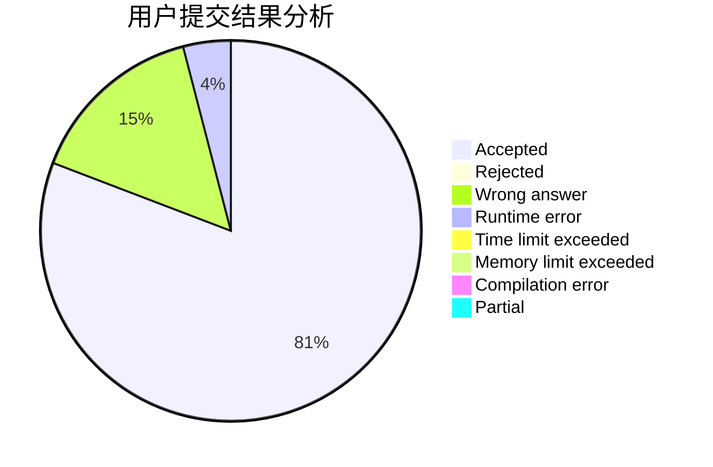
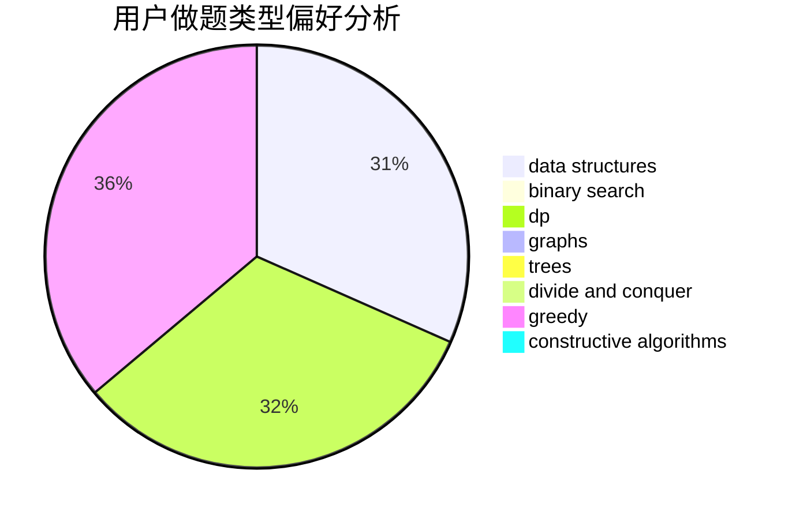
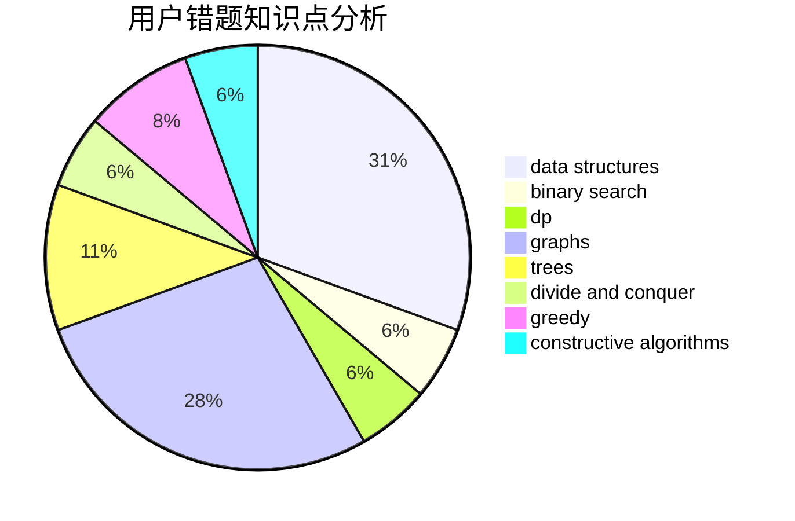

# EternalEpic

<!-- tabs:start -->

#### **用户提交结果分析**

#### **用户做题类型偏好分析**

#### **用户错题知识点分析**

<!-- tabs:end -->
# 推荐题目
[286A](https://codeforces.com/contest/286/problem/A)		constructive algorithms,
                        math		  
[814C](https://codeforces.com/contest/814/problem/C)		brute force,
                        dp,
                        strings,
                        two pointers		  
[591A](https://codeforces.com/contest/591/problem/A)		implementation,
                        math		  
[631D](https://codeforces.com/contest/631/problem/D)		data structures,
                        hashing,
                        implementation,
                        string suffix structures,
                        strings		  
[551C](https://codeforces.com/contest/551/problem/C)		binary search,
                        greedy		  
[852E](https://codeforces.com/contest/852/problem/E)		dp		  
[1133A](https://codeforces.com/contest/1133/problem/A)		implementation		  
[1065G](https://codeforces.com/contest/1065/problem/G)		strings		  
[461B](https://codeforces.com/contest/461/problem/B)		dfs and similar,
                        dp,
                        trees		  
[386C](https://codeforces.com/contest/386/problem/C)		dp,
                        strings,
                        two pointers		  
