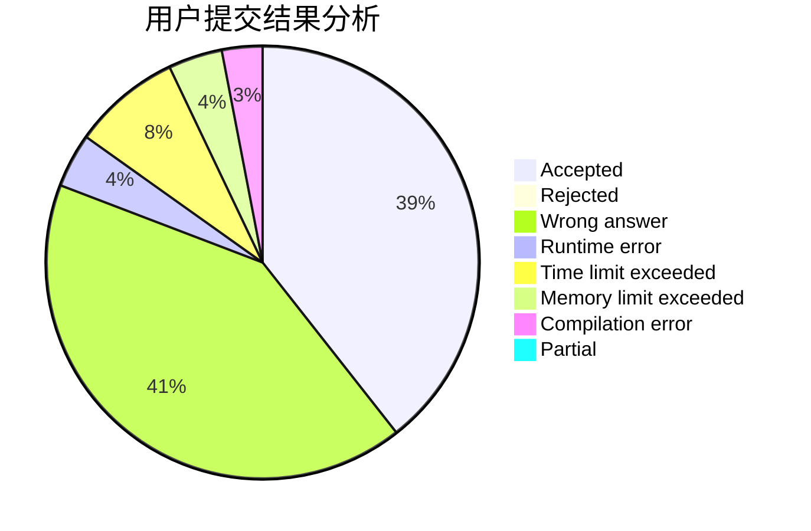
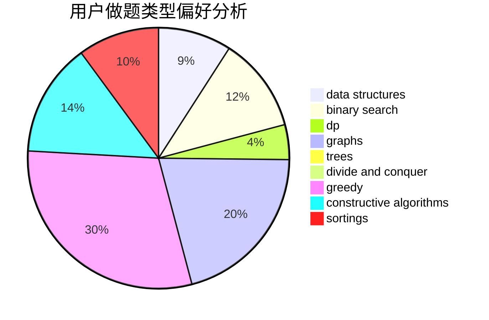
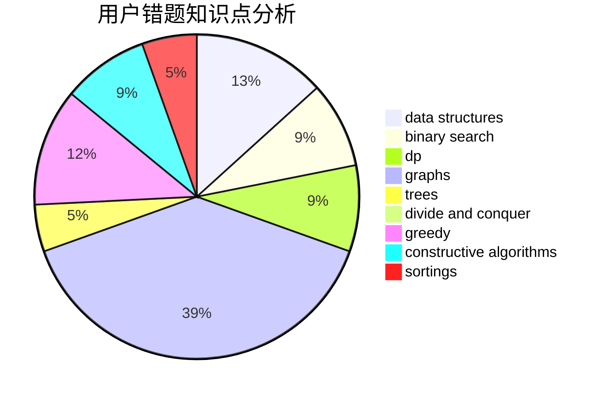

# 201831990439
<!-- tabs:start -->
#### **用户提交结果分析**

#### **用户做题类型偏好分析**

#### **用户错题知识点分析**

<!-- tabs:end -->
# 推荐题目
[1252D](http://codeforces.com/problemset/problem/1252/D)		data structures,
                        dp,
                        strings,
                        trees		  
[1254D](http://codeforces.com/problemset/problem/1254/D)		data structures,
                        probabilities,
                        trees		  
[1102A](http://codeforces.com/problemset/problem/1102/A)		math		  
[1252A](http://codeforces.com/problemset/problem/1252/A)		nan		  
[1253A](http://codeforces.com/problemset/problem/1253/A)		implementation		  
[1251E1](http://codeforces.com/problemset/problem/1251/E1)		data structures,
                        dp,
                        greedy		  
[1251B](http://codeforces.com/problemset/problem/1251/B)		greedy,
                        strings		  
[1253D](http://codeforces.com/problemset/problem/1253/D)		constructive algorithms,
                        dfs and similar,
                        dsu,
                        graphs,
                        greedy,
                        sortings		  
[1252G](http://codeforces.com/problemset/problem/1252/G)		data structures		  
[1252L](http://codeforces.com/problemset/problem/1252/L)		flows,
                        graphs		  
<!-- tabs:start -->
#### **data structures**
[1252D](http://codeforces.com/problemset/problem/1252/D)		data structures,
                        dp,
                        strings,
                        trees		  
[1254D](http://codeforces.com/problemset/problem/1254/D)		data structures,
                        probabilities,
                        trees		  
[1251E1](http://codeforces.com/problemset/problem/1251/E1)		data structures,
                        dp,
                        greedy		  
[1252G](http://codeforces.com/problemset/problem/1252/G)		data structures		  
[1251E2](http://codeforces.com/problemset/problem/1251/E2)		binary search,
                        data structures,
                        greedy		  
[1253E](http://codeforces.com/problemset/problem/1253/E)		data structures,
                        dp,
                        greedy,
                        sortings		  
[1252K](http://codeforces.com/problemset/problem/1252/K)		data structures,
                        math,
                        matrices		  
[1252C](http://codeforces.com/problemset/problem/1252/C)		data structures,
                        implementation		  
[1237B](http://codeforces.com/problemset/problem/1237/B)		data structures,
                        sortings,
                        two pointers		  
[1492C](http://codeforces.com/problemset/problem/1492/C)		binary search,
                        data structures,
                        dp,
                        greedy,
                        two pointers		  
#### **binary search**
[1251E2](http://codeforces.com/problemset/problem/1251/E2)		binary search,
                        data structures,
                        greedy		  
[1251D](http://codeforces.com/problemset/problem/1251/D)		binary search,
                        greedy,
                        sortings		  
[1253F](http://codeforces.com/problemset/problem/1253/F)		binary search,
                        dsu,
                        graphs,
                        shortest paths,
                        trees		  
[1492C](http://codeforces.com/problemset/problem/1492/C)		binary search,
                        data structures,
                        dp,
                        greedy,
                        two pointers		  
[1463D](http://codeforces.com/problemset/problem/1463/D)		binary search,
                        constructive algorithms,
                        greedy,
                        two pointers		  
[1490G](http://codeforces.com/problemset/problem/1490/G)		binary search,
                        data structures,
                        math		  
[1479D](http://codeforces.com/problemset/problem/1479/D)		binary search,
                        bitmasks,
                        brute force,
                        data structures,
                        probabilities,
                        trees		  
[1436E](http://codeforces.com/problemset/problem/1436/E)		binary search,
                        data structures,
                        two pointers		  
[1461D](http://codeforces.com/problemset/problem/1461/D)		binary search,
                        brute force,
                        data structures,
                        divide and conquer,
                        implementation,
                        sortings		  
[1493C](http://codeforces.com/problemset/problem/1493/C)		binary search,
                        brute force,
                        constructive algorithms,
                        greedy,
                        strings		  
#### **dp**
[1252D](http://codeforces.com/problemset/problem/1252/D)		data structures,
                        dp,
                        strings,
                        trees		  
[1251E1](http://codeforces.com/problemset/problem/1251/E1)		data structures,
                        dp,
                        greedy		  
[1253E](http://codeforces.com/problemset/problem/1253/E)		data structures,
                        dp,
                        greedy,
                        sortings		  
[1253C](http://codeforces.com/problemset/problem/1253/C)		dp,
                        greedy,
                        math,
                        sortings		  
[1252J](http://codeforces.com/problemset/problem/1252/J)		brute force,
                        dp		  
[1492C](http://codeforces.com/problemset/problem/1492/C)		binary search,
                        data structures,
                        dp,
                        greedy,
                        two pointers		  
[1457C](https://codeforces.com/contest/1457/problem/C)		brute force,
                        dp,
                        implementation		  
[1491C](http://codeforces.com/problemset/problem/1491/C)		brute force,
                        data structures,
                        dp,
                        greedy,
                        implementation		  
[1437C](http://codeforces.com/problemset/problem/1437/C)		dp,
                        flows,
                        graph matchings,
                        greedy,
                        math,
                        sortings		  
[1499B](http://codeforces.com/problemset/problem/1499/B)		brute force,
                        dp,
                        greedy,
                        implementation		  
#### **graph**
[1253D](http://codeforces.com/problemset/problem/1253/D)		constructive algorithms,
                        dfs and similar,
                        dsu,
                        graphs,
                        greedy,
                        sortings		  
[1252L](http://codeforces.com/problemset/problem/1252/L)		flows,
                        graphs		  
[1255B](http://codeforces.com/problemset/problem/1255/B)		graphs,
                        implementation		  
[1186F](http://codeforces.com/problemset/problem/1186/F)		dfs and similar,
                        graphs,
                        greedy,
                        implementation		  
[1250E](http://codeforces.com/problemset/problem/1250/E)		graphs,
                        implementation		  
[1253F](http://codeforces.com/problemset/problem/1253/F)		binary search,
                        dsu,
                        graphs,
                        shortest paths,
                        trees		  
[1487C](http://codeforces.com/problemset/problem/1487/C)		brute force,
                        constructive algorithms,
                        dfs and similar,
                        graphs,
                        greedy,
                        implementation,
                        math		  
[1437C](http://codeforces.com/problemset/problem/1437/C)		dp,
                        flows,
                        graph matchings,
                        greedy,
                        math,
                        sortings		  
[1470D](http://codeforces.com/problemset/problem/1470/D)		constructive algorithms,
                        dfs and similar,
                        graph matchings,
                        graphs,
                        greedy		  
[1476C](http://codeforces.com/problemset/problem/1476/C)		dp,
                        graphs,
                        greedy		  
#### **trees**
[1252D](http://codeforces.com/problemset/problem/1252/D)		data structures,
                        dp,
                        strings,
                        trees		  
[1254D](http://codeforces.com/problemset/problem/1254/D)		data structures,
                        probabilities,
                        trees		  
[1254E](http://codeforces.com/problemset/problem/1254/E)		combinatorics,
                        dfs and similar,
                        dsu,
                        trees		  
[1252F](http://codeforces.com/problemset/problem/1252/F)		hashing,
                        trees		  
[1253F](http://codeforces.com/problemset/problem/1253/F)		binary search,
                        dsu,
                        graphs,
                        shortest paths,
                        trees		  
[1479D](http://codeforces.com/problemset/problem/1479/D)		binary search,
                        bitmasks,
                        brute force,
                        data structures,
                        probabilities,
                        trees		  
[1511C](http://codeforces.com/problemset/problem/1511/C)		brute force,
                        data structures,
                        implementation,
                        trees		  
[1499F](http://codeforces.com/problemset/problem/1499/F)		combinatorics,
                        dfs and similar,
                        dp,
                        trees		  
[1491E](http://codeforces.com/problemset/problem/1491/E)		brute force,
                        dfs and similar,
                        divide and conquer,
                        number theory,
                        trees		  
[1466D](http://codeforces.com/problemset/problem/1466/D)		data structures,
                        greedy,
                        sortings,
                        trees		  
#### **divide and conquer**
[1461D](http://codeforces.com/problemset/problem/1461/D)		binary search,
                        brute force,
                        data structures,
                        divide and conquer,
                        implementation,
                        sortings		  
[1466G](http://codeforces.com/problemset/problem/1466/G)		combinatorics,
                        divide and conquer,
                        hashing,
                        math,
                        string suffix structures,
                        strings		  
[1490D](http://codeforces.com/problemset/problem/1490/D)		dfs and similar,
                        divide and conquer,
                        implementation		  
[1483C](https://codeforces.com/contest/1483/problem/C)		data structures,
                        divide and conquer,
                        dp		  
[1491E](http://codeforces.com/problemset/problem/1491/E)		brute force,
                        dfs and similar,
                        divide and conquer,
                        number theory,
                        trees		  
[1303G](http://codeforces.com/problemset/problem/1303/G)		data structures,
                        divide and conquer,
                        geometry,
                        trees		  
[1494D](http://codeforces.com/problemset/problem/1494/D)		constructive algorithms,
                        data structures,
                        dfs and similar,
                        divide and conquer,
                        dsu,
                        greedy,
                        sortings,
                        trees		  
[1482E](http://codeforces.com/problemset/problem/1482/E)		data structures,
                        divide and conquer,
                        dp		  
[566C](http://codeforces.com/problemset/problem/566/C)		dfs and similar,
                        divide and conquer,
                        trees		  
[1428F](http://codeforces.com/problemset/problem/1428/F)		binary search,
                        data structures,
                        divide and conquer,
                        dp,
                        two pointers		  
#### **greedy**
[1251E1](http://codeforces.com/problemset/problem/1251/E1)		data structures,
                        dp,
                        greedy		  
[1251B](http://codeforces.com/problemset/problem/1251/B)		greedy,
                        strings		  
[1253D](http://codeforces.com/problemset/problem/1253/D)		constructive algorithms,
                        dfs and similar,
                        dsu,
                        graphs,
                        greedy,
                        sortings		  
[1254B1](http://codeforces.com/problemset/problem/1254/B1)		constructive algorithms,
                        greedy,
                        math,
                        number theory,
                        ternary search,
                        two pointers		  
[1251E2](http://codeforces.com/problemset/problem/1251/E2)		binary search,
                        data structures,
                        greedy		  
[1253E](http://codeforces.com/problemset/problem/1253/E)		data structures,
                        dp,
                        greedy,
                        sortings		  
[1253C](http://codeforces.com/problemset/problem/1253/C)		dp,
                        greedy,
                        math,
                        sortings		  
[1251C](http://codeforces.com/problemset/problem/1251/C)		greedy,
                        two pointers		  
[1254A](http://codeforces.com/problemset/problem/1254/A)		constructive algorithms,
                        greedy,
                        implementation		  
[1167A](http://codeforces.com/problemset/problem/1167/A)		brute force,
                        greedy,
                        strings		  
#### **constructive algorithms**
[1253D](http://codeforces.com/problemset/problem/1253/D)		constructive algorithms,
                        dfs and similar,
                        dsu,
                        graphs,
                        greedy,
                        sortings		  
[1254B1](http://codeforces.com/problemset/problem/1254/B1)		constructive algorithms,
                        greedy,
                        math,
                        number theory,
                        ternary search,
                        two pointers		  
[1255C](http://codeforces.com/problemset/problem/1255/C)		constructive algorithms,
                        implementation		  
[1254A](http://codeforces.com/problemset/problem/1254/A)		constructive algorithms,
                        greedy,
                        implementation		  
[1254C](http://codeforces.com/problemset/problem/1254/C)		constructive algorithms,
                        geometry,
                        interactive,
                        math		  
[1254B2](http://codeforces.com/problemset/problem/1254/B2)		constructive algorithms,
                        greedy,
                        math,
                        number theory,
                        ternary search,
                        two pointers		  
[1255D](https://codeforces.com/contest/1255/problem/D)		constructive algorithms,
                        greedy,
                        implementation		  
[1493A](http://codeforces.com/problemset/problem/1493/A)		constructive algorithms,
                        greedy		  
[1463D](http://codeforces.com/problemset/problem/1463/D)		binary search,
                        constructive algorithms,
                        greedy,
                        two pointers		  
[1456B](https://codeforces.com/contest/1456/problem/B)		bitmasks,
                        brute force,
                        constructive algorithms		  
#### **sortings**
[1253D](http://codeforces.com/problemset/problem/1253/D)		constructive algorithms,
                        dfs and similar,
                        dsu,
                        graphs,
                        greedy,
                        sortings		  
[1253E](http://codeforces.com/problemset/problem/1253/E)		data structures,
                        dp,
                        greedy,
                        sortings		  
[1253C](http://codeforces.com/problemset/problem/1253/C)		dp,
                        greedy,
                        math,
                        sortings		  
[1251D](http://codeforces.com/problemset/problem/1251/D)		binary search,
                        greedy,
                        sortings		  
[1237B](http://codeforces.com/problemset/problem/1237/B)		data structures,
                        sortings,
                        two pointers		  
[1496C](https://codeforces.com/contest/1496/problem/C)		geometry,
                        greedy,
                        math,
                        sortings		  
[1495A](http://codeforces.com/problemset/problem/1495/A)		geometry,
                        greedy,
                        math,
                        sortings		  
[1497A](http://codeforces.com/problemset/problem/1497/A)		brute force,
                        data structures,
                        greedy,
                        sortings		  
[1427A](http://codeforces.com/problemset/problem/1427/A)		math,
                        sortings		  
[1461D](http://codeforces.com/problemset/problem/1461/D)		binary search,
                        brute force,
                        data structures,
                        divide and conquer,
                        implementation,
                        sortings		  
<!-- tabs:end -->
