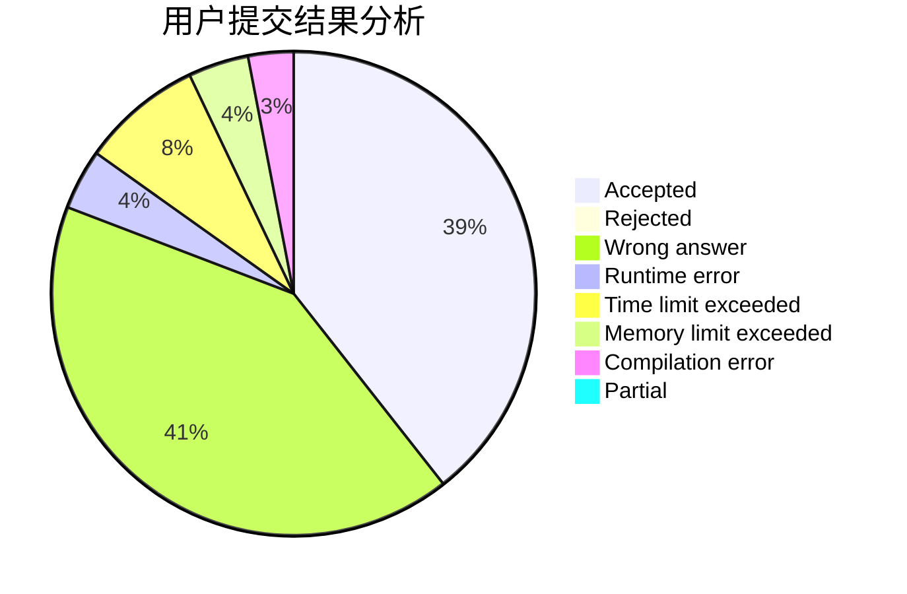
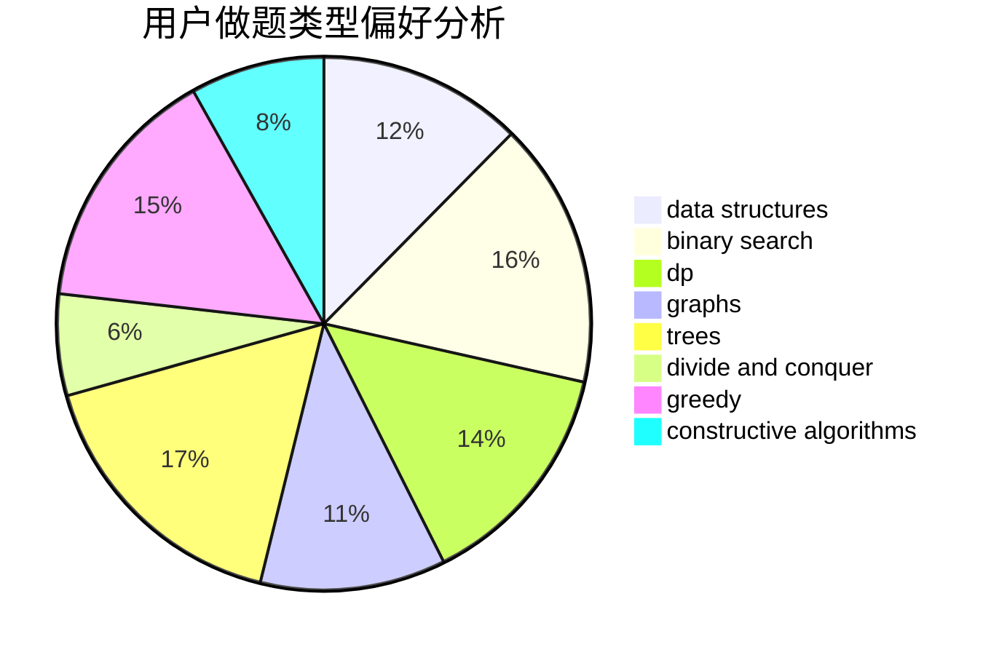
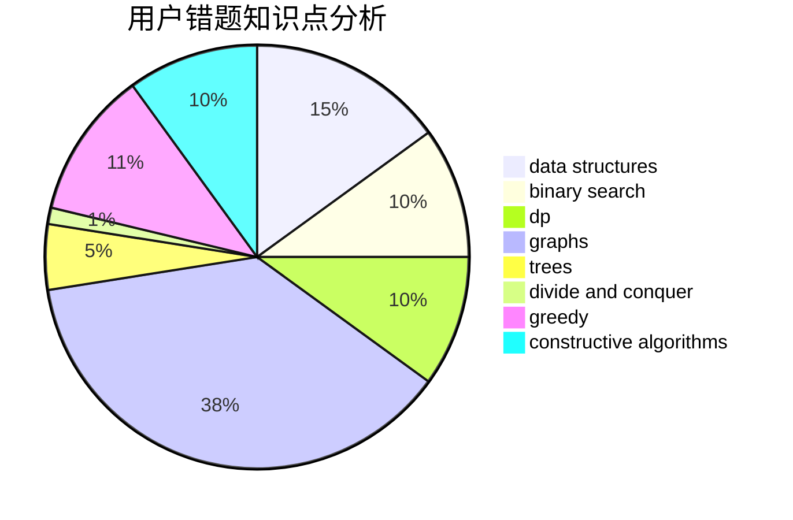

# 201831990439

<!-- tabs:start -->

#### **用户提交结果分析**

#### **用户做题类型偏好分析**

#### **用户错题知识点分析**

<!-- tabs:end -->
# 推荐题目
[1260C](https://codeforces.com/contest/1260/problem/C)		greedy,
                        math,
                        number theory		  
[1257C](https://codeforces.com/contest/1257/problem/C)		greedy,
                        implementation,
                        sortings,
                        strings,
                        two pointers		  
[1257E](https://codeforces.com/contest/1257/problem/E)		data structures,
                        dp,
                        greedy		  
[12621](https://codeforces.com/contest/1262/problem/1)		dsu,graphs,sortings,trees		  
[1260F](https://codeforces.com/contest/1260/problem/F)		data structures,
                        trees		  
[1256C](https://codeforces.com/contest/1256/problem/C)		greedy		  
[1256F](https://codeforces.com/contest/1256/problem/F)		constructive algorithms,
                        sortings,
                        strings		  
[12622](https://codeforces.com/contest/1262/problem/2)		dsu,graphs,sortings,trees		  
[1262B](https://codeforces.com/contest/1262/problem/B)		dsu,graphs,sortings,trees		  
[125A](https://codeforces.com/contest/125/problem/A)		math		  
