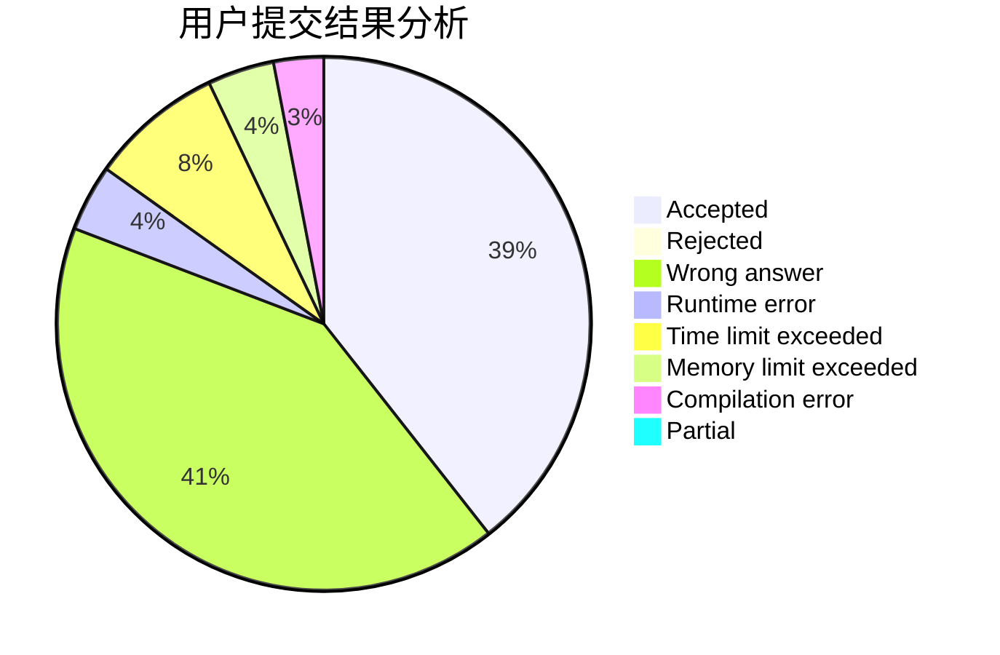
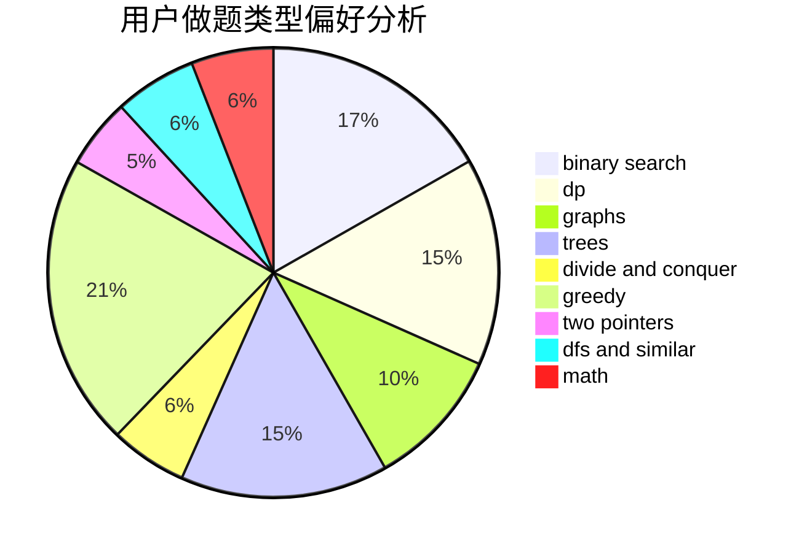

# 201831990439

<!-- tabs:start -->

#### **用户提交结果分析**

#### **用户做题类型偏好分析**

<!-- tabs:end -->
# 推荐题目
[1260C](https://codeforces.com/contest/1260/problem/C)
[1257C](https://codeforces.com/contest/1257/problem/C)
[1257E](https://codeforces.com/contest/1257/problem/E)
[12621](https://codeforces.com/contest/1262/problem/1)
[1260F](https://codeforces.com/contest/1260/problem/F)
[1256C](https://codeforces.com/contest/1256/problem/C)
[1256F](https://codeforces.com/contest/1256/problem/F)
[12622](https://codeforces.com/contest/1262/problem/2)
[1262B](https://codeforces.com/contest/1262/problem/B)
[125A](https://codeforces.com/contest/125/problem/A)
