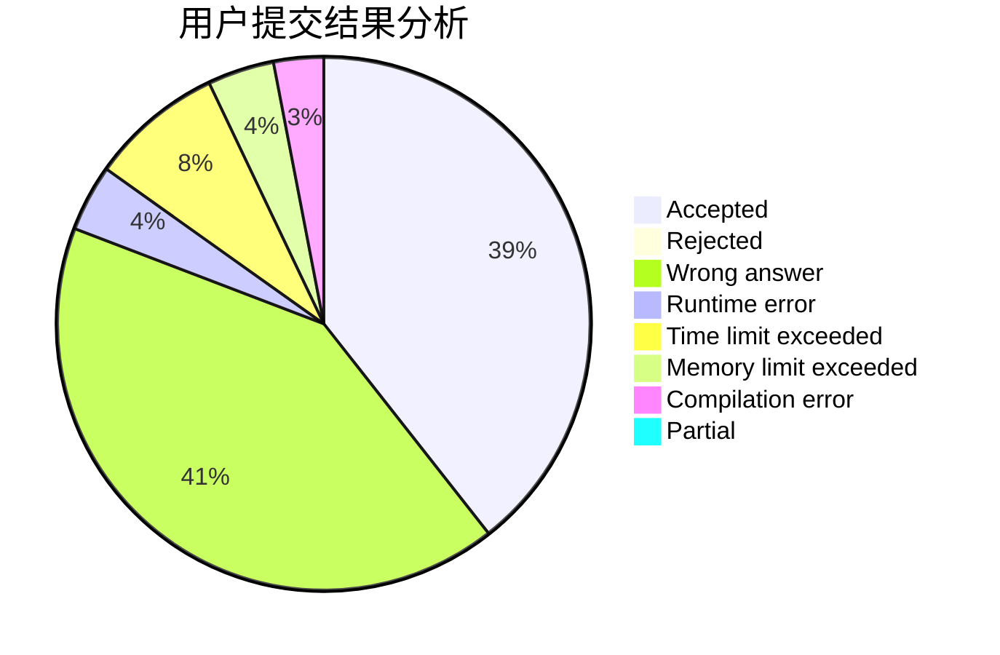
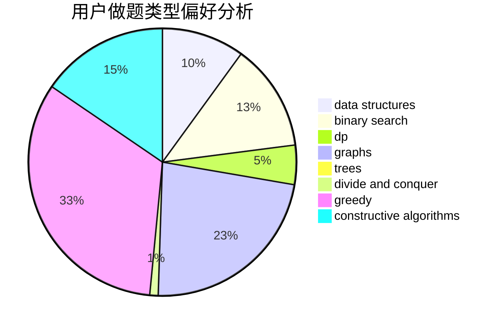
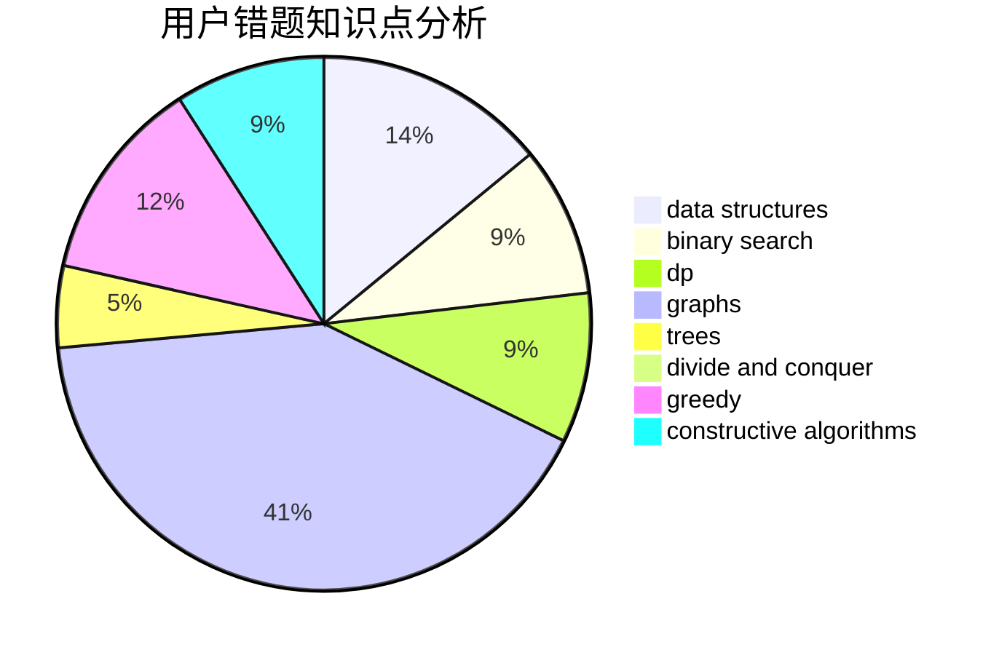

# 201831990439

<!-- tabs:start -->

#### **用户提交结果分析**

#### **用户做题类型偏好分析**

#### **用户错题知识点分析**

<!-- tabs:end -->
# 推荐题目
[1253A](https://codeforces.com/contest/1253/problem/A)		implementation		  
[1252A](https://codeforces.com/contest/1252/problem/A)		nan		  
[1252D](https://codeforces.com/contest/1252/problem/D)		data structures,
                        dp,
                        strings,
                        trees		  
[1254D](https://codeforces.com/contest/1254/problem/D)		data structures,
                        probabilities,
                        trees		  
[1253D](https://codeforces.com/contest/1253/problem/D)		constructive algorithms,
                        dfs and similar,
                        dsu,
                        graphs,
                        greedy,
                        sortings		  
[1251B](https://codeforces.com/contest/1251/problem/B)		greedy,
                        strings		  
[1251E1](https://codeforces.com/contest/1251E/problem/1)		data structures,
                        dp,
                        greedy		  
[1254E](https://codeforces.com/contest/1254/problem/E)		combinatorics,
                        dfs and similar,
                        dsu,
                        trees		  
[1255B](https://codeforces.com/contest/1255/problem/B)		graphs,
                        implementation		  
[1252G](https://codeforces.com/contest/1252/problem/G)		data structures		  
