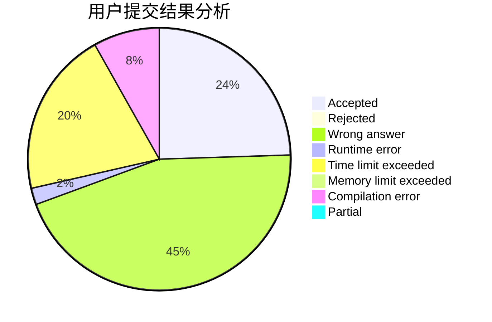
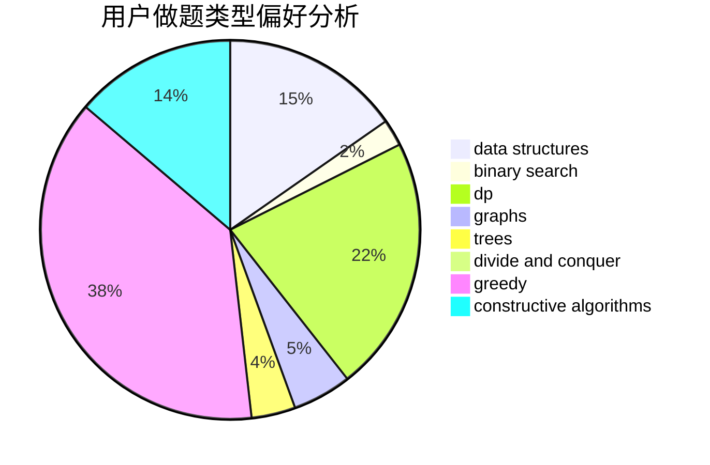
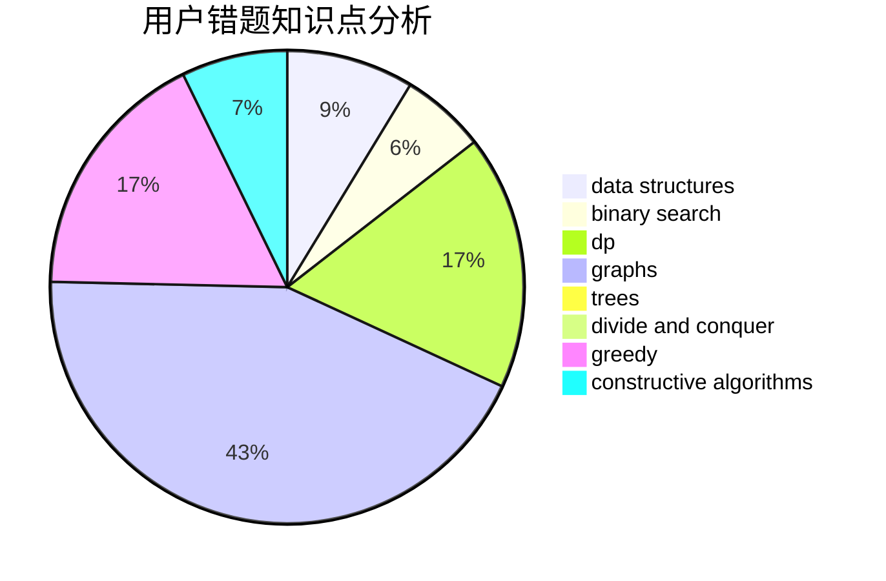

# EthanAGan
<!-- tabs:start -->
#### **用户提交结果分析**

#### **用户做题类型偏好分析**

#### **用户错题知识点分析**

<!-- tabs:end -->
# 推荐题目
[Permutation Transformation](http://codeforces.com/problemset/problem/1490/D)		dfs and similar,
                        divide and conquer,
                        implementation		  
[Balls of Buma](http://codeforces.com/problemset/problem/1267/B)		nan		  
[Neko Rules the Catniverse (Large Version)](http://codeforces.com/problemset/problem/1152/F2)		bitmasks,
                        dp,
                        matrices		  
[Game with Strings](http://codeforces.com/problemset/problem/354/B)		bitmasks,
                        dp,
                        games		  
[The penguin's game](http://codeforces.com/problemset/problem/835/E)		binary search,
                        constructive algorithms,
                        interactive		  
[Max Correct Set](http://codeforces.com/problemset/problem/1463/F)		bitmasks,
                        dp,
                        math		  
[Zuhair and Strings](http://codeforces.com/problemset/problem/1105/B)		brute force,
                        implementation,
                        strings		  
[Privatization of Roads in Berland](http://codeforces.com/problemset/problem/1070/I)		flows,
                        graph matchings,
                        graphs		  
[Palindrome XOR](http://codeforces.com/problemset/problem/1147/D)		dfs and similar,
                        graphs		  
[Birthday](http://codeforces.com/problemset/problem/1068/A)		math		  
<!-- tabs:start -->
#### **data structures**
[Scalar Queries](http://codeforces.com/problemset/problem/1167/F)		combinatorics,
                        data structures,
                        math,
                        sortings		  
[Archaeology](http://codeforces.com/problemset/problem/176/E)		data structures,
                        dfs and similar,
                        trees		  
[Dominant Indices](http://codeforces.com/problemset/problem/1009/F)		data structures,
                        dsu,
                        trees		  
[Special Segments of Permutation](http://codeforces.com/problemset/problem/1156/E)		data structures,
                        divide and conquer,
                        dsu,
                        two pointers		  
[Card Deck](http://codeforces.com/problemset/problem/1492/B)		data structures,
                        greedy,
                        math		  
[Cleaning](http://codeforces.com/problemset/problem/1474/D)		data structures,
                        dp,
                        greedy,
                        math		  
[Maximum width](http://codeforces.com/problemset/problem/1492/C)		binary search,
                        data structures,
                        dp,
                        greedy,
                        two pointers		  
[Old Floppy Drive](http://codeforces.com/problemset/problem/1490/G)		binary search,
                        data structures,
                        math		  
[Odd Mineral Resource](http://codeforces.com/problemset/problem/1479/D)		binary search,
                        bitmasks,
                        brute force,
                        data structures,
                        probabilities,
                        trees		  
[Meximization](http://codeforces.com/problemset/problem/1497/A)		brute force,
                        data structures,
                        greedy,
                        sortings		  
#### **binary search**
[The penguin's game](http://codeforces.com/problemset/problem/835/E)		binary search,
                        constructive algorithms,
                        interactive		  
[Searching Local Minimum](https://codeforces.com/contest/1480/problem/C)		binary search,
                        interactive,
                        ternary search		  
[The hat](https://codeforces.com/contest/1020/problem/D)		binary search,
                        interactive		  
[Maximum width](http://codeforces.com/problemset/problem/1492/C)		binary search,
                        data structures,
                        dp,
                        greedy,
                        two pointers		  
[Pairs](http://codeforces.com/problemset/problem/1463/D)		binary search,
                        constructive algorithms,
                        greedy,
                        two pointers		  
[Old Floppy Drive](http://codeforces.com/problemset/problem/1490/G)		binary search,
                        data structures,
                        math		  
[Odd Mineral Resource](http://codeforces.com/problemset/problem/1479/D)		binary search,
                        bitmasks,
                        brute force,
                        data structures,
                        probabilities,
                        trees		  
[Complicated Computations](http://codeforces.com/problemset/problem/1436/E)		binary search,
                        data structures,
                        two pointers		  
[Divide and Summarize](http://codeforces.com/problemset/problem/1461/D)		binary search,
                        brute force,
                        data structures,
                        divide and conquer,
                        implementation,
                        sortings		  
[K-beautiful Strings](http://codeforces.com/problemset/problem/1493/C)		binary search,
                        brute force,
                        constructive algorithms,
                        greedy,
                        strings		  
#### **dp**
[Neko Rules the Catniverse (Large Version)](http://codeforces.com/problemset/problem/1152/F2)		bitmasks,
                        dp,
                        matrices		  
[Game with Strings](http://codeforces.com/problemset/problem/354/B)		bitmasks,
                        dp,
                        games		  
[Max Correct Set](http://codeforces.com/problemset/problem/1463/F)		bitmasks,
                        dp,
                        math		  
[My pretty girl Noora](http://codeforces.com/problemset/problem/822/D)		brute force,
                        dp,
                        greedy,
                        math,
                        number theory		  
[Riding in a Lift](http://codeforces.com/problemset/problem/479/E)		combinatorics,
                        dp		  
[Alex and a Rhombus](http://codeforces.com/problemset/problem/1180/A)		dp,
                        implementation,
                        math		  
[Sequential Nim](http://codeforces.com/problemset/problem/1382/B)		dp,
                        games		  
[Bear and Destroying Subtrees](http://codeforces.com/problemset/problem/643/E)		dp,
                        math,
                        probabilities,
                        trees		  
[Roads in the Kingdom](http://codeforces.com/problemset/problem/835/F)		dfs and similar,
                        dp,
                        graphs,
                        trees		  
[Star sky](http://codeforces.com/problemset/problem/835/C)		dp,
                        implementation		  
#### **graph**
[Privatization of Roads in Berland](http://codeforces.com/problemset/problem/1070/I)		flows,
                        graph matchings,
                        graphs		  
[Palindrome XOR](http://codeforces.com/problemset/problem/1147/D)		dfs and similar,
                        graphs		  
[Infinite Maze](https://codeforces.com/contest/197/problem/D)		dfs and similar,
                        graphs		  
[Johnny Solving](http://codeforces.com/problemset/problem/1103/C)		constructive algorithms,
                        dfs and similar,
                        graphs,
                        math		  
[Roads in the Kingdom](http://codeforces.com/problemset/problem/835/F)		dfs and similar,
                        dp,
                        graphs,
                        trees		  
[Edge coloring of bipartite graph](http://codeforces.com/problemset/problem/600/F)		graphs		  
[Reducing Delivery Cost](http://codeforces.com/problemset/problem/1433/G)		brute force,
                        graphs,
                        shortest paths		  
[Fake bullions](http://codeforces.com/problemset/problem/804/F)		combinatorics,
                        dfs and similar,
                        dp,
                        graphs,
                        number theory		  
[Make It Connected](http://codeforces.com/problemset/problem/1095/F)		dsu,
                        graphs,
                        greedy		  
[Minimum Ties](http://codeforces.com/problemset/problem/1487/C)		brute force,
                        constructive algorithms,
                        dfs and similar,
                        graphs,
                        greedy,
                        implementation,
                        math		  
#### **trees**
[Bear and Destroying Subtrees](http://codeforces.com/problemset/problem/643/E)		dp,
                        math,
                        probabilities,
                        trees		  
[Roads in the Kingdom](http://codeforces.com/problemset/problem/835/F)		dfs and similar,
                        dp,
                        graphs,
                        trees		  
[Send Tree to Charlie](http://codeforces.com/problemset/problem/1254/E)		combinatorics,
                        dfs and similar,
                        dsu,
                        trees		  
[Archaeology](http://codeforces.com/problemset/problem/176/E)		data structures,
                        dfs and similar,
                        trees		  
[Dominant Indices](http://codeforces.com/problemset/problem/1009/F)		data structures,
                        dsu,
                        trees		  
[Odd Mineral Resource](http://codeforces.com/problemset/problem/1479/D)		binary search,
                        bitmasks,
                        brute force,
                        data structures,
                        probabilities,
                        trees		  
[Yet Another Card Deck](http://codeforces.com/problemset/problem/1511/C)		brute force,
                        data structures,
                        implementation,
                        trees		  
[Diameter Cuts](http://codeforces.com/problemset/problem/1499/F)		combinatorics,
                        dfs and similar,
                        dp,
                        trees		  
[Fib-tree](http://codeforces.com/problemset/problem/1491/E)		brute force,
                        dfs and similar,
                        divide and conquer,
                        number theory,
                        trees		  
[13th Labour of Heracles](http://codeforces.com/problemset/problem/1466/D)		data structures,
                        greedy,
                        sortings,
                        trees		  
#### **divide and conquer**
[Permutation Transformation](http://codeforces.com/problemset/problem/1490/D)		dfs and similar,
                        divide and conquer,
                        implementation		  
[Special Segments of Permutation](http://codeforces.com/problemset/problem/1156/E)		data structures,
                        divide and conquer,
                        dsu,
                        two pointers		  
[Divide and Summarize](http://codeforces.com/problemset/problem/1461/D)		binary search,
                        brute force,
                        data structures,
                        divide and conquer,
                        implementation,
                        sortings		  
[Song of the Sirens](http://codeforces.com/problemset/problem/1466/G)		combinatorics,
                        divide and conquer,
                        hashing,
                        math,
                        string suffix structures,
                        strings		  
[Permutation Transformation](http://codeforces.com/problemset/problem/1490/D)		dfs and similar,
                        divide and conquer,
                        implementation		  
[Skyline Photo](https://codeforces.com/contest/1483/problem/C)		data structures,
                        divide and conquer,
                        dp		  
[Fib-tree](http://codeforces.com/problemset/problem/1491/E)		brute force,
                        dfs and similar,
                        divide and conquer,
                        number theory,
                        trees		  
[Sum of Prefix Sums](http://codeforces.com/problemset/problem/1303/G)		data structures,
                        divide and conquer,
                        geometry,
                        trees		  
[Dogeforces](http://codeforces.com/problemset/problem/1494/D)		constructive algorithms,
                        data structures,
                        dfs and similar,
                        divide and conquer,
                        dsu,
                        greedy,
                        sortings,
                        trees		  
[Skyline Photo](http://codeforces.com/problemset/problem/1482/E)		data structures,
                        divide and conquer,
                        dp		  
#### **greedy**
[My pretty girl Noora](http://codeforces.com/problemset/problem/822/D)		brute force,
                        dp,
                        greedy,
                        math,
                        number theory		  
[Cubes](https://codeforces.com/contest/521/problem/B)		games,
                        greedy,
                        implementation		  
[24 Game](http://codeforces.com/problemset/problem/468/A)		constructive algorithms,
                        greedy,
                        math		  
[The number on the board](http://codeforces.com/problemset/problem/835/B)		greedy		  
[Numbers Box](http://codeforces.com/problemset/problem/1447/B)		greedy,
                        math		  
[Repainting Street](https://codeforces.com/contest/1457/problem/B)		brute force,
                        brute force,
                        greedy		  
[Make It Good](http://codeforces.com/problemset/problem/1385/C)		greedy		  
[Beautiful Regional Contest](https://codeforces.com/contest/1265/problem/C)		greedy,
                        implementation		  
[Make It Connected](http://codeforces.com/problemset/problem/1095/F)		dsu,
                        graphs,
                        greedy		  
[Card Deck](http://codeforces.com/problemset/problem/1492/B)		data structures,
                        greedy,
                        math		  
#### **constructive algorithms**
[The penguin's game](http://codeforces.com/problemset/problem/835/E)		binary search,
                        constructive algorithms,
                        interactive		  
[Johnny Solving](http://codeforces.com/problemset/problem/1103/C)		constructive algorithms,
                        dfs and similar,
                        graphs,
                        math		  
[24 Game](http://codeforces.com/problemset/problem/468/A)		constructive algorithms,
                        greedy,
                        math		  
[Errich-Tac-Toe (Hard Version)](http://codeforces.com/problemset/problem/1450/C2)		constructive algorithms,
                        math		  
[Sonya and Robots](http://codeforces.com/problemset/problem/1004/C)		constructive algorithms,
                        implementation		  
[Lucky Permutation Triple](http://codeforces.com/problemset/problem/303/A)		constructive algorithms,
                        implementation,
                        math		  
[Errich-Tac-Toe (Easy Version)](http://codeforces.com/problemset/problem/1450/C1)		constructive algorithms,
                        math		  
[Anti-knapsack](http://codeforces.com/problemset/problem/1493/A)		constructive algorithms,
                        greedy		  
[Pairs](http://codeforces.com/problemset/problem/1463/D)		binary search,
                        constructive algorithms,
                        greedy,
                        two pointers		  
[XOR-gun](https://codeforces.com/contest/1456/problem/B)		bitmasks,
                        brute force,
                        constructive algorithms		  
#### **sortings**
[Scalar Queries](http://codeforces.com/problemset/problem/1167/F)		combinatorics,
                        data structures,
                        math,
                        sortings		  
[Young Explorers](http://codeforces.com/problemset/problem/1355/B)		dp,
                        greedy,
                        sortings		  
[Diamond Miner](https://codeforces.com/contest/1496/problem/C)		geometry,
                        greedy,
                        math,
                        sortings		  
[Diamond Miner](http://codeforces.com/problemset/problem/1495/A)		geometry,
                        greedy,
                        math,
                        sortings		  
[Meximization](http://codeforces.com/problemset/problem/1497/A)		brute force,
                        data structures,
                        greedy,
                        sortings		  
[Avoiding Zero](http://codeforces.com/problemset/problem/1427/A)		math,
                        sortings		  
[Divide and Summarize](http://codeforces.com/problemset/problem/1461/D)		binary search,
                        brute force,
                        data structures,
                        divide and conquer,
                        implementation,
                        sortings		  
[Chef Monocarp](http://codeforces.com/problemset/problem/1437/C)		dp,
                        flows,
                        graph matchings,
                        greedy,
                        math,
                        sortings		  
[Replacing Elements](http://codeforces.com/problemset/problem/1473/A)		greedy,
                        implementation,
                        math,
                        sortings		  
[Eastern Exhibition](http://codeforces.com/problemset/problem/1486/B)		binary search,
                        geometry,
                        shortest paths,
                        sortings		  
<!-- tabs:end -->
