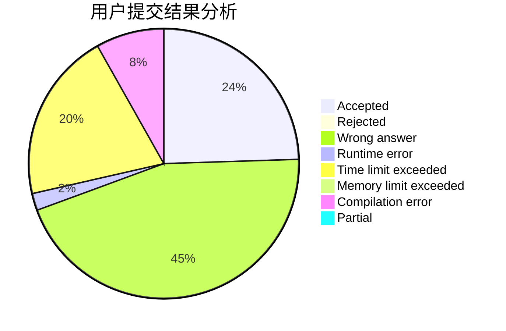
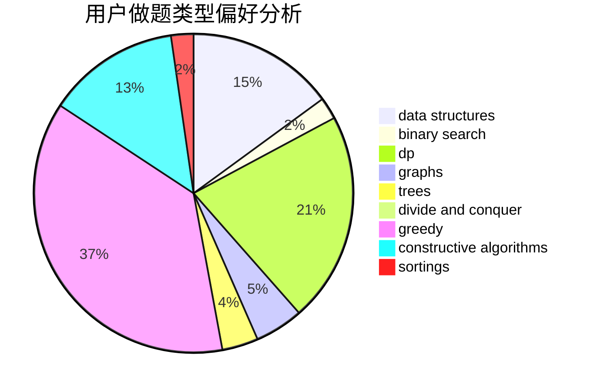
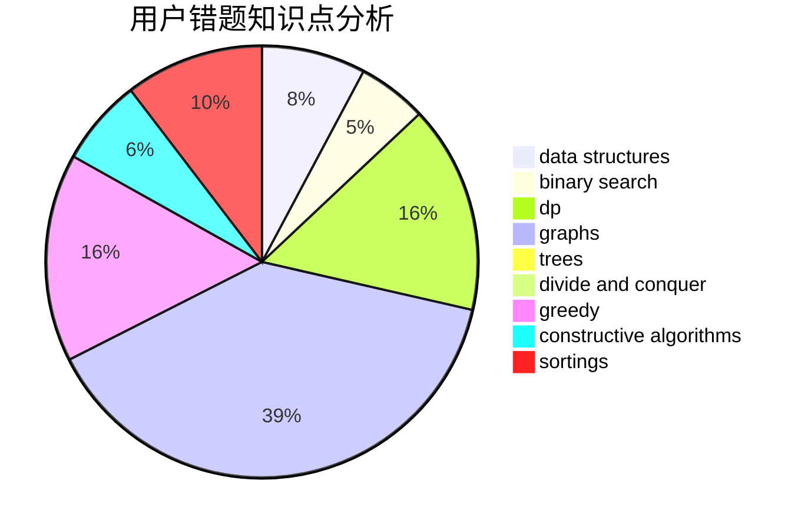

# EthanAGan
<!-- tabs:start -->
#### **用户提交结果分析**

#### **用户做题类型偏好分析**

#### **用户错题知识点分析**

<!-- tabs:end -->
# 推荐题目
[1490D](http://codeforces.com/problemset/problem/1490/D)		dfs and similar,
                        divide and conquer,
                        implementation		  
[1267B](http://codeforces.com/problemset/problem/1267/B)		nan		  
[1152F2](http://codeforces.com/problemset/problem/1152/F2)		bitmasks,
                        dp,
                        matrices		  
[354B](http://codeforces.com/problemset/problem/354/B)		bitmasks,
                        dp,
                        games		  
[835E](http://codeforces.com/problemset/problem/835/E)		binary search,
                        constructive algorithms,
                        interactive		  
[1463F](http://codeforces.com/problemset/problem/1463/F)		bitmasks,
                        dp,
                        math		  
[1105B](http://codeforces.com/problemset/problem/1105/B)		brute force,
                        implementation,
                        strings		  
[1070I](http://codeforces.com/problemset/problem/1070/I)		flows,
                        graph matchings,
                        graphs		  
[1147D](http://codeforces.com/problemset/problem/1147/D)		dfs and similar,
                        graphs		  
[1068A](http://codeforces.com/problemset/problem/1068/A)		math		  
<!-- tabs:start -->
#### **data structures**
[1167F](http://codeforces.com/problemset/problem/1167/F)		combinatorics,
                        data structures,
                        math,
                        sortings		  
[176E](http://codeforces.com/problemset/problem/176/E)		data structures,
                        dfs and similar,
                        trees		  
[1009F](http://codeforces.com/problemset/problem/1009/F)		data structures,
                        dsu,
                        trees		  
[1156E](http://codeforces.com/problemset/problem/1156/E)		data structures,
                        divide and conquer,
                        dsu,
                        two pointers		  
[1492B](http://codeforces.com/problemset/problem/1492/B)		data structures,
                        greedy,
                        math		  
[1474D](http://codeforces.com/problemset/problem/1474/D)		data structures,
                        dp,
                        greedy,
                        math		  
[1492C](http://codeforces.com/problemset/problem/1492/C)		binary search,
                        data structures,
                        dp,
                        greedy,
                        two pointers		  
[1490G](http://codeforces.com/problemset/problem/1490/G)		binary search,
                        data structures,
                        math		  
[1479D](http://codeforces.com/problemset/problem/1479/D)		binary search,
                        bitmasks,
                        brute force,
                        data structures,
                        probabilities,
                        trees		  
[1497A](http://codeforces.com/problemset/problem/1497/A)		brute force,
                        data structures,
                        greedy,
                        sortings		  
#### **binary search**
[835E](http://codeforces.com/problemset/problem/835/E)		binary search,
                        constructive algorithms,
                        interactive		  
[1480C](https://codeforces.com/contest/1480/problem/C)		binary search,
                        interactive,
                        ternary search		  
[1020D](https://codeforces.com/contest/1020/problem/D)		binary search,
                        interactive		  
[1492C](http://codeforces.com/problemset/problem/1492/C)		binary search,
                        data structures,
                        dp,
                        greedy,
                        two pointers		  
[1463D](http://codeforces.com/problemset/problem/1463/D)		binary search,
                        constructive algorithms,
                        greedy,
                        two pointers		  
[1490G](http://codeforces.com/problemset/problem/1490/G)		binary search,
                        data structures,
                        math		  
[1479D](http://codeforces.com/problemset/problem/1479/D)		binary search,
                        bitmasks,
                        brute force,
                        data structures,
                        probabilities,
                        trees		  
[1436E](http://codeforces.com/problemset/problem/1436/E)		binary search,
                        data structures,
                        two pointers		  
[1461D](http://codeforces.com/problemset/problem/1461/D)		binary search,
                        brute force,
                        data structures,
                        divide and conquer,
                        implementation,
                        sortings		  
[1493C](http://codeforces.com/problemset/problem/1493/C)		binary search,
                        brute force,
                        constructive algorithms,
                        greedy,
                        strings		  
#### **dp**
[1152F2](http://codeforces.com/problemset/problem/1152/F2)		bitmasks,
                        dp,
                        matrices		  
[354B](http://codeforces.com/problemset/problem/354/B)		bitmasks,
                        dp,
                        games		  
[1463F](http://codeforces.com/problemset/problem/1463/F)		bitmasks,
                        dp,
                        math		  
[822D](http://codeforces.com/problemset/problem/822/D)		brute force,
                        dp,
                        greedy,
                        math,
                        number theory		  
[479E](http://codeforces.com/problemset/problem/479/E)		combinatorics,
                        dp		  
[1180A](http://codeforces.com/problemset/problem/1180/A)		dp,
                        implementation,
                        math		  
[1382B](http://codeforces.com/problemset/problem/1382/B)		dp,
                        games		  
[643E](http://codeforces.com/problemset/problem/643/E)		dp,
                        math,
                        probabilities,
                        trees		  
[835F](http://codeforces.com/problemset/problem/835/F)		dfs and similar,
                        dp,
                        graphs,
                        trees		  
[835C](http://codeforces.com/problemset/problem/835/C)		dp,
                        implementation		  
#### **graph**
[1070I](http://codeforces.com/problemset/problem/1070/I)		flows,
                        graph matchings,
                        graphs		  
[1147D](http://codeforces.com/problemset/problem/1147/D)		dfs and similar,
                        graphs		  
[197D](https://codeforces.com/contest/197/problem/D)		dfs and similar,
                        graphs		  
[1103C](http://codeforces.com/problemset/problem/1103/C)		constructive algorithms,
                        dfs and similar,
                        graphs,
                        math		  
[835F](http://codeforces.com/problemset/problem/835/F)		dfs and similar,
                        dp,
                        graphs,
                        trees		  
[600F](http://codeforces.com/problemset/problem/600/F)		graphs		  
[1433G](http://codeforces.com/problemset/problem/1433/G)		brute force,
                        graphs,
                        shortest paths		  
[804F](http://codeforces.com/problemset/problem/804/F)		combinatorics,
                        dfs and similar,
                        dp,
                        graphs,
                        number theory		  
[1095F](http://codeforces.com/problemset/problem/1095/F)		dsu,
                        graphs,
                        greedy		  
[1487C](http://codeforces.com/problemset/problem/1487/C)		brute force,
                        constructive algorithms,
                        dfs and similar,
                        graphs,
                        greedy,
                        implementation,
                        math		  
#### **trees**
[643E](http://codeforces.com/problemset/problem/643/E)		dp,
                        math,
                        probabilities,
                        trees		  
[835F](http://codeforces.com/problemset/problem/835/F)		dfs and similar,
                        dp,
                        graphs,
                        trees		  
[1254E](http://codeforces.com/problemset/problem/1254/E)		combinatorics,
                        dfs and similar,
                        dsu,
                        trees		  
[176E](http://codeforces.com/problemset/problem/176/E)		data structures,
                        dfs and similar,
                        trees		  
[1009F](http://codeforces.com/problemset/problem/1009/F)		data structures,
                        dsu,
                        trees		  
[1479D](http://codeforces.com/problemset/problem/1479/D)		binary search,
                        bitmasks,
                        brute force,
                        data structures,
                        probabilities,
                        trees		  
[1511C](http://codeforces.com/problemset/problem/1511/C)		brute force,
                        data structures,
                        implementation,
                        trees		  
[1499F](http://codeforces.com/problemset/problem/1499/F)		combinatorics,
                        dfs and similar,
                        dp,
                        trees		  
[1491E](http://codeforces.com/problemset/problem/1491/E)		brute force,
                        dfs and similar,
                        divide and conquer,
                        number theory,
                        trees		  
[1466D](http://codeforces.com/problemset/problem/1466/D)		data structures,
                        greedy,
                        sortings,
                        trees		  
#### **divide and conquer**
[1490D](http://codeforces.com/problemset/problem/1490/D)		dfs and similar,
                        divide and conquer,
                        implementation		  
[1156E](http://codeforces.com/problemset/problem/1156/E)		data structures,
                        divide and conquer,
                        dsu,
                        two pointers		  
[1461D](http://codeforces.com/problemset/problem/1461/D)		binary search,
                        brute force,
                        data structures,
                        divide and conquer,
                        implementation,
                        sortings		  
[1466G](http://codeforces.com/problemset/problem/1466/G)		combinatorics,
                        divide and conquer,
                        hashing,
                        math,
                        string suffix structures,
                        strings		  
[1490D](http://codeforces.com/problemset/problem/1490/D)		dfs and similar,
                        divide and conquer,
                        implementation		  
[1483C](https://codeforces.com/contest/1483/problem/C)		data structures,
                        divide and conquer,
                        dp		  
[1491E](http://codeforces.com/problemset/problem/1491/E)		brute force,
                        dfs and similar,
                        divide and conquer,
                        number theory,
                        trees		  
[1303G](http://codeforces.com/problemset/problem/1303/G)		data structures,
                        divide and conquer,
                        geometry,
                        trees		  
[1494D](http://codeforces.com/problemset/problem/1494/D)		constructive algorithms,
                        data structures,
                        dfs and similar,
                        divide and conquer,
                        dsu,
                        greedy,
                        sortings,
                        trees		  
[1482E](http://codeforces.com/problemset/problem/1482/E)		data structures,
                        divide and conquer,
                        dp		  
#### **greedy**
[822D](http://codeforces.com/problemset/problem/822/D)		brute force,
                        dp,
                        greedy,
                        math,
                        number theory		  
[521B](https://codeforces.com/contest/521/problem/B)		games,
                        greedy,
                        implementation		  
[468A](http://codeforces.com/problemset/problem/468/A)		constructive algorithms,
                        greedy,
                        math		  
[835B](http://codeforces.com/problemset/problem/835/B)		greedy		  
[1447B](http://codeforces.com/problemset/problem/1447/B)		greedy,
                        math		  
[1457B](https://codeforces.com/contest/1457/problem/B)		brute force,
                        brute force,
                        greedy		  
[1385C](http://codeforces.com/problemset/problem/1385/C)		greedy		  
[1265C](https://codeforces.com/contest/1265/problem/C)		greedy,
                        implementation		  
[1095F](http://codeforces.com/problemset/problem/1095/F)		dsu,
                        graphs,
                        greedy		  
[1492B](http://codeforces.com/problemset/problem/1492/B)		data structures,
                        greedy,
                        math		  
#### **constructive algorithms**
[835E](http://codeforces.com/problemset/problem/835/E)		binary search,
                        constructive algorithms,
                        interactive		  
[1103C](http://codeforces.com/problemset/problem/1103/C)		constructive algorithms,
                        dfs and similar,
                        graphs,
                        math		  
[468A](http://codeforces.com/problemset/problem/468/A)		constructive algorithms,
                        greedy,
                        math		  
[1450C2](http://codeforces.com/problemset/problem/1450/C2)		constructive algorithms,
                        math		  
[1004C](http://codeforces.com/problemset/problem/1004/C)		constructive algorithms,
                        implementation		  
[303A](http://codeforces.com/problemset/problem/303/A)		constructive algorithms,
                        implementation,
                        math		  
[1450C1](http://codeforces.com/problemset/problem/1450/C1)		constructive algorithms,
                        math		  
[1493A](http://codeforces.com/problemset/problem/1493/A)		constructive algorithms,
                        greedy		  
[1463D](http://codeforces.com/problemset/problem/1463/D)		binary search,
                        constructive algorithms,
                        greedy,
                        two pointers		  
[1456B](https://codeforces.com/contest/1456/problem/B)		bitmasks,
                        brute force,
                        constructive algorithms		  
#### **sortings**
[1167F](http://codeforces.com/problemset/problem/1167/F)		combinatorics,
                        data structures,
                        math,
                        sortings		  
[1355B](http://codeforces.com/problemset/problem/1355/B)		dp,
                        greedy,
                        sortings		  
[1496C](https://codeforces.com/contest/1496/problem/C)		geometry,
                        greedy,
                        math,
                        sortings		  
[1495A](http://codeforces.com/problemset/problem/1495/A)		geometry,
                        greedy,
                        math,
                        sortings		  
[1497A](http://codeforces.com/problemset/problem/1497/A)		brute force,
                        data structures,
                        greedy,
                        sortings		  
[1427A](http://codeforces.com/problemset/problem/1427/A)		math,
                        sortings		  
[1461D](http://codeforces.com/problemset/problem/1461/D)		binary search,
                        brute force,
                        data structures,
                        divide and conquer,
                        implementation,
                        sortings		  
[1437C](http://codeforces.com/problemset/problem/1437/C)		dp,
                        flows,
                        graph matchings,
                        greedy,
                        math,
                        sortings		  
[1473A](http://codeforces.com/problemset/problem/1473/A)		greedy,
                        implementation,
                        math,
                        sortings		  
[1486B](http://codeforces.com/problemset/problem/1486/B)		binary search,
                        geometry,
                        shortest paths,
                        sortings		  
<!-- tabs:end -->
