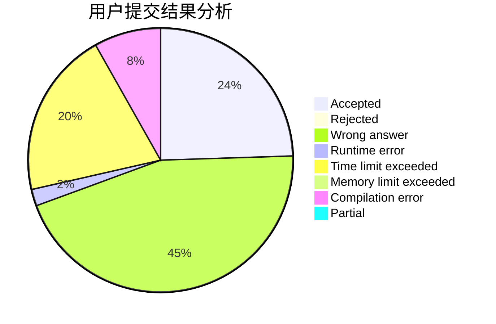
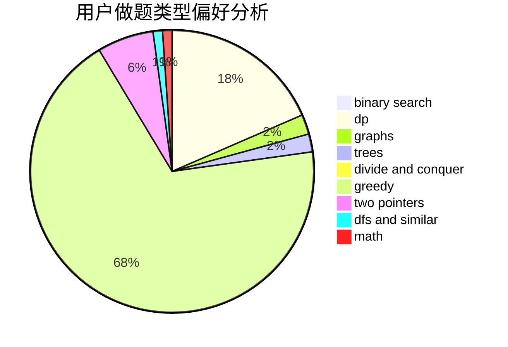

# EthanAGan

<!-- tabs:start -->

#### **用户提交结果分析**

#### **用户做题类型偏好分析**

<!-- tabs:end -->
# 推荐题目
[853C](https://codeforces.com/contest/853/problem/C)
[1154G](https://codeforces.com/contest/1154/problem/G)
[1105E](https://codeforces.com/contest/1105/problem/E)
[842C](https://codeforces.com/contest/842/problem/C)
[1149C](https://codeforces.com/contest/1149/problem/C)
[620B](https://codeforces.com/contest/620/problem/B)
[660D](https://codeforces.com/contest/660/problem/D)
[737A](https://codeforces.com/contest/737/problem/A)
[12622](https://codeforces.com/contest/1262/problem/2)
[1031C](https://codeforces.com/contest/1031/problem/C)
