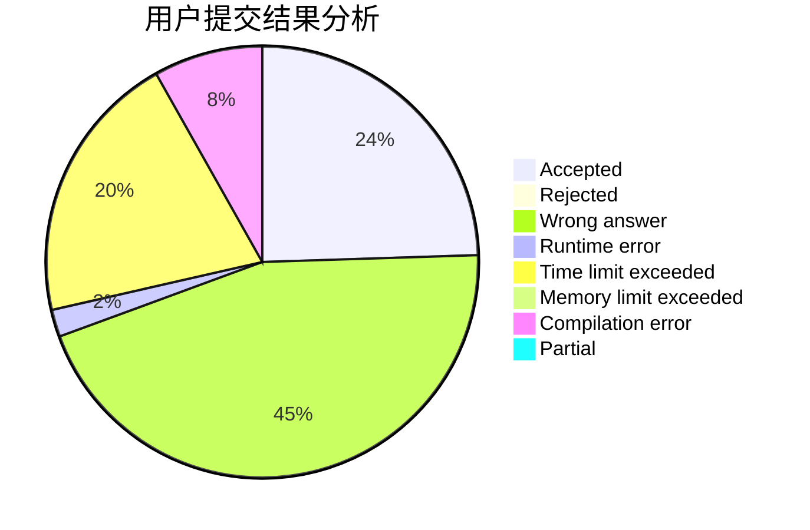
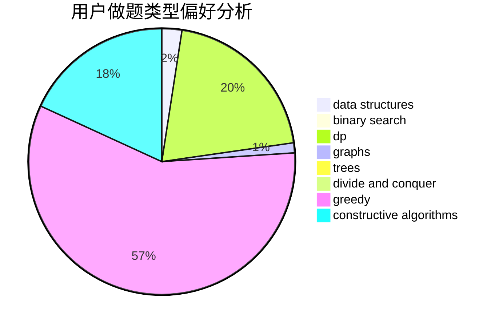
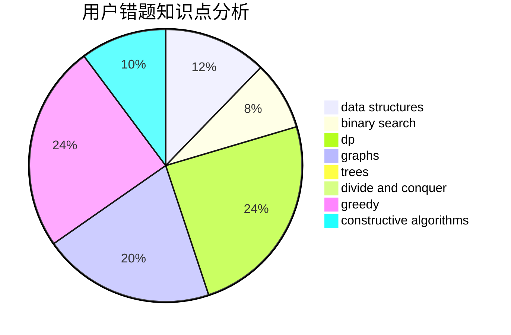

# EthanAGan

<!-- tabs:start -->

#### **用户提交结果分析**

#### **用户做题类型偏好分析**

#### **用户错题知识点分析**

<!-- tabs:end -->
# 推荐题目
[853C](https://codeforces.com/contest/853/problem/C)		data structures		  
[1154G](https://codeforces.com/contest/1154/problem/G)		brute force,
                        greedy,
                        math,
                        number theory		  
[1105E](https://codeforces.com/contest/1105/problem/E)		bitmasks,
                        brute force,
                        dp,
                        meet-in-the-middle		  
[842C](https://codeforces.com/contest/842/problem/C)		dfs and similar,
                        graphs,
                        math,
                        number theory,
                        trees		  
[1149C](https://codeforces.com/contest/1149/problem/C)		data structures,
                        implementation,
                        trees		  
[620B](https://codeforces.com/contest/620/problem/B)		implementation		  
[660D](https://codeforces.com/contest/660/problem/D)		geometry		  
[737A](https://codeforces.com/contest/737/problem/A)		dsu,graphs,sortings,trees		  
[12622](https://codeforces.com/contest/1262/problem/2)		dsu,graphs,sortings,trees		  
[1031C](https://codeforces.com/contest/1031/problem/C)		greedy		  
