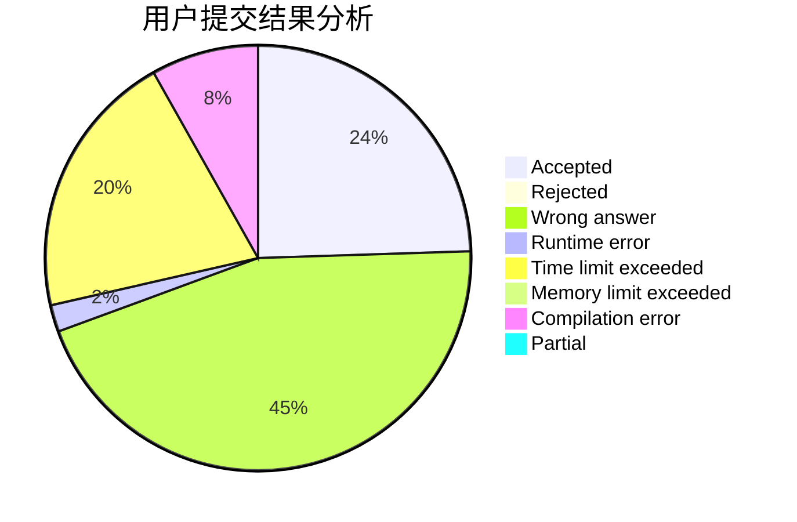
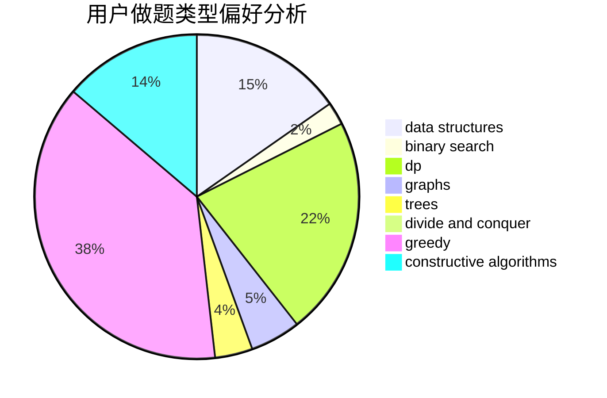
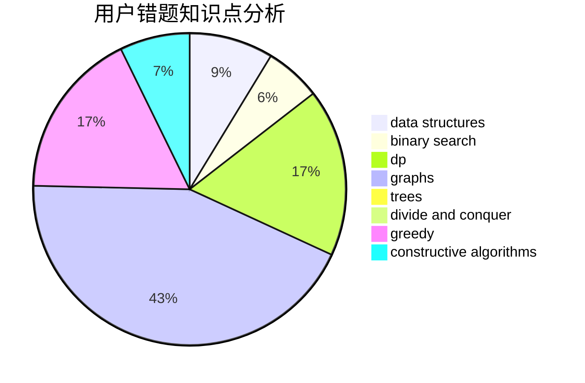

# EthanAGan

<!-- tabs:start -->

#### **用户提交结果分析**

#### **用户做题类型偏好分析**

#### **用户错题知识点分析**

<!-- tabs:end -->
# 推荐题目
[835E](https://codeforces.com/contest/835/problem/E)		binary search,
                        constructive algorithms,
                        interactive		  
[1152F2](https://codeforces.com/contest/1152F/problem/2)		bitmasks,
                        dp,
                        matrices		  
[1105B](https://codeforces.com/contest/1105/problem/B)		brute force,
                        implementation,
                        strings		  
[822D](https://codeforces.com/contest/822/problem/D)		brute force,
                        dp,
                        greedy,
                        math,
                        number theory		  
[1147D](https://codeforces.com/contest/1147/problem/D)		dfs and similar,
                        graphs		  
[600F](https://codeforces.com/contest/600/problem/F)		graphs		  
[630I](https://codeforces.com/contest/630/problem/I)		combinatorics,
                        math		  
[71A](https://codeforces.com/contest/71/problem/A)		strings		  
[1254E](https://codeforces.com/contest/1254/problem/E)		combinatorics,
                        dfs and similar,
                        dsu,
                        trees		  
[1030G](https://codeforces.com/contest/1030/problem/G)		number theory		  
