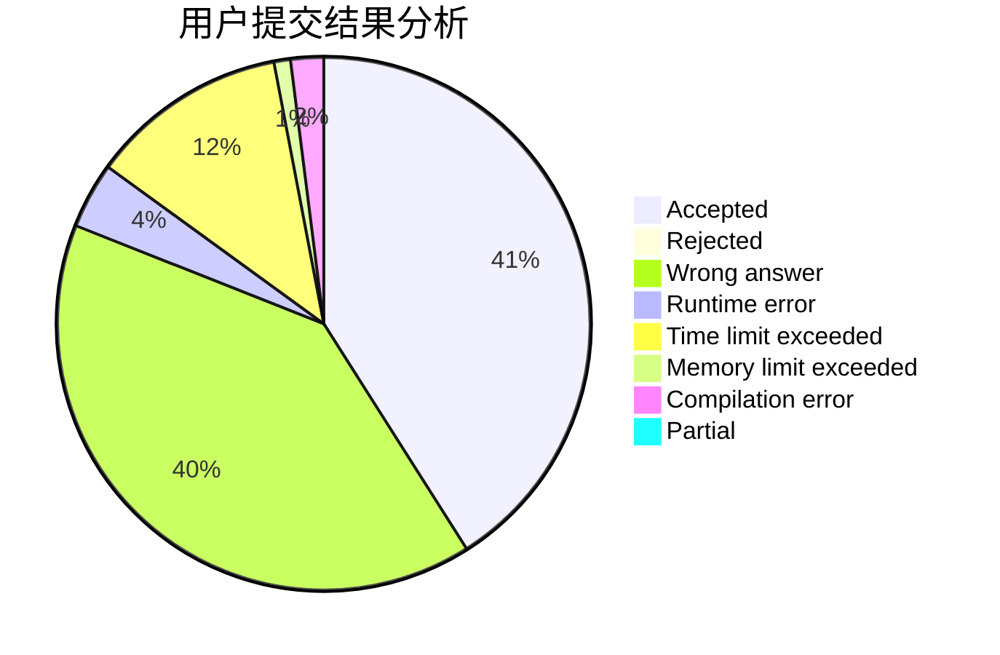
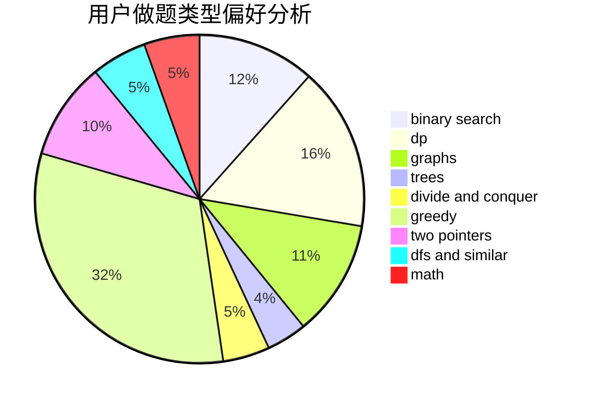

# Evolylenol

<!-- tabs:start -->

#### **用户提交结果分析**

#### **用户做题类型偏好分析**

<!-- tabs:end -->
# 推荐题目
[677C](https://codeforces.com/contest/677/problem/C)
[25D](https://codeforces.com/contest/25/problem/D)
[429B](https://codeforces.com/contest/429/problem/B)
[1360E](https://codeforces.com/contest/1360/problem/E)
[742D](https://codeforces.com/contest/742/problem/D)
[733D](https://codeforces.com/contest/733/problem/D)
[427B](https://codeforces.com/contest/427/problem/B)
[754C](https://codeforces.com/contest/754/problem/C)
[1191F](https://codeforces.com/contest/1191/problem/F)
[520C](https://codeforces.com/contest/520/problem/C)
