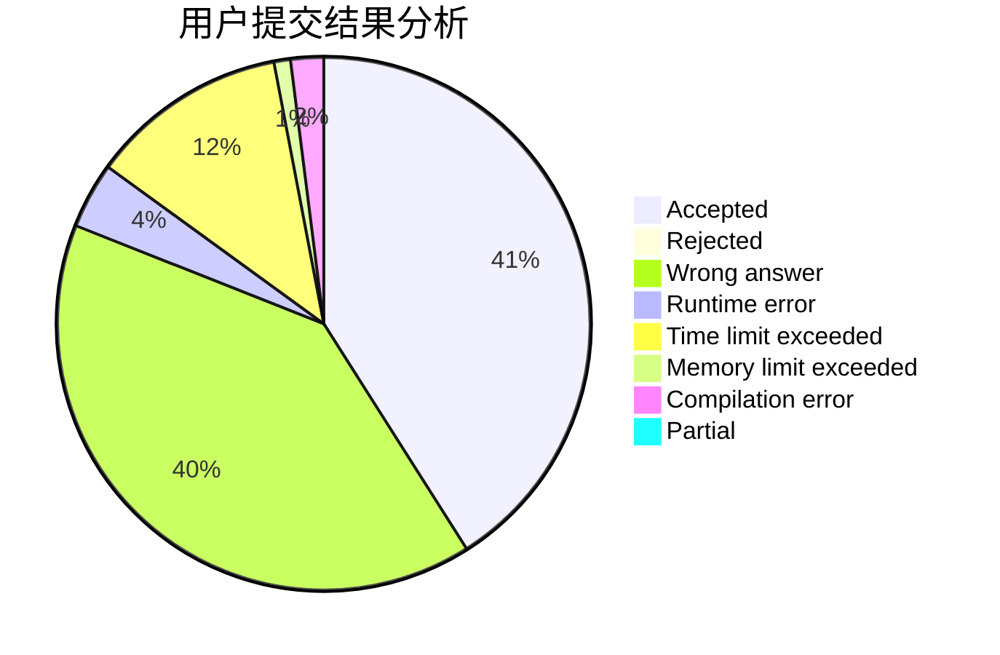
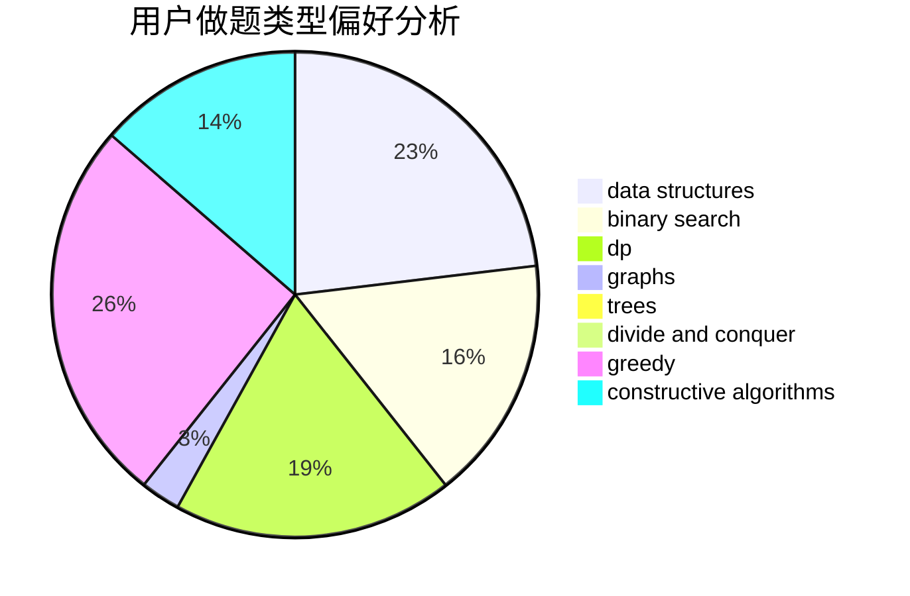
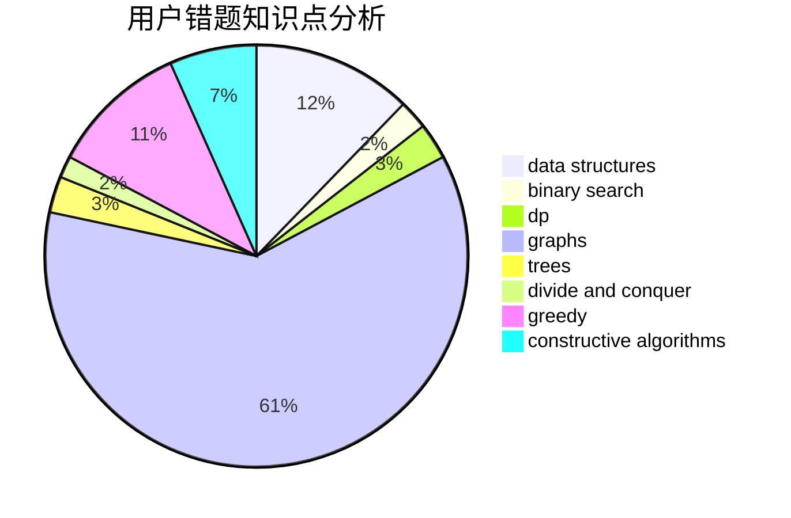

# Evolylenol

<!-- tabs:start -->

#### **用户提交结果分析**

#### **用户做题类型偏好分析**

#### **用户错题知识点分析**

<!-- tabs:end -->
# 推荐题目
[653C](https://codeforces.com/contest/653/problem/C)		brute force,
                        implementation		  
[238A](https://codeforces.com/contest/238/problem/A)		constructive algorithms,
                        math		  
[3A](https://codeforces.com/contest/3/problem/A)		greedy,
                        shortest paths		  
[1354A](https://codeforces.com/contest/1354/problem/A)		math		  
[724G](https://codeforces.com/contest/724/problem/G)		bitmasks,
                        graphs,
                        math,
                        number theory,
                        trees		  
[715B](https://codeforces.com/contest/715/problem/B)		binary search,
                        constructive algorithms,
                        graphs,
                        shortest paths		  
[39E](https://codeforces.com/contest/39/problem/E)		dp,
                        games		  
[734A](https://codeforces.com/contest/734/problem/A)		implementation,
                        strings		  
[1188A2](https://codeforces.com/contest/1188A/problem/2)		constructive algorithms,
                        dfs and similar,
                        implementation,
                        trees		  
[4C](https://codeforces.com/contest/4/problem/C)		data structures,
                        hashing,
                        implementation		  
