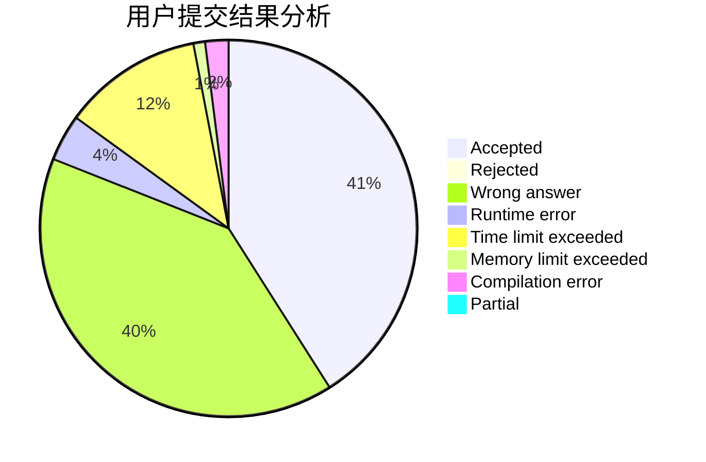
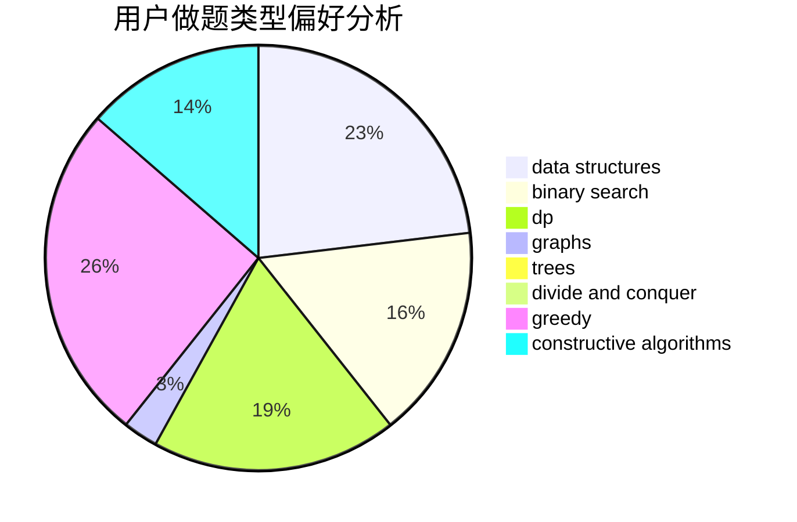
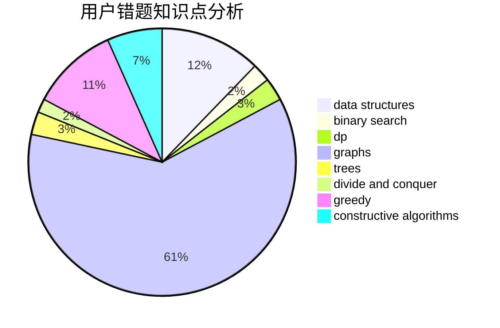

# Evolylenol
<!-- tabs:start -->
#### **用户提交结果分析**

#### **用户做题类型偏好分析**

#### **用户错题知识点分析**

<!-- tabs:end -->
# 推荐题目
[Alarm Clock](http://codeforces.com/problemset/problem/1354/A)		math		  
[Flag of Berland](http://codeforces.com/problemset/problem/837/B)		brute force,
                        implementation		  
[Not Wool Sequences](http://codeforces.com/problemset/problem/238/A)		constructive algorithms,
                        math		  
[Columns Swaps](http://codeforces.com/problemset/problem/1385/G)		2-sat,
                        dfs and similar,
                        dsu,
                        graphs,
                        implementation		  
[Anton and Danik](http://codeforces.com/problemset/problem/734/A)		implementation,
                        strings		  
[Bear and Up-Down](http://codeforces.com/problemset/problem/653/C)		brute force,
                        implementation		  
[Shortest path of the king](http://codeforces.com/problemset/problem/3/A)		greedy,
                        shortest paths		  
[Two Seals](http://codeforces.com/problemset/problem/837/C)		brute force,
                        implementation		  
[April Fools' Problem (hard)](http://codeforces.com/problemset/problem/802/O)		binary search,
                        data structures,
                        flows		  
[What Has Dirichlet Got to Do with That?](http://codeforces.com/problemset/problem/39/E)		dp,
                        games		  
<!-- tabs:start -->
#### **data structures**
[April Fools' Problem (hard)](http://codeforces.com/problemset/problem/802/O)		binary search,
                        data structures,
                        flows		  
[Functions On The Segments](http://codeforces.com/problemset/problem/837/G)		data structures		  
[Lipshitz Sequence](http://codeforces.com/problemset/problem/601/B)		data structures,
                        math		  
[Build a Contest](http://codeforces.com/problemset/problem/1100/B)		data structures,
                        implementation		  
[Diverging Directions](http://codeforces.com/problemset/problem/838/B)		data structures,
                        dfs and similar,
                        trees		  
[Kay and Snowflake](http://codeforces.com/problemset/problem/685/B)		data structures,
                        dfs and similar,
                        dp,
                        trees		  
[ELCA](http://codeforces.com/problemset/problem/482/E)		data structures,
                        trees		  
[Registration System](http://codeforces.com/problemset/problem/4/C)		data structures,
                        hashing,
                        implementation		  
[Maximum width](http://codeforces.com/problemset/problem/1492/C)		binary search,
                        data structures,
                        dp,
                        greedy,
                        two pointers		  
[Old Floppy Drive](http://codeforces.com/problemset/problem/1490/G)		binary search,
                        data structures,
                        math		  
#### **binary search**
[April Fools' Problem (hard)](http://codeforces.com/problemset/problem/802/O)		binary search,
                        data structures,
                        flows		  
[Prefix Sums](http://codeforces.com/problemset/problem/837/F)		binary search,
                        brute force,
                        combinatorics,
                        math,
                        matrices		  
[Elongated Matrix](http://codeforces.com/problemset/problem/1102/F)		binary search,
                        bitmasks,
                        brute force,
                        dp,
                        graphs		  
[Complete The Graph](http://codeforces.com/problemset/problem/715/B)		binary search,
                        constructive algorithms,
                        graphs,
                        shortest paths		  
[Vasya's Function](http://codeforces.com/problemset/problem/837/E)		binary search,
                        implementation,
                        math		  
[Searching Local Minimum](https://codeforces.com/contest/1480/problem/C)		binary search,
                        interactive,
                        ternary search		  
[Maximum width](http://codeforces.com/problemset/problem/1492/C)		binary search,
                        data structures,
                        dp,
                        greedy,
                        two pointers		  
[Pairs](http://codeforces.com/problemset/problem/1463/D)		binary search,
                        constructive algorithms,
                        greedy,
                        two pointers		  
[Old Floppy Drive](http://codeforces.com/problemset/problem/1490/G)		binary search,
                        data structures,
                        math		  
[Odd Mineral Resource](http://codeforces.com/problemset/problem/1479/D)		binary search,
                        bitmasks,
                        brute force,
                        data structures,
                        probabilities,
                        trees		  
#### **dp**
[What Has Dirichlet Got to Do with That?](http://codeforces.com/problemset/problem/39/E)		dp,
                        games		  
[Elongated Matrix](http://codeforces.com/problemset/problem/1102/F)		binary search,
                        bitmasks,
                        brute force,
                        dp,
                        graphs		  
[Kay and Snowflake](http://codeforces.com/problemset/problem/685/B)		data structures,
                        dfs and similar,
                        dp,
                        trees		  
[Discarding Game](http://codeforces.com/problemset/problem/1250/G)		dp,
                        greedy,
                        two pointers		  
[Round Subset](http://codeforces.com/problemset/problem/837/D)		dp,
                        math		  
[Maximum width](http://codeforces.com/problemset/problem/1492/C)		binary search,
                        data structures,
                        dp,
                        greedy,
                        two pointers		  
[Bouncing Ball](https://codeforces.com/contest/1457/problem/C)		brute force,
                        dp,
                        implementation		  
[Pekora and Trampoline](http://codeforces.com/problemset/problem/1491/C)		brute force,
                        data structures,
                        dp,
                        greedy,
                        implementation		  
[Chef Monocarp](http://codeforces.com/problemset/problem/1437/C)		dp,
                        flows,
                        graph matchings,
                        greedy,
                        math,
                        sortings		  
[Binary Removals](http://codeforces.com/problemset/problem/1499/B)		brute force,
                        dp,
                        greedy,
                        implementation		  
#### **graph**
[Columns Swaps](http://codeforces.com/problemset/problem/1385/G)		2-sat,
                        dfs and similar,
                        dsu,
                        graphs,
                        implementation		  
[Johnny Solving](http://codeforces.com/problemset/problem/1103/C)		constructive algorithms,
                        dfs and similar,
                        graphs,
                        math		  
[Elongated Matrix](http://codeforces.com/problemset/problem/1102/F)		binary search,
                        bitmasks,
                        brute force,
                        dp,
                        graphs		  
[Complete The Graph](http://codeforces.com/problemset/problem/715/B)		binary search,
                        constructive algorithms,
                        graphs,
                        shortest paths		  
[Xor-matic Number of the Graph](http://codeforces.com/problemset/problem/724/G)		bitmasks,
                        graphs,
                        math,
                        number theory,
                        trees		  
[Minimum Ties](http://codeforces.com/problemset/problem/1487/C)		brute force,
                        constructive algorithms,
                        dfs and similar,
                        graphs,
                        greedy,
                        implementation,
                        math		  
[Chef Monocarp](http://codeforces.com/problemset/problem/1437/C)		dp,
                        flows,
                        graph matchings,
                        greedy,
                        math,
                        sortings		  
[Strange Housing](http://codeforces.com/problemset/problem/1470/D)		constructive algorithms,
                        dfs and similar,
                        graph matchings,
                        graphs,
                        greedy		  
[Longest Simple Cycle](http://codeforces.com/problemset/problem/1476/C)		dp,
                        graphs,
                        greedy		  
[Shortest and Longest LIS](http://codeforces.com/problemset/problem/1304/D)		constructive algorithms,
                        graphs,
                        greedy,
                        two pointers		  
#### **trees**
[Diverging Directions](http://codeforces.com/problemset/problem/838/B)		data structures,
                        dfs and similar,
                        trees		  
[Kay and Snowflake](http://codeforces.com/problemset/problem/685/B)		data structures,
                        dfs and similar,
                        dp,
                        trees		  
[Xor-matic Number of the Graph](http://codeforces.com/problemset/problem/724/G)		bitmasks,
                        graphs,
                        math,
                        number theory,
                        trees		  
[Add on a Tree: Revolution](http://codeforces.com/problemset/problem/1188/A2)		constructive algorithms,
                        dfs and similar,
                        implementation,
                        trees		  
[ELCA](http://codeforces.com/problemset/problem/482/E)		data structures,
                        trees		  
[Odd Mineral Resource](http://codeforces.com/problemset/problem/1479/D)		binary search,
                        bitmasks,
                        brute force,
                        data structures,
                        probabilities,
                        trees		  
[Yet Another Card Deck](http://codeforces.com/problemset/problem/1511/C)		brute force,
                        data structures,
                        implementation,
                        trees		  
[Diameter Cuts](http://codeforces.com/problemset/problem/1499/F)		combinatorics,
                        dfs and similar,
                        dp,
                        trees		  
[Fib-tree](http://codeforces.com/problemset/problem/1491/E)		brute force,
                        dfs and similar,
                        divide and conquer,
                        number theory,
                        trees		  
[13th Labour of Heracles](http://codeforces.com/problemset/problem/1466/D)		data structures,
                        greedy,
                        sortings,
                        trees		  
#### **divide and conquer**
[Divide and Summarize](http://codeforces.com/problemset/problem/1461/D)		binary search,
                        brute force,
                        data structures,
                        divide and conquer,
                        implementation,
                        sortings		  
[Song of the Sirens](http://codeforces.com/problemset/problem/1466/G)		combinatorics,
                        divide and conquer,
                        hashing,
                        math,
                        string suffix structures,
                        strings		  
[Permutation Transformation](http://codeforces.com/problemset/problem/1490/D)		dfs and similar,
                        divide and conquer,
                        implementation		  
[Skyline Photo](https://codeforces.com/contest/1483/problem/C)		data structures,
                        divide and conquer,
                        dp		  
[Fib-tree](http://codeforces.com/problemset/problem/1491/E)		brute force,
                        dfs and similar,
                        divide and conquer,
                        number theory,
                        trees		  
[Sum of Prefix Sums](http://codeforces.com/problemset/problem/1303/G)		data structures,
                        divide and conquer,
                        geometry,
                        trees		  
[Dogeforces](http://codeforces.com/problemset/problem/1494/D)		constructive algorithms,
                        data structures,
                        dfs and similar,
                        divide and conquer,
                        dsu,
                        greedy,
                        sortings,
                        trees		  
[Skyline Photo](http://codeforces.com/problemset/problem/1482/E)		data structures,
                        divide and conquer,
                        dp		  
[Logistical Questions](http://codeforces.com/problemset/problem/566/C)		dfs and similar,
                        divide and conquer,
                        trees		  
[Fruit Sequences](http://codeforces.com/problemset/problem/1428/F)		binary search,
                        data structures,
                        divide and conquer,
                        dp,
                        two pointers		  
#### **greedy**
[Shortest path of the king](http://codeforces.com/problemset/problem/3/A)		greedy,
                        shortest paths		  
[Discarding Game](http://codeforces.com/problemset/problem/1250/G)		dp,
                        greedy,
                        two pointers		  
[Most socially-distanced subsequence](http://codeforces.com/problemset/problem/1364/B)		greedy,
                        two pointers		  
[Maximum width](http://codeforces.com/problemset/problem/1492/C)		binary search,
                        data structures,
                        dp,
                        greedy,
                        two pointers		  
[Diamond Miner](https://codeforces.com/contest/1496/problem/C)		geometry,
                        greedy,
                        math,
                        sortings		  
[Anti-knapsack](http://codeforces.com/problemset/problem/1493/A)		constructive algorithms,
                        greedy		  
[Pairs](http://codeforces.com/problemset/problem/1463/D)		binary search,
                        constructive algorithms,
                        greedy,
                        two pointers		  
[Unique Number](http://codeforces.com/problemset/problem/1462/C)		brute force,
                        greedy,
                        math		  
[Berland Crossword](http://codeforces.com/problemset/problem/1494/B)		bitmasks,
                        brute force,
                        greedy,
                        implementation		  
[Genius's Gambit](http://codeforces.com/problemset/problem/1492/D)		bitmasks,
                        constructive algorithms,
                        greedy,
                        math		  
#### **constructive algorithms**
[Not Wool Sequences](http://codeforces.com/problemset/problem/238/A)		constructive algorithms,
                        math		  
[Johnny Solving](http://codeforces.com/problemset/problem/1103/C)		constructive algorithms,
                        dfs and similar,
                        graphs,
                        math		  
[Complete The Graph](http://codeforces.com/problemset/problem/715/B)		binary search,
                        constructive algorithms,
                        graphs,
                        shortest paths		  
[Add on a Tree: Revolution](http://codeforces.com/problemset/problem/1188/A2)		constructive algorithms,
                        dfs and similar,
                        implementation,
                        trees		  
[Putting Bricks in the Wall](http://codeforces.com/problemset/problem/1421/B)		constructive algorithms,
                        implementation		  
[Anti-knapsack](http://codeforces.com/problemset/problem/1493/A)		constructive algorithms,
                        greedy		  
[Pairs](http://codeforces.com/problemset/problem/1463/D)		binary search,
                        constructive algorithms,
                        greedy,
                        two pointers		  
[XOR-gun](https://codeforces.com/contest/1456/problem/B)		bitmasks,
                        brute force,
                        constructive algorithms		  
[Genius's Gambit](http://codeforces.com/problemset/problem/1492/D)		bitmasks,
                        constructive algorithms,
                        greedy,
                        math		  
[3-Coloring](https://codeforces.com/contest/1504/problem/D)		constructive algorithms,
                        games,
                        interactive		  
#### **sortings**
[Diamond Miner](https://codeforces.com/contest/1496/problem/C)		geometry,
                        greedy,
                        math,
                        sortings		  
[Diamond Miner](http://codeforces.com/problemset/problem/1495/A)		geometry,
                        greedy,
                        math,
                        sortings		  
[Meximization](http://codeforces.com/problemset/problem/1497/A)		brute force,
                        data structures,
                        greedy,
                        sortings		  
[Avoiding Zero](http://codeforces.com/problemset/problem/1427/A)		math,
                        sortings		  
[Divide and Summarize](http://codeforces.com/problemset/problem/1461/D)		binary search,
                        brute force,
                        data structures,
                        divide and conquer,
                        implementation,
                        sortings		  
[Chef Monocarp](http://codeforces.com/problemset/problem/1437/C)		dp,
                        flows,
                        graph matchings,
                        greedy,
                        math,
                        sortings		  
[Replacing Elements](http://codeforces.com/problemset/problem/1473/A)		greedy,
                        implementation,
                        math,
                        sortings		  
[Eastern Exhibition](http://codeforces.com/problemset/problem/1486/B)		binary search,
                        geometry,
                        shortest paths,
                        sortings		  
[The Great Hero](http://codeforces.com/problemset/problem/1480/B)		greedy,
                        implementation,
                        sortings		  
[Rescue Nibel!](http://codeforces.com/problemset/problem/1420/D)		combinatorics,
                        data structures,
                        sortings		  
<!-- tabs:end -->
