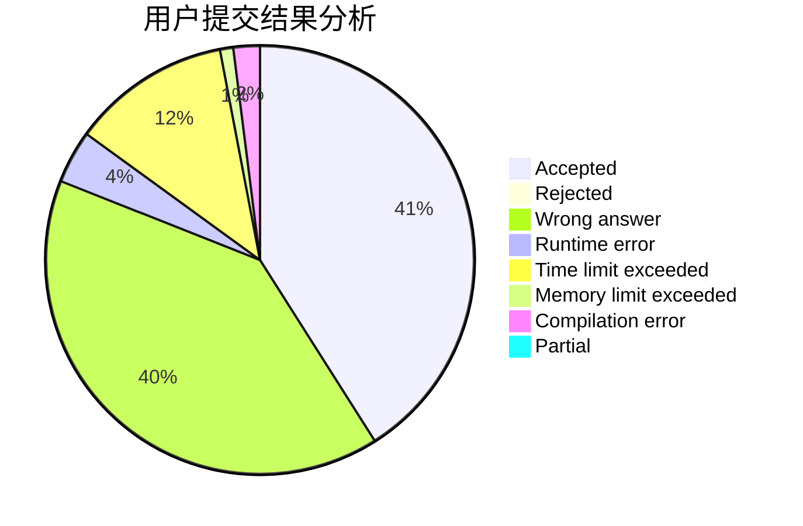
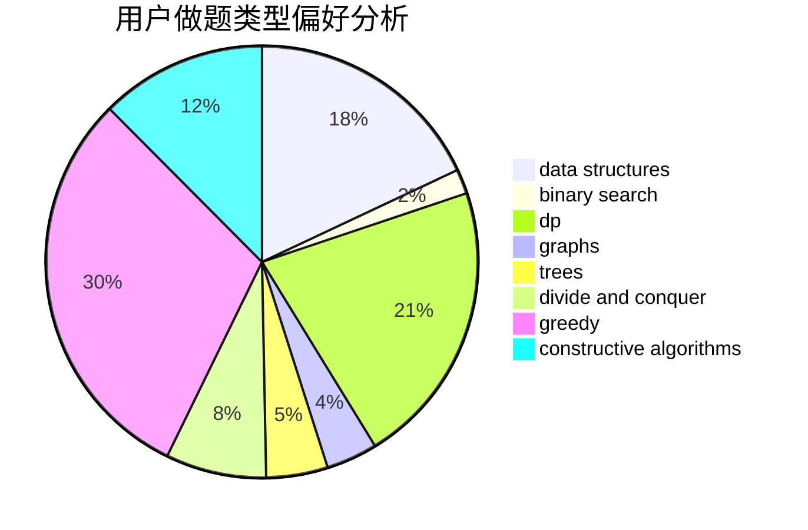
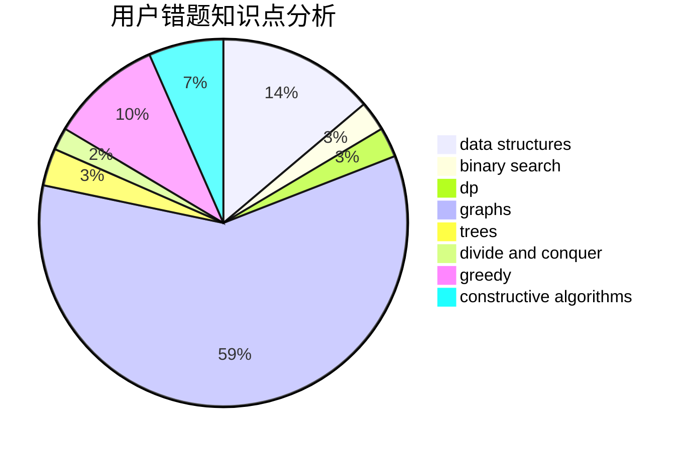

# Evolylenol

<!-- tabs:start -->

#### **用户提交结果分析**

#### **用户做题类型偏好分析**

#### **用户错题知识点分析**

<!-- tabs:end -->
# 推荐题目
[677C](https://codeforces.com/contest/677/problem/C)		bitmasks,
                        combinatorics,
                        implementation,
                        strings		  
[25D](https://codeforces.com/contest/25/problem/D)		dsu,
                        graphs,
                        trees		  
[429B](https://codeforces.com/contest/429/problem/B)		dp		  
[1360E](https://codeforces.com/contest/1360/problem/E)		dp,
                        graphs,
                        implementation,
                        shortest paths		  
[742D](https://codeforces.com/contest/742/problem/D)		dsu,graphs,sortings,trees		  
[733D](https://codeforces.com/contest/733/problem/D)		data structures,
                        hashing		  
[427B](https://codeforces.com/contest/427/problem/B)		data structures,
                        implementation		  
[754C](https://codeforces.com/contest/754/problem/C)		brute force,
                        constructive algorithms,
                        dp,
                        implementation,
                        strings		  
[1191F](https://codeforces.com/contest/1191/problem/F)		dsu,graphs,sortings,trees		  
[520C](https://codeforces.com/contest/520/problem/C)		math,
                        strings		  
