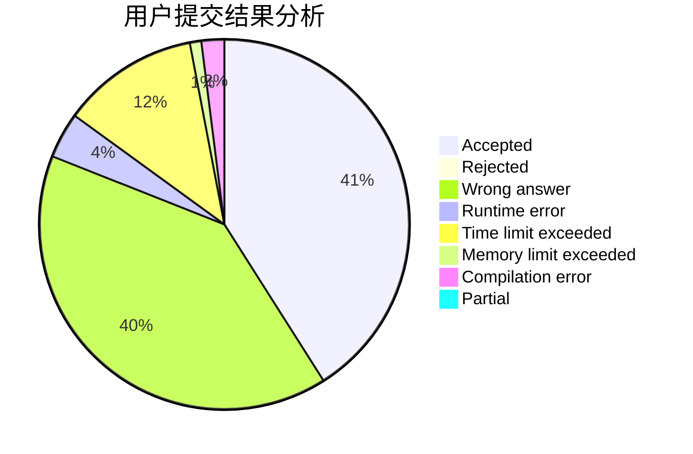
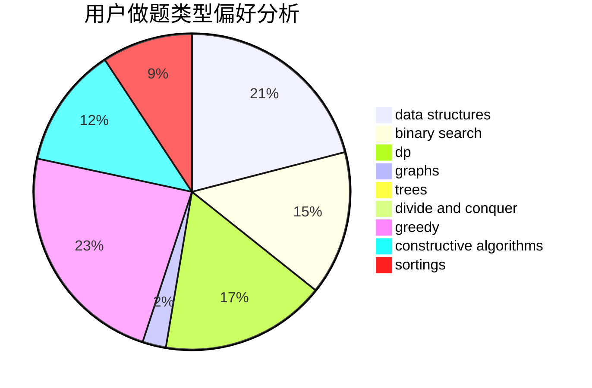
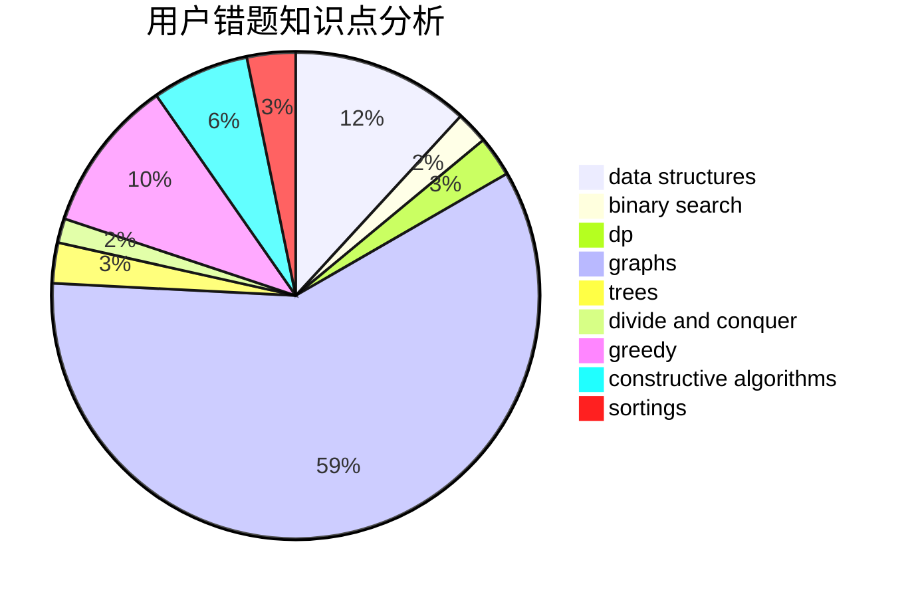

# Evolylenol
<!-- tabs:start -->
#### **用户提交结果分析**

#### **用户做题类型偏好分析**

#### **用户错题知识点分析**

<!-- tabs:end -->
# 推荐题目
[1354A](http://codeforces.com/problemset/problem/1354/A)		math		  
[837B](http://codeforces.com/problemset/problem/837/B)		brute force,
                        implementation		  
[238A](http://codeforces.com/problemset/problem/238/A)		constructive algorithms,
                        math		  
[1385G](http://codeforces.com/problemset/problem/1385/G)		2-sat,
                        dfs and similar,
                        dsu,
                        graphs,
                        implementation		  
[734A](http://codeforces.com/problemset/problem/734/A)		implementation,
                        strings		  
[653C](http://codeforces.com/problemset/problem/653/C)		brute force,
                        implementation		  
[3A](http://codeforces.com/problemset/problem/3/A)		greedy,
                        shortest paths		  
[837C](http://codeforces.com/problemset/problem/837/C)		brute force,
                        implementation		  
[802O](http://codeforces.com/problemset/problem/802/O)		binary search,
                        data structures,
                        flows		  
[39E](http://codeforces.com/problemset/problem/39/E)		dp,
                        games		  
<!-- tabs:start -->
#### **data structures**
[802O](http://codeforces.com/problemset/problem/802/O)		binary search,
                        data structures,
                        flows		  
[837G](http://codeforces.com/problemset/problem/837/G)		data structures		  
[601B](http://codeforces.com/problemset/problem/601/B)		data structures,
                        math		  
[1100B](http://codeforces.com/problemset/problem/1100/B)		data structures,
                        implementation		  
[838B](http://codeforces.com/problemset/problem/838/B)		data structures,
                        dfs and similar,
                        trees		  
[685B](http://codeforces.com/problemset/problem/685/B)		data structures,
                        dfs and similar,
                        dp,
                        trees		  
[482E](http://codeforces.com/problemset/problem/482/E)		data structures,
                        trees		  
[4C](http://codeforces.com/problemset/problem/4/C)		data structures,
                        hashing,
                        implementation		  
[1492C](http://codeforces.com/problemset/problem/1492/C)		binary search,
                        data structures,
                        dp,
                        greedy,
                        two pointers		  
[1490G](http://codeforces.com/problemset/problem/1490/G)		binary search,
                        data structures,
                        math		  
#### **binary search**
[802O](http://codeforces.com/problemset/problem/802/O)		binary search,
                        data structures,
                        flows		  
[837F](http://codeforces.com/problemset/problem/837/F)		binary search,
                        brute force,
                        combinatorics,
                        math,
                        matrices		  
[1102F](http://codeforces.com/problemset/problem/1102/F)		binary search,
                        bitmasks,
                        brute force,
                        dp,
                        graphs		  
[715B](http://codeforces.com/problemset/problem/715/B)		binary search,
                        constructive algorithms,
                        graphs,
                        shortest paths		  
[837E](http://codeforces.com/problemset/problem/837/E)		binary search,
                        implementation,
                        math		  
[1480C](https://codeforces.com/contest/1480/problem/C)		binary search,
                        interactive,
                        ternary search		  
[1492C](http://codeforces.com/problemset/problem/1492/C)		binary search,
                        data structures,
                        dp,
                        greedy,
                        two pointers		  
[1463D](http://codeforces.com/problemset/problem/1463/D)		binary search,
                        constructive algorithms,
                        greedy,
                        two pointers		  
[1490G](http://codeforces.com/problemset/problem/1490/G)		binary search,
                        data structures,
                        math		  
[1479D](http://codeforces.com/problemset/problem/1479/D)		binary search,
                        bitmasks,
                        brute force,
                        data structures,
                        probabilities,
                        trees		  
#### **dp**
[39E](http://codeforces.com/problemset/problem/39/E)		dp,
                        games		  
[1102F](http://codeforces.com/problemset/problem/1102/F)		binary search,
                        bitmasks,
                        brute force,
                        dp,
                        graphs		  
[685B](http://codeforces.com/problemset/problem/685/B)		data structures,
                        dfs and similar,
                        dp,
                        trees		  
[1250G](http://codeforces.com/problemset/problem/1250/G)		dp,
                        greedy,
                        two pointers		  
[837D](http://codeforces.com/problemset/problem/837/D)		dp,
                        math		  
[1492C](http://codeforces.com/problemset/problem/1492/C)		binary search,
                        data structures,
                        dp,
                        greedy,
                        two pointers		  
[1457C](https://codeforces.com/contest/1457/problem/C)		brute force,
                        dp,
                        implementation		  
[1491C](http://codeforces.com/problemset/problem/1491/C)		brute force,
                        data structures,
                        dp,
                        greedy,
                        implementation		  
[1437C](http://codeforces.com/problemset/problem/1437/C)		dp,
                        flows,
                        graph matchings,
                        greedy,
                        math,
                        sortings		  
[1499B](http://codeforces.com/problemset/problem/1499/B)		brute force,
                        dp,
                        greedy,
                        implementation		  
#### **graph**
[1385G](http://codeforces.com/problemset/problem/1385/G)		2-sat,
                        dfs and similar,
                        dsu,
                        graphs,
                        implementation		  
[1103C](http://codeforces.com/problemset/problem/1103/C)		constructive algorithms,
                        dfs and similar,
                        graphs,
                        math		  
[1102F](http://codeforces.com/problemset/problem/1102/F)		binary search,
                        bitmasks,
                        brute force,
                        dp,
                        graphs		  
[715B](http://codeforces.com/problemset/problem/715/B)		binary search,
                        constructive algorithms,
                        graphs,
                        shortest paths		  
[724G](http://codeforces.com/problemset/problem/724/G)		bitmasks,
                        graphs,
                        math,
                        number theory,
                        trees		  
[1487C](http://codeforces.com/problemset/problem/1487/C)		brute force,
                        constructive algorithms,
                        dfs and similar,
                        graphs,
                        greedy,
                        implementation,
                        math		  
[1437C](http://codeforces.com/problemset/problem/1437/C)		dp,
                        flows,
                        graph matchings,
                        greedy,
                        math,
                        sortings		  
[1470D](http://codeforces.com/problemset/problem/1470/D)		constructive algorithms,
                        dfs and similar,
                        graph matchings,
                        graphs,
                        greedy		  
[1476C](http://codeforces.com/problemset/problem/1476/C)		dp,
                        graphs,
                        greedy		  
[1304D](http://codeforces.com/problemset/problem/1304/D)		constructive algorithms,
                        graphs,
                        greedy,
                        two pointers		  
#### **trees**
[838B](http://codeforces.com/problemset/problem/838/B)		data structures,
                        dfs and similar,
                        trees		  
[685B](http://codeforces.com/problemset/problem/685/B)		data structures,
                        dfs and similar,
                        dp,
                        trees		  
[724G](http://codeforces.com/problemset/problem/724/G)		bitmasks,
                        graphs,
                        math,
                        number theory,
                        trees		  
[1188A2](http://codeforces.com/problemset/problem/1188/A2)		constructive algorithms,
                        dfs and similar,
                        implementation,
                        trees		  
[482E](http://codeforces.com/problemset/problem/482/E)		data structures,
                        trees		  
[1479D](http://codeforces.com/problemset/problem/1479/D)		binary search,
                        bitmasks,
                        brute force,
                        data structures,
                        probabilities,
                        trees		  
[1511C](http://codeforces.com/problemset/problem/1511/C)		brute force,
                        data structures,
                        implementation,
                        trees		  
[1499F](http://codeforces.com/problemset/problem/1499/F)		combinatorics,
                        dfs and similar,
                        dp,
                        trees		  
[1491E](http://codeforces.com/problemset/problem/1491/E)		brute force,
                        dfs and similar,
                        divide and conquer,
                        number theory,
                        trees		  
[1466D](http://codeforces.com/problemset/problem/1466/D)		data structures,
                        greedy,
                        sortings,
                        trees		  
#### **divide and conquer**
[1461D](http://codeforces.com/problemset/problem/1461/D)		binary search,
                        brute force,
                        data structures,
                        divide and conquer,
                        implementation,
                        sortings		  
[1466G](http://codeforces.com/problemset/problem/1466/G)		combinatorics,
                        divide and conquer,
                        hashing,
                        math,
                        string suffix structures,
                        strings		  
[1490D](http://codeforces.com/problemset/problem/1490/D)		dfs and similar,
                        divide and conquer,
                        implementation		  
[1483C](https://codeforces.com/contest/1483/problem/C)		data structures,
                        divide and conquer,
                        dp		  
[1491E](http://codeforces.com/problemset/problem/1491/E)		brute force,
                        dfs and similar,
                        divide and conquer,
                        number theory,
                        trees		  
[1303G](http://codeforces.com/problemset/problem/1303/G)		data structures,
                        divide and conquer,
                        geometry,
                        trees		  
[1494D](http://codeforces.com/problemset/problem/1494/D)		constructive algorithms,
                        data structures,
                        dfs and similar,
                        divide and conquer,
                        dsu,
                        greedy,
                        sortings,
                        trees		  
[1482E](http://codeforces.com/problemset/problem/1482/E)		data structures,
                        divide and conquer,
                        dp		  
[566C](http://codeforces.com/problemset/problem/566/C)		dfs and similar,
                        divide and conquer,
                        trees		  
[1428F](http://codeforces.com/problemset/problem/1428/F)		binary search,
                        data structures,
                        divide and conquer,
                        dp,
                        two pointers		  
#### **greedy**
[3A](http://codeforces.com/problemset/problem/3/A)		greedy,
                        shortest paths		  
[1250G](http://codeforces.com/problemset/problem/1250/G)		dp,
                        greedy,
                        two pointers		  
[1364B](http://codeforces.com/problemset/problem/1364/B)		greedy,
                        two pointers		  
[1492C](http://codeforces.com/problemset/problem/1492/C)		binary search,
                        data structures,
                        dp,
                        greedy,
                        two pointers		  
[1496C](https://codeforces.com/contest/1496/problem/C)		geometry,
                        greedy,
                        math,
                        sortings		  
[1493A](http://codeforces.com/problemset/problem/1493/A)		constructive algorithms,
                        greedy		  
[1463D](http://codeforces.com/problemset/problem/1463/D)		binary search,
                        constructive algorithms,
                        greedy,
                        two pointers		  
[1462C](http://codeforces.com/problemset/problem/1462/C)		brute force,
                        greedy,
                        math		  
[1494B](http://codeforces.com/problemset/problem/1494/B)		bitmasks,
                        brute force,
                        greedy,
                        implementation		  
[1492D](http://codeforces.com/problemset/problem/1492/D)		bitmasks,
                        constructive algorithms,
                        greedy,
                        math		  
#### **constructive algorithms**
[238A](http://codeforces.com/problemset/problem/238/A)		constructive algorithms,
                        math		  
[1103C](http://codeforces.com/problemset/problem/1103/C)		constructive algorithms,
                        dfs and similar,
                        graphs,
                        math		  
[715B](http://codeforces.com/problemset/problem/715/B)		binary search,
                        constructive algorithms,
                        graphs,
                        shortest paths		  
[1188A2](http://codeforces.com/problemset/problem/1188/A2)		constructive algorithms,
                        dfs and similar,
                        implementation,
                        trees		  
[1421B](http://codeforces.com/problemset/problem/1421/B)		constructive algorithms,
                        implementation		  
[1493A](http://codeforces.com/problemset/problem/1493/A)		constructive algorithms,
                        greedy		  
[1463D](http://codeforces.com/problemset/problem/1463/D)		binary search,
                        constructive algorithms,
                        greedy,
                        two pointers		  
[1456B](https://codeforces.com/contest/1456/problem/B)		bitmasks,
                        brute force,
                        constructive algorithms		  
[1492D](http://codeforces.com/problemset/problem/1492/D)		bitmasks,
                        constructive algorithms,
                        greedy,
                        math		  
[1504D](https://codeforces.com/contest/1504/problem/D)		constructive algorithms,
                        games,
                        interactive		  
#### **sortings**
[1496C](https://codeforces.com/contest/1496/problem/C)		geometry,
                        greedy,
                        math,
                        sortings		  
[1495A](http://codeforces.com/problemset/problem/1495/A)		geometry,
                        greedy,
                        math,
                        sortings		  
[1497A](http://codeforces.com/problemset/problem/1497/A)		brute force,
                        data structures,
                        greedy,
                        sortings		  
[1427A](http://codeforces.com/problemset/problem/1427/A)		math,
                        sortings		  
[1461D](http://codeforces.com/problemset/problem/1461/D)		binary search,
                        brute force,
                        data structures,
                        divide and conquer,
                        implementation,
                        sortings		  
[1437C](http://codeforces.com/problemset/problem/1437/C)		dp,
                        flows,
                        graph matchings,
                        greedy,
                        math,
                        sortings		  
[1473A](http://codeforces.com/problemset/problem/1473/A)		greedy,
                        implementation,
                        math,
                        sortings		  
[1486B](http://codeforces.com/problemset/problem/1486/B)		binary search,
                        geometry,
                        shortest paths,
                        sortings		  
[1480B](http://codeforces.com/problemset/problem/1480/B)		greedy,
                        implementation,
                        sortings		  
[1420D](http://codeforces.com/problemset/problem/1420/D)		combinatorics,
                        data structures,
                        sortings		  
<!-- tabs:end -->
