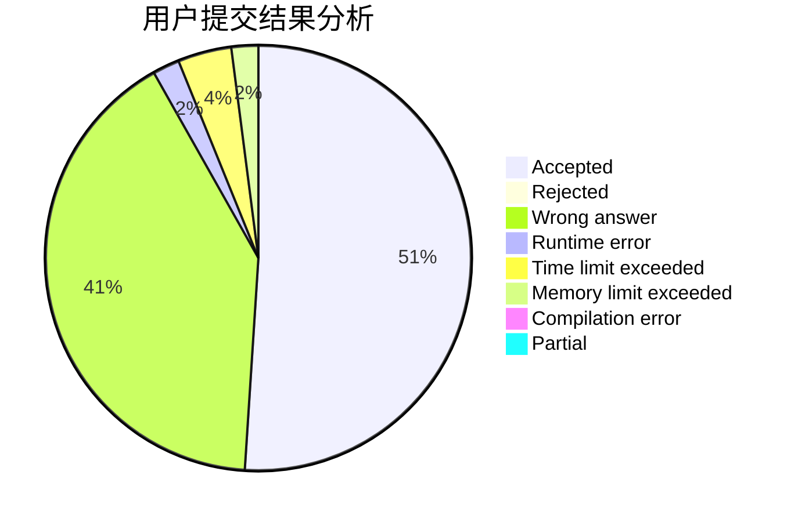
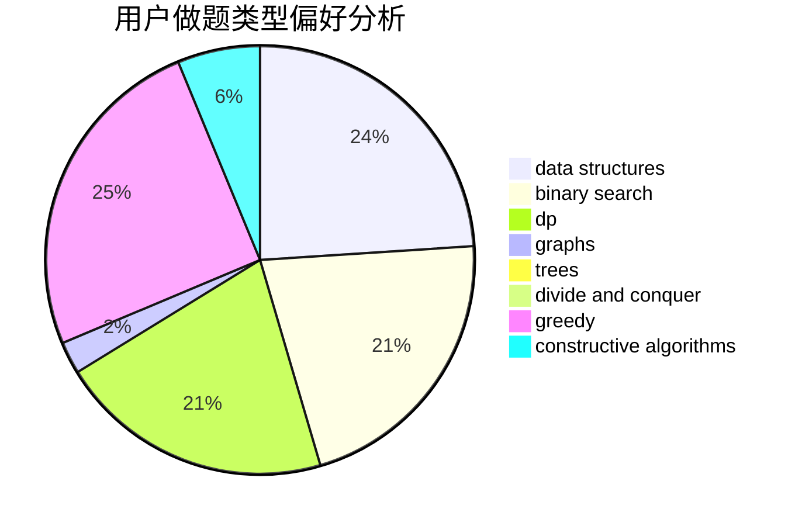

# Evrse
<!-- tabs:start -->
#### **用户提交结果分析**

#### **用户做题类型偏好分析**

#### **用户错题知识点分析**

<!-- tabs:end -->
# 推荐题目
[Balls of Buma](http://codeforces.com/problemset/problem/1267/B)		nan		  
[Multithreading (Easy Version)](http://codeforces.com/problemset/problem/1450/H1)		combinatorics,
                        fft,
                        math		  
[Azamon Web Services](http://codeforces.com/problemset/problem/1281/B)		greedy		  
[Fake NP](http://codeforces.com/problemset/problem/805/A)		greedy,
                        math		  
[Multicolored Markers](http://codeforces.com/problemset/problem/1029/F)		binary search,
                        brute force,
                        math,
                        number theory		  
[LCS Again](http://codeforces.com/problemset/problem/578/D)		dp,
                        greedy		  
[Elections](http://codeforces.com/problemset/problem/1043/A)		implementation,
                        math		  
[Konrad and Company Evaluation](http://codeforces.com/problemset/problem/1210/D)		graphs		  
[Cowslip Collections](http://codeforces.com/problemset/problem/645/F)		combinatorics,
                        math,
                        number theory		  
[Phone Numbers](http://codeforces.com/problemset/problem/1060/A)		brute force		  
<!-- tabs:start -->
#### **data structures**
[Balls of Buma](http://codeforces.com/problemset/problem/446/C)		data structures,
                        math,
                        number theory		  
[Multithreading (Easy Version)](http://codeforces.com/problemset/problem/1077/F2)		data structures,
                        dp		  
[Azamon Web Services](http://codeforces.com/problemset/problem/436/F)		brute force,
                        data structures,
                        dp		  
[Fake NP](http://codeforces.com/problemset/problem/1492/C)		binary search,
                        data structures,
                        dp,
                        greedy,
                        two pointers		  
[Multicolored Markers](http://codeforces.com/problemset/problem/1490/G)		binary search,
                        data structures,
                        math		  
[LCS Again](http://codeforces.com/problemset/problem/1479/D)		binary search,
                        bitmasks,
                        brute force,
                        data structures,
                        probabilities,
                        trees		  
[Elections](http://codeforces.com/problemset/problem/1497/A)		brute force,
                        data structures,
                        greedy,
                        sortings		  
[Konrad and Company Evaluation](http://codeforces.com/problemset/problem/1491/C)		brute force,
                        data structures,
                        dp,
                        greedy,
                        implementation		  
[Cowslip Collections](http://codeforces.com/problemset/problem/1492/B)		data structures,
                        greedy,
                        math		  
[Phone Numbers](http://codeforces.com/problemset/problem/1436/E)		binary search,
                        data structures,
                        two pointers		  
#### **binary search**
[Balls of Buma](http://codeforces.com/problemset/problem/1029/F)		binary search,
                        brute force,
                        math,
                        number theory		  
[Multithreading (Easy Version)](https://codeforces.com/contest/737/problem/A)		binary search,
                        greedy,
                        sortings		  
[Azamon Web Services](http://codeforces.com/problemset/problem/1285/F)		binary search,
                        combinatorics,
                        number theory		  
[Fake NP](http://codeforces.com/problemset/problem/1500/B)		binary search,
                        brute force,
                        chinese remainder theorem,
                        math,
                        number theory		  
[Multicolored Markers](http://codeforces.com/problemset/problem/1492/C)		binary search,
                        data structures,
                        dp,
                        greedy,
                        two pointers		  
[LCS Again](http://codeforces.com/problemset/problem/1463/D)		binary search,
                        constructive algorithms,
                        greedy,
                        two pointers		  
[Elections](http://codeforces.com/problemset/problem/1490/G)		binary search,
                        data structures,
                        math		  
[Konrad and Company Evaluation](http://codeforces.com/problemset/problem/1479/D)		binary search,
                        bitmasks,
                        brute force,
                        data structures,
                        probabilities,
                        trees		  
[Cowslip Collections](http://codeforces.com/problemset/problem/1436/E)		binary search,
                        data structures,
                        two pointers		  
[Phone Numbers](http://codeforces.com/problemset/problem/1461/D)		binary search,
                        brute force,
                        data structures,
                        divide and conquer,
                        implementation,
                        sortings		  
#### **dp**
[Balls of Buma](http://codeforces.com/problemset/problem/578/D)		dp,
                        greedy		  
[Multithreading (Easy Version)](https://codeforces.com/contest/1173/problem/E2)		dp,
                        probabilities		  
[Azamon Web Services](http://codeforces.com/problemset/problem/1077/F2)		data structures,
                        dp		  
[Fake NP](http://codeforces.com/problemset/problem/238/E)		dp,
                        graphs,
                        shortest paths		  
[Multicolored Markers](http://codeforces.com/problemset/problem/838/E)		dp		  
[LCS Again](http://codeforces.com/problemset/problem/436/F)		brute force,
                        data structures,
                        dp		  
[Elections](http://codeforces.com/problemset/problem/838/C)		dp,
                        games		  
[Konrad and Company Evaluation](http://codeforces.com/problemset/problem/747/D)		dp,
                        greedy,
                        sortings		  
[Cowslip Collections](http://codeforces.com/problemset/problem/1492/C)		binary search,
                        data structures,
                        dp,
                        greedy,
                        two pointers		  
[Phone Numbers](https://codeforces.com/contest/1457/problem/C)		brute force,
                        dp,
                        implementation		  
#### **graph**
[Balls of Buma](http://codeforces.com/problemset/problem/1210/D)		graphs		  
[Multithreading (Easy Version)](http://codeforces.com/problemset/problem/466/E)		dfs and similar,
                        dsu,
                        graphs,
                        trees		  
[Azamon Web Services](http://codeforces.com/problemset/problem/238/E)		dp,
                        graphs,
                        shortest paths		  
[Fake NP](http://codeforces.com/problemset/problem/1000/E)		dfs and similar,
                        graphs,
                        trees		  
[Multicolored Markers](http://codeforces.com/problemset/problem/118/E)		dfs and similar,
                        graphs		  
[LCS Again](http://codeforces.com/problemset/problem/1487/C)		brute force,
                        constructive algorithms,
                        dfs and similar,
                        graphs,
                        greedy,
                        implementation,
                        math		  
[Elections](http://codeforces.com/problemset/problem/1437/C)		dp,
                        flows,
                        graph matchings,
                        greedy,
                        math,
                        sortings		  
[Konrad and Company Evaluation](http://codeforces.com/problemset/problem/1470/D)		constructive algorithms,
                        dfs and similar,
                        graph matchings,
                        graphs,
                        greedy		  
[Cowslip Collections](http://codeforces.com/problemset/problem/1476/C)		dp,
                        graphs,
                        greedy		  
[Phone Numbers](http://codeforces.com/problemset/problem/1304/D)		constructive algorithms,
                        graphs,
                        greedy,
                        two pointers		  
#### **trees**
[Balls of Buma](http://codeforces.com/problemset/problem/429/A)		dfs and similar,
                        trees		  
[Multithreading (Easy Version)](http://codeforces.com/problemset/problem/466/E)		dfs and similar,
                        dsu,
                        graphs,
                        trees		  
[Azamon Web Services](http://codeforces.com/problemset/problem/1000/E)		dfs and similar,
                        graphs,
                        trees		  
[Fake NP](http://codeforces.com/problemset/problem/1479/D)		binary search,
                        bitmasks,
                        brute force,
                        data structures,
                        probabilities,
                        trees		  
[Multicolored Markers](http://codeforces.com/problemset/problem/1511/C)		brute force,
                        data structures,
                        implementation,
                        trees		  
[LCS Again](http://codeforces.com/problemset/problem/1499/F)		combinatorics,
                        dfs and similar,
                        dp,
                        trees		  
[Elections](http://codeforces.com/problemset/problem/1491/E)		brute force,
                        dfs and similar,
                        divide and conquer,
                        number theory,
                        trees		  
[Konrad and Company Evaluation](http://codeforces.com/problemset/problem/1466/D)		data structures,
                        greedy,
                        sortings,
                        trees		  
[Cowslip Collections](http://codeforces.com/problemset/problem/1495/D)		combinatorics,
                        dfs and similar,
                        graphs,
                        math,
                        shortest paths,
                        trees		  
[Phone Numbers](http://codeforces.com/problemset/problem/1303/G)		data structures,
                        divide and conquer,
                        geometry,
                        trees		  
#### **divide and conquer**
[Balls of Buma](http://codeforces.com/problemset/problem/1461/D)		binary search,
                        brute force,
                        data structures,
                        divide and conquer,
                        implementation,
                        sortings		  
[Multithreading (Easy Version)](http://codeforces.com/problemset/problem/1466/G)		combinatorics,
                        divide and conquer,
                        hashing,
                        math,
                        string suffix structures,
                        strings		  
[Azamon Web Services](http://codeforces.com/problemset/problem/1490/D)		dfs and similar,
                        divide and conquer,
                        implementation		  
[Fake NP](https://codeforces.com/contest/1483/problem/C)		data structures,
                        divide and conquer,
                        dp		  
[Multicolored Markers](http://codeforces.com/problemset/problem/1491/E)		brute force,
                        dfs and similar,
                        divide and conquer,
                        number theory,
                        trees		  
[LCS Again](http://codeforces.com/problemset/problem/1303/G)		data structures,
                        divide and conquer,
                        geometry,
                        trees		  
[Elections](http://codeforces.com/problemset/problem/1494/D)		constructive algorithms,
                        data structures,
                        dfs and similar,
                        divide and conquer,
                        dsu,
                        greedy,
                        sortings,
                        trees		  
[Konrad and Company Evaluation](http://codeforces.com/problemset/problem/1482/E)		data structures,
                        divide and conquer,
                        dp		  
[Cowslip Collections](http://codeforces.com/problemset/problem/566/C)		dfs and similar,
                        divide and conquer,
                        trees		  
[Phone Numbers](http://codeforces.com/problemset/problem/1428/F)		binary search,
                        data structures,
                        divide and conquer,
                        dp,
                        two pointers		  
#### **greedy**
[Balls of Buma](http://codeforces.com/problemset/problem/1281/B)		greedy		  
[Multithreading (Easy Version)](http://codeforces.com/problemset/problem/805/A)		greedy,
                        math		  
[Azamon Web Services](http://codeforces.com/problemset/problem/578/D)		dp,
                        greedy		  
[Fake NP](http://codeforces.com/problemset/problem/405/A)		greedy,
                        implementation,
                        sortings		  
[Multicolored Markers](http://codeforces.com/problemset/problem/743/A)		constructive algorithms,
                        greedy,
                        implementation		  
[LCS Again](https://codeforces.com/contest/737/problem/A)		binary search,
                        greedy,
                        sortings		  
[Elections](http://codeforces.com/problemset/problem/1119/C)		constructive algorithms,
                        greedy,
                        implementation,
                        math		  
[Konrad and Company Evaluation](http://codeforces.com/problemset/problem/388/A)		greedy,
                        sortings		  
[Cowslip Collections](http://codeforces.com/problemset/problem/1097/C)		greedy,
                        implementation		  
[Phone Numbers](http://codeforces.com/problemset/problem/747/D)		dp,
                        greedy,
                        sortings		  
#### **constructive algorithms**
[Balls of Buma](http://codeforces.com/problemset/problem/743/A)		constructive algorithms,
                        greedy,
                        implementation		  
[Multithreading (Easy Version)](http://codeforces.com/problemset/problem/1078/E)		constructive algorithms		  
[Azamon Web Services](http://codeforces.com/problemset/problem/763/B)		constructive algorithms,
                        geometry		  
[Fake NP](http://codeforces.com/problemset/problem/1446/E)		constructive algorithms,
                        dfs and similar		  
[Multicolored Markers](http://codeforces.com/problemset/problem/1119/C)		constructive algorithms,
                        greedy,
                        implementation,
                        math		  
[LCS Again](http://codeforces.com/problemset/problem/193/C)		constructive algorithms,
                        greedy,
                        math,
                        matrices		  
[Elections](http://codeforces.com/problemset/problem/613/C)		constructive algorithms,
                        math		  
[Konrad and Company Evaluation](http://codeforces.com/problemset/problem/1493/A)		constructive algorithms,
                        greedy		  
[Cowslip Collections](http://codeforces.com/problemset/problem/1463/D)		binary search,
                        constructive algorithms,
                        greedy,
                        two pointers		  
[Phone Numbers](https://codeforces.com/contest/1456/problem/B)		bitmasks,
                        brute force,
                        constructive algorithms		  
#### **sortings**
[Balls of Buma](http://codeforces.com/problemset/problem/405/A)		greedy,
                        implementation,
                        sortings		  
[Multithreading (Easy Version)](https://codeforces.com/contest/737/problem/A)		binary search,
                        greedy,
                        sortings		  
[Azamon Web Services](http://codeforces.com/problemset/problem/388/A)		greedy,
                        sortings		  
[Fake NP](http://codeforces.com/problemset/problem/747/D)		dp,
                        greedy,
                        sortings		  
[Multicolored Markers](https://codeforces.com/contest/1496/problem/C)		geometry,
                        greedy,
                        math,
                        sortings		  
[LCS Again](http://codeforces.com/problemset/problem/1495/A)		geometry,
                        greedy,
                        math,
                        sortings		  
[Elections](http://codeforces.com/problemset/problem/1497/A)		brute force,
                        data structures,
                        greedy,
                        sortings		  
[Konrad and Company Evaluation](http://codeforces.com/problemset/problem/1427/A)		math,
                        sortings		  
[Cowslip Collections](http://codeforces.com/problemset/problem/1461/D)		binary search,
                        brute force,
                        data structures,
                        divide and conquer,
                        implementation,
                        sortings		  
[Phone Numbers](http://codeforces.com/problemset/problem/1437/C)		dp,
                        flows,
                        graph matchings,
                        greedy,
                        math,
                        sortings		  
<!-- tabs:end -->
