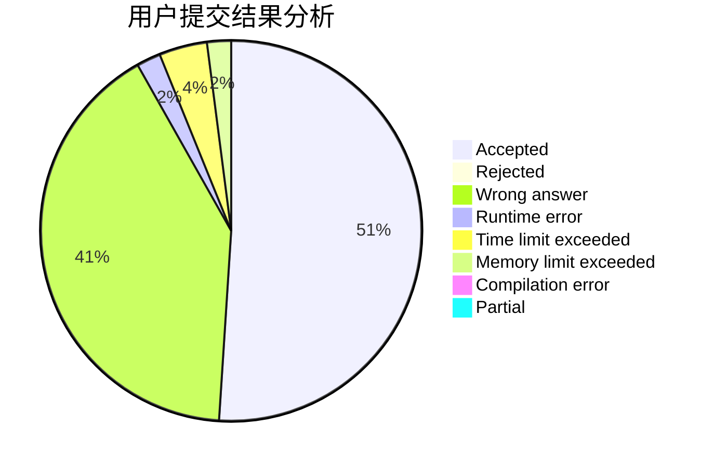
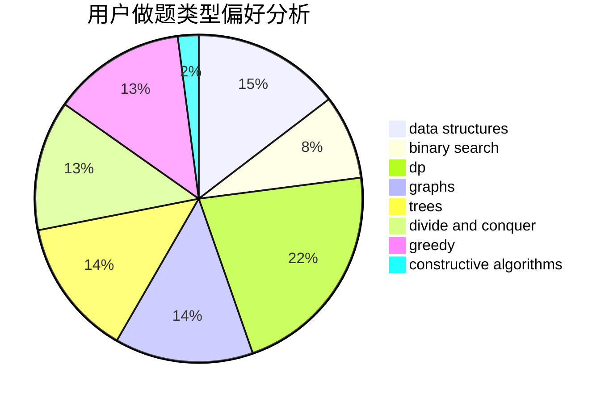

# Evrse

<!-- tabs:start -->

#### **用户提交结果分析**

#### **用户做题类型偏好分析**

#### **用户错题知识点分析**

<!-- tabs:end -->
# 推荐题目
[1272E](https://codeforces.com/contest/1272/problem/E)		dfs and similar,
                        graphs,
                        shortest paths		  
[1459E](https://codeforces.com/contest/1459/problem/E)		dsu,graphs,sortings,trees		  
[1287B](https://codeforces.com/contest/1287/problem/B)		brute force,
                        data structures,
                        implementation		  
[821B](https://codeforces.com/contest/821/problem/B)		brute force,
                        math		  
[59A](https://codeforces.com/contest/59/problem/A)		implementation,
                        strings		  
[466D](https://codeforces.com/contest/466/problem/D)		combinatorics,
                        dp		  
[672B](https://codeforces.com/contest/672/problem/B)		constructive algorithms,
                        implementation,
                        strings		  
[1078C](https://codeforces.com/contest/1078/problem/C)		dsu,graphs,sortings,trees		  
[1030A](https://codeforces.com/contest/1030/problem/A)		implementation		  
[767A](https://codeforces.com/contest/767/problem/A)		data structures,
                        implementation		  
