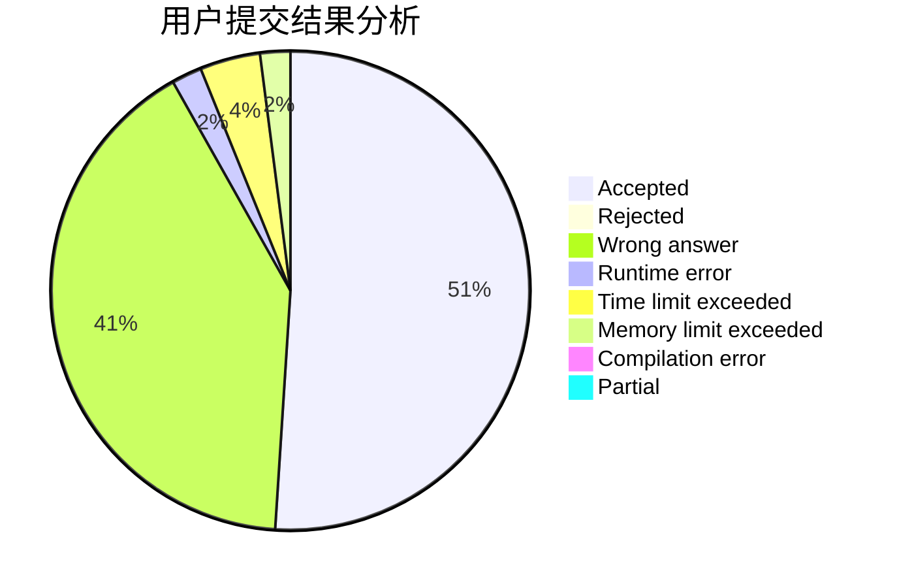
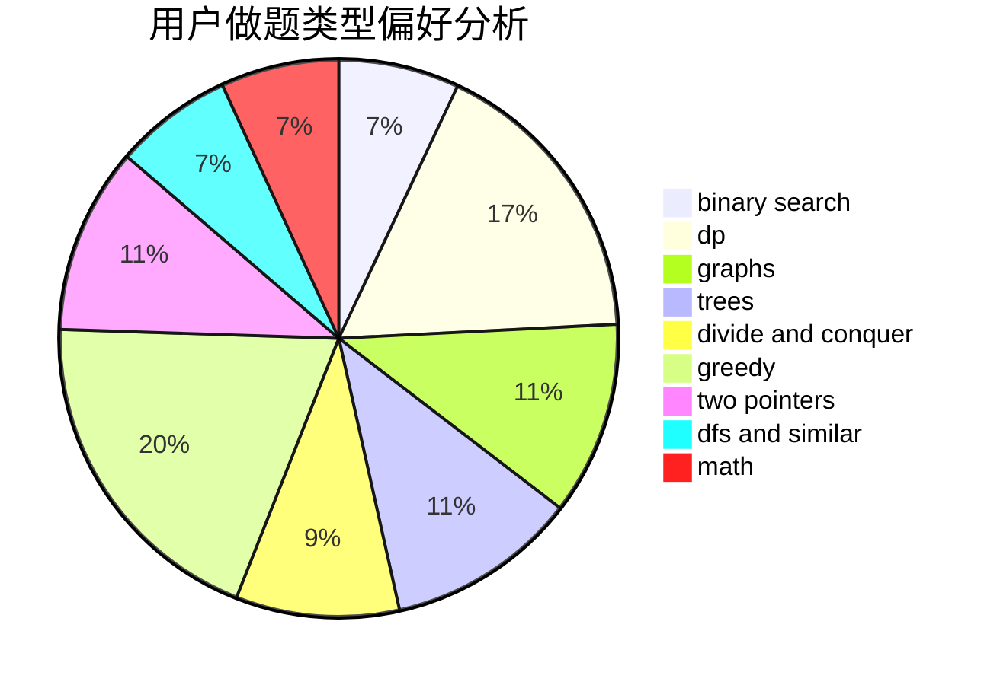

# Evrse

<!-- tabs:start -->

#### **用户提交结果分析**

#### **用户做题类型偏好分析**

<!-- tabs:end -->
# 推荐题目
[1272E](https://codeforces.com/contest/1272/problem/E)
[1459E](https://codeforces.com/contest/1459/problem/E)
[1287B](https://codeforces.com/contest/1287/problem/B)
[821B](https://codeforces.com/contest/821/problem/B)
[59A](https://codeforces.com/contest/59/problem/A)
[466D](https://codeforces.com/contest/466/problem/D)
[672B](https://codeforces.com/contest/672/problem/B)
[1078C](https://codeforces.com/contest/1078/problem/C)
[1030A](https://codeforces.com/contest/1030/problem/A)
[767A](https://codeforces.com/contest/767/problem/A)
