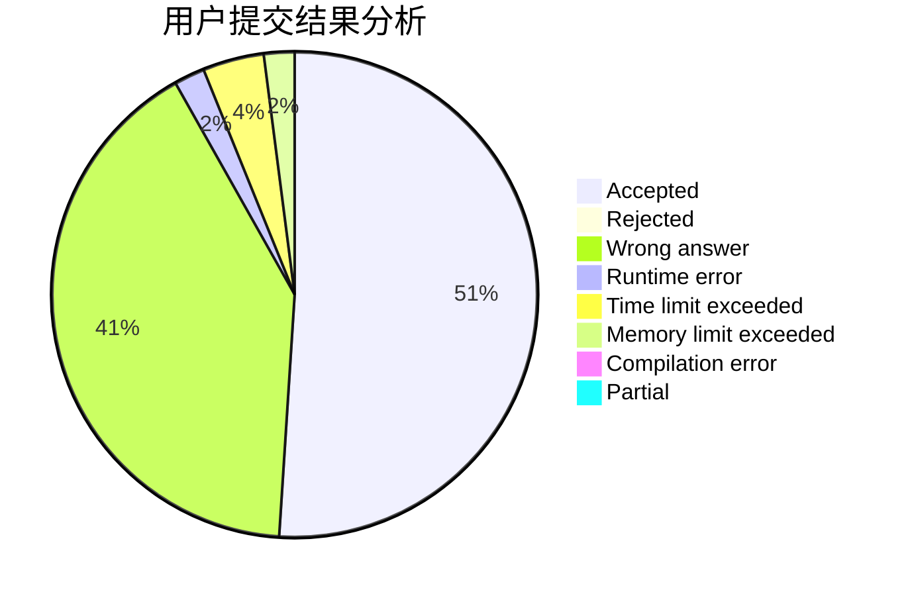
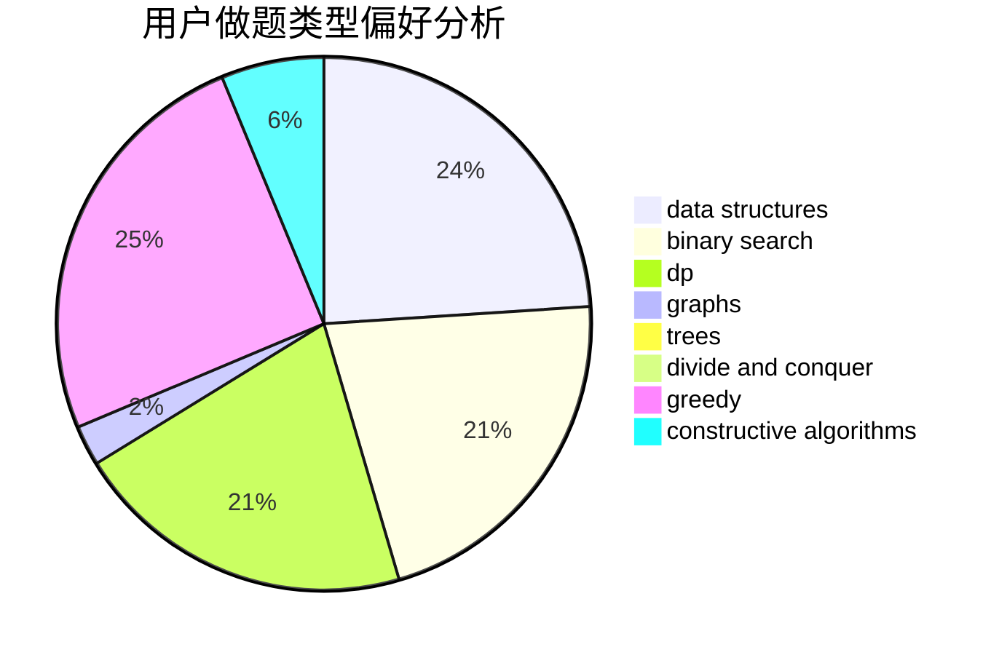

# Evrse

<!-- tabs:start -->

#### **用户提交结果分析**

#### **用户做题类型偏好分析**

#### **用户错题知识点分析**

<!-- tabs:end -->
# 推荐题目
[1267B](https://codeforces.com/contest/1267/problem/B)		nan		  
[1450H1](https://codeforces.com/contest/1450H/problem/1)		combinatorics,
                        fft,
                        math		  
[1281B](https://codeforces.com/contest/1281/problem/B)		greedy		  
[805A](https://codeforces.com/contest/805/problem/A)		greedy,
                        math		  
[578D](https://codeforces.com/contest/578/problem/D)		dp,
                        greedy		  
[446C](https://codeforces.com/contest/446/problem/C)		data structures,
                        math,
                        number theory		  
[645F](https://codeforces.com/contest/645/problem/F)		combinatorics,
                        math,
                        number theory		  
[1077F2](https://codeforces.com/contest/1077F/problem/2)		data structures,
                        dp		  
[1029F](https://codeforces.com/contest/1029/problem/F)		binary search,
                        brute force,
                        math,
                        number theory		  
[747D](https://codeforces.com/contest/747/problem/D)		dp,
                        greedy,
                        sortings		  
