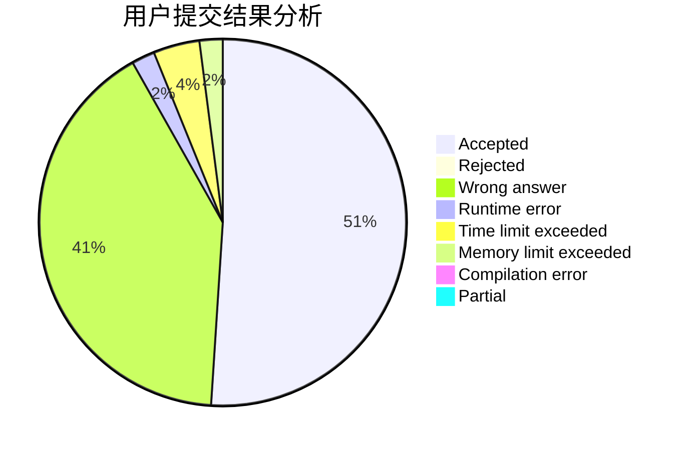
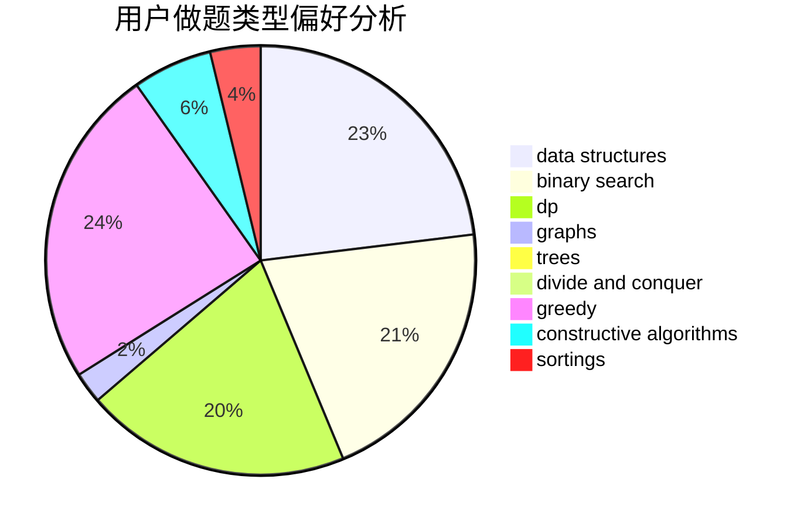

# Evrse
<!-- tabs:start -->
#### **用户提交结果分析**

#### **用户做题类型偏好分析**

#### **用户错题知识点分析**

<!-- tabs:end -->
# 推荐题目
[1267B](http://codeforces.com/problemset/problem/1267/B)		nan		  
[1450H1](http://codeforces.com/problemset/problem/1450/H1)		combinatorics,
                        fft,
                        math		  
[1281B](http://codeforces.com/problemset/problem/1281/B)		greedy		  
[805A](http://codeforces.com/problemset/problem/805/A)		greedy,
                        math		  
[1029F](http://codeforces.com/problemset/problem/1029/F)		binary search,
                        brute force,
                        math,
                        number theory		  
[578D](http://codeforces.com/problemset/problem/578/D)		dp,
                        greedy		  
[1043A](http://codeforces.com/problemset/problem/1043/A)		implementation,
                        math		  
[1210D](http://codeforces.com/problemset/problem/1210/D)		graphs		  
[645F](http://codeforces.com/problemset/problem/645/F)		combinatorics,
                        math,
                        number theory		  
[1060A](http://codeforces.com/problemset/problem/1060/A)		brute force		  
<!-- tabs:start -->
#### **data structures**
[446C](http://codeforces.com/problemset/problem/446/C)		data structures,
                        math,
                        number theory		  
[1077F2](http://codeforces.com/problemset/problem/1077/F2)		data structures,
                        dp		  
[436F](http://codeforces.com/problemset/problem/436/F)		brute force,
                        data structures,
                        dp		  
[1492C](http://codeforces.com/problemset/problem/1492/C)		binary search,
                        data structures,
                        dp,
                        greedy,
                        two pointers		  
[1490G](http://codeforces.com/problemset/problem/1490/G)		binary search,
                        data structures,
                        math		  
[1479D](http://codeforces.com/problemset/problem/1479/D)		binary search,
                        bitmasks,
                        brute force,
                        data structures,
                        probabilities,
                        trees		  
[1497A](http://codeforces.com/problemset/problem/1497/A)		brute force,
                        data structures,
                        greedy,
                        sortings		  
[1491C](http://codeforces.com/problemset/problem/1491/C)		brute force,
                        data structures,
                        dp,
                        greedy,
                        implementation		  
[1492B](http://codeforces.com/problemset/problem/1492/B)		data structures,
                        greedy,
                        math		  
[1436E](http://codeforces.com/problemset/problem/1436/E)		binary search,
                        data structures,
                        two pointers		  
#### **binary search**
[1029F](http://codeforces.com/problemset/problem/1029/F)		binary search,
                        brute force,
                        math,
                        number theory		  
[737A](https://codeforces.com/contest/737/problem/A)		binary search,
                        greedy,
                        sortings		  
[1285F](http://codeforces.com/problemset/problem/1285/F)		binary search,
                        combinatorics,
                        number theory		  
[1500B](http://codeforces.com/problemset/problem/1500/B)		binary search,
                        brute force,
                        chinese remainder theorem,
                        math,
                        number theory		  
[1492C](http://codeforces.com/problemset/problem/1492/C)		binary search,
                        data structures,
                        dp,
                        greedy,
                        two pointers		  
[1463D](http://codeforces.com/problemset/problem/1463/D)		binary search,
                        constructive algorithms,
                        greedy,
                        two pointers		  
[1490G](http://codeforces.com/problemset/problem/1490/G)		binary search,
                        data structures,
                        math		  
[1479D](http://codeforces.com/problemset/problem/1479/D)		binary search,
                        bitmasks,
                        brute force,
                        data structures,
                        probabilities,
                        trees		  
[1436E](http://codeforces.com/problemset/problem/1436/E)		binary search,
                        data structures,
                        two pointers		  
[1461D](http://codeforces.com/problemset/problem/1461/D)		binary search,
                        brute force,
                        data structures,
                        divide and conquer,
                        implementation,
                        sortings		  
#### **dp**
[578D](http://codeforces.com/problemset/problem/578/D)		dp,
                        greedy		  
[1173E2](https://codeforces.com/contest/1173/problem/E2)		dp,
                        probabilities		  
[1077F2](http://codeforces.com/problemset/problem/1077/F2)		data structures,
                        dp		  
[238E](http://codeforces.com/problemset/problem/238/E)		dp,
                        graphs,
                        shortest paths		  
[838E](http://codeforces.com/problemset/problem/838/E)		dp		  
[436F](http://codeforces.com/problemset/problem/436/F)		brute force,
                        data structures,
                        dp		  
[838C](http://codeforces.com/problemset/problem/838/C)		dp,
                        games		  
[747D](http://codeforces.com/problemset/problem/747/D)		dp,
                        greedy,
                        sortings		  
[1492C](http://codeforces.com/problemset/problem/1492/C)		binary search,
                        data structures,
                        dp,
                        greedy,
                        two pointers		  
[1457C](https://codeforces.com/contest/1457/problem/C)		brute force,
                        dp,
                        implementation		  
#### **graph**
[1210D](http://codeforces.com/problemset/problem/1210/D)		graphs		  
[466E](http://codeforces.com/problemset/problem/466/E)		dfs and similar,
                        dsu,
                        graphs,
                        trees		  
[238E](http://codeforces.com/problemset/problem/238/E)		dp,
                        graphs,
                        shortest paths		  
[1000E](http://codeforces.com/problemset/problem/1000/E)		dfs and similar,
                        graphs,
                        trees		  
[118E](http://codeforces.com/problemset/problem/118/E)		dfs and similar,
                        graphs		  
[1487C](http://codeforces.com/problemset/problem/1487/C)		brute force,
                        constructive algorithms,
                        dfs and similar,
                        graphs,
                        greedy,
                        implementation,
                        math		  
[1437C](http://codeforces.com/problemset/problem/1437/C)		dp,
                        flows,
                        graph matchings,
                        greedy,
                        math,
                        sortings		  
[1470D](http://codeforces.com/problemset/problem/1470/D)		constructive algorithms,
                        dfs and similar,
                        graph matchings,
                        graphs,
                        greedy		  
[1476C](http://codeforces.com/problemset/problem/1476/C)		dp,
                        graphs,
                        greedy		  
[1304D](http://codeforces.com/problemset/problem/1304/D)		constructive algorithms,
                        graphs,
                        greedy,
                        two pointers		  
#### **trees**
[429A](http://codeforces.com/problemset/problem/429/A)		dfs and similar,
                        trees		  
[466E](http://codeforces.com/problemset/problem/466/E)		dfs and similar,
                        dsu,
                        graphs,
                        trees		  
[1000E](http://codeforces.com/problemset/problem/1000/E)		dfs and similar,
                        graphs,
                        trees		  
[1479D](http://codeforces.com/problemset/problem/1479/D)		binary search,
                        bitmasks,
                        brute force,
                        data structures,
                        probabilities,
                        trees		  
[1511C](http://codeforces.com/problemset/problem/1511/C)		brute force,
                        data structures,
                        implementation,
                        trees		  
[1499F](http://codeforces.com/problemset/problem/1499/F)		combinatorics,
                        dfs and similar,
                        dp,
                        trees		  
[1491E](http://codeforces.com/problemset/problem/1491/E)		brute force,
                        dfs and similar,
                        divide and conquer,
                        number theory,
                        trees		  
[1466D](http://codeforces.com/problemset/problem/1466/D)		data structures,
                        greedy,
                        sortings,
                        trees		  
[1495D](http://codeforces.com/problemset/problem/1495/D)		combinatorics,
                        dfs and similar,
                        graphs,
                        math,
                        shortest paths,
                        trees		  
[1303G](http://codeforces.com/problemset/problem/1303/G)		data structures,
                        divide and conquer,
                        geometry,
                        trees		  
#### **divide and conquer**
[1461D](http://codeforces.com/problemset/problem/1461/D)		binary search,
                        brute force,
                        data structures,
                        divide and conquer,
                        implementation,
                        sortings		  
[1466G](http://codeforces.com/problemset/problem/1466/G)		combinatorics,
                        divide and conquer,
                        hashing,
                        math,
                        string suffix structures,
                        strings		  
[1490D](http://codeforces.com/problemset/problem/1490/D)		dfs and similar,
                        divide and conquer,
                        implementation		  
[1483C](https://codeforces.com/contest/1483/problem/C)		data structures,
                        divide and conquer,
                        dp		  
[1491E](http://codeforces.com/problemset/problem/1491/E)		brute force,
                        dfs and similar,
                        divide and conquer,
                        number theory,
                        trees		  
[1303G](http://codeforces.com/problemset/problem/1303/G)		data structures,
                        divide and conquer,
                        geometry,
                        trees		  
[1494D](http://codeforces.com/problemset/problem/1494/D)		constructive algorithms,
                        data structures,
                        dfs and similar,
                        divide and conquer,
                        dsu,
                        greedy,
                        sortings,
                        trees		  
[1482E](http://codeforces.com/problemset/problem/1482/E)		data structures,
                        divide and conquer,
                        dp		  
[566C](http://codeforces.com/problemset/problem/566/C)		dfs and similar,
                        divide and conquer,
                        trees		  
[1428F](http://codeforces.com/problemset/problem/1428/F)		binary search,
                        data structures,
                        divide and conquer,
                        dp,
                        two pointers		  
#### **greedy**
[1281B](http://codeforces.com/problemset/problem/1281/B)		greedy		  
[805A](http://codeforces.com/problemset/problem/805/A)		greedy,
                        math		  
[578D](http://codeforces.com/problemset/problem/578/D)		dp,
                        greedy		  
[405A](http://codeforces.com/problemset/problem/405/A)		greedy,
                        implementation,
                        sortings		  
[743A](http://codeforces.com/problemset/problem/743/A)		constructive algorithms,
                        greedy,
                        implementation		  
[737A](https://codeforces.com/contest/737/problem/A)		binary search,
                        greedy,
                        sortings		  
[1119C](http://codeforces.com/problemset/problem/1119/C)		constructive algorithms,
                        greedy,
                        implementation,
                        math		  
[388A](http://codeforces.com/problemset/problem/388/A)		greedy,
                        sortings		  
[1097C](http://codeforces.com/problemset/problem/1097/C)		greedy,
                        implementation		  
[747D](http://codeforces.com/problemset/problem/747/D)		dp,
                        greedy,
                        sortings		  
#### **constructive algorithms**
[743A](http://codeforces.com/problemset/problem/743/A)		constructive algorithms,
                        greedy,
                        implementation		  
[1078E](http://codeforces.com/problemset/problem/1078/E)		constructive algorithms		  
[763B](http://codeforces.com/problemset/problem/763/B)		constructive algorithms,
                        geometry		  
[1446E](http://codeforces.com/problemset/problem/1446/E)		constructive algorithms,
                        dfs and similar		  
[1119C](http://codeforces.com/problemset/problem/1119/C)		constructive algorithms,
                        greedy,
                        implementation,
                        math		  
[193C](http://codeforces.com/problemset/problem/193/C)		constructive algorithms,
                        greedy,
                        math,
                        matrices		  
[613C](http://codeforces.com/problemset/problem/613/C)		constructive algorithms,
                        math		  
[1493A](http://codeforces.com/problemset/problem/1493/A)		constructive algorithms,
                        greedy		  
[1463D](http://codeforces.com/problemset/problem/1463/D)		binary search,
                        constructive algorithms,
                        greedy,
                        two pointers		  
[1456B](https://codeforces.com/contest/1456/problem/B)		bitmasks,
                        brute force,
                        constructive algorithms		  
#### **sortings**
[405A](http://codeforces.com/problemset/problem/405/A)		greedy,
                        implementation,
                        sortings		  
[737A](https://codeforces.com/contest/737/problem/A)		binary search,
                        greedy,
                        sortings		  
[388A](http://codeforces.com/problemset/problem/388/A)		greedy,
                        sortings		  
[747D](http://codeforces.com/problemset/problem/747/D)		dp,
                        greedy,
                        sortings		  
[1496C](https://codeforces.com/contest/1496/problem/C)		geometry,
                        greedy,
                        math,
                        sortings		  
[1495A](http://codeforces.com/problemset/problem/1495/A)		geometry,
                        greedy,
                        math,
                        sortings		  
[1497A](http://codeforces.com/problemset/problem/1497/A)		brute force,
                        data structures,
                        greedy,
                        sortings		  
[1427A](http://codeforces.com/problemset/problem/1427/A)		math,
                        sortings		  
[1461D](http://codeforces.com/problemset/problem/1461/D)		binary search,
                        brute force,
                        data structures,
                        divide and conquer,
                        implementation,
                        sortings		  
[1437C](http://codeforces.com/problemset/problem/1437/C)		dp,
                        flows,
                        graph matchings,
                        greedy,
                        math,
                        sortings		  
<!-- tabs:end -->
