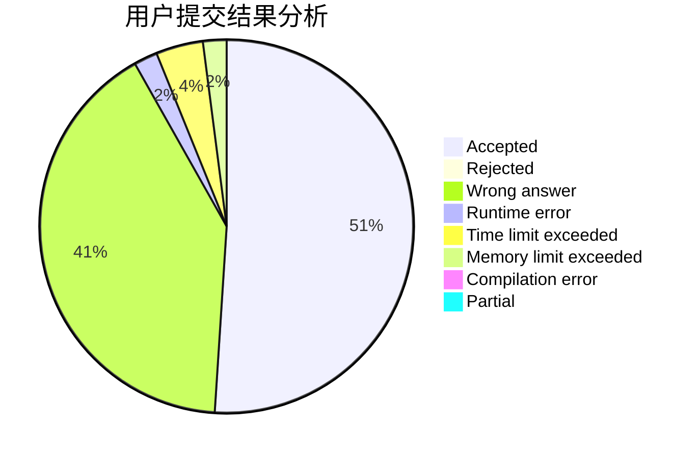
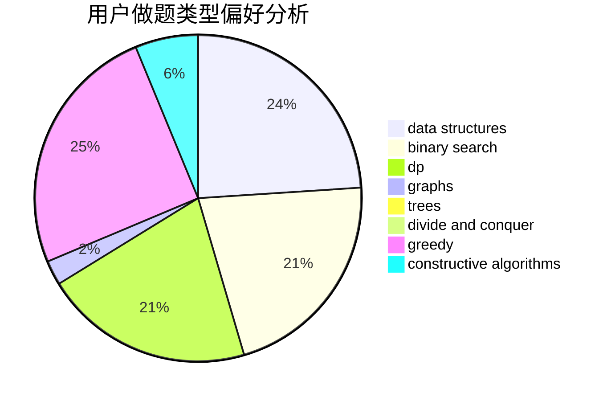

# Evrse
<!-- tabs:start -->
#### **用户提交结果分析**

#### **用户做题类型偏好分析**

#### **用户错题知识点分析**

<!-- tabs:end -->
# 推荐题目
[Balls of Buma](http://codeforces.com/problemset/problem/1267/B)		nan		  
[Multithreading (Easy Version)](http://codeforces.com/problemset/problem/1450/H1)		combinatorics,
                        fft,
                        math		  
[Azamon Web Services](http://codeforces.com/problemset/problem/1281/B)		greedy		  
[Fake NP](http://codeforces.com/problemset/problem/805/A)		greedy,
                        math		  
[Multicolored Markers](http://codeforces.com/problemset/problem/1029/F)		binary search,
                        brute force,
                        math,
                        number theory		  
[LCS Again](http://codeforces.com/problemset/problem/578/D)		dp,
                        greedy		  
[Elections](http://codeforces.com/problemset/problem/1043/A)		implementation,
                        math		  
[Konrad and Company Evaluation](http://codeforces.com/problemset/problem/1210/D)		graphs		  
[Cowslip Collections](http://codeforces.com/problemset/problem/645/F)		combinatorics,
                        math,
                        number theory		  
[Phone Numbers](http://codeforces.com/problemset/problem/1060/A)		brute force		  
<!-- tabs:start -->
#### **data structures**
[DZY Loves Fibonacci Numbers](http://codeforces.com/problemset/problem/446/C)		data structures,
                        math,
                        number theory		  
[Pictures with Kittens (hard version)](http://codeforces.com/problemset/problem/1077/F2)		data structures,
                        dp		  
[Banners](http://codeforces.com/problemset/problem/436/F)		brute force,
                        data structures,
                        dp		  
[Maximum width](http://codeforces.com/problemset/problem/1492/C)		binary search,
                        data structures,
                        dp,
                        greedy,
                        two pointers		  
[Old Floppy Drive](http://codeforces.com/problemset/problem/1490/G)		binary search,
                        data structures,
                        math		  
[Odd Mineral Resource](http://codeforces.com/problemset/problem/1479/D)		binary search,
                        bitmasks,
                        brute force,
                        data structures,
                        probabilities,
                        trees		  
[Meximization](http://codeforces.com/problemset/problem/1497/A)		brute force,
                        data structures,
                        greedy,
                        sortings		  
[Pekora and Trampoline](http://codeforces.com/problemset/problem/1491/C)		brute force,
                        data structures,
                        dp,
                        greedy,
                        implementation		  
[Card Deck](http://codeforces.com/problemset/problem/1492/B)		data structures,
                        greedy,
                        math		  
[Complicated Computations](http://codeforces.com/problemset/problem/1436/E)		binary search,
                        data structures,
                        two pointers		  
#### **binary search**
[Multicolored Markers](http://codeforces.com/problemset/problem/1029/F)		binary search,
                        brute force,
                        math,
                        number theory		  
[Road to Cinema](https://codeforces.com/contest/737/problem/A)		binary search,
                        greedy,
                        sortings		  
[Classical?](http://codeforces.com/problemset/problem/1285/F)		binary search,
                        combinatorics,
                        number theory		  
[Two chandeliers](http://codeforces.com/problemset/problem/1500/B)		binary search,
                        brute force,
                        chinese remainder theorem,
                        math,
                        number theory		  
[Maximum width](http://codeforces.com/problemset/problem/1492/C)		binary search,
                        data structures,
                        dp,
                        greedy,
                        two pointers		  
[Pairs](http://codeforces.com/problemset/problem/1463/D)		binary search,
                        constructive algorithms,
                        greedy,
                        two pointers		  
[Old Floppy Drive](http://codeforces.com/problemset/problem/1490/G)		binary search,
                        data structures,
                        math		  
[Odd Mineral Resource](http://codeforces.com/problemset/problem/1479/D)		binary search,
                        bitmasks,
                        brute force,
                        data structures,
                        probabilities,
                        trees		  
[Complicated Computations](http://codeforces.com/problemset/problem/1436/E)		binary search,
                        data structures,
                        two pointers		  
[Divide and Summarize](http://codeforces.com/problemset/problem/1461/D)		binary search,
                        brute force,
                        data structures,
                        divide and conquer,
                        implementation,
                        sortings		  
#### **dp**
[LCS Again](http://codeforces.com/problemset/problem/578/D)		dp,
                        greedy		  
[Nauuo and Pictures (hard version)](https://codeforces.com/contest/1173/problem/E2)		dp,
                        probabilities		  
[Pictures with Kittens (hard version)](http://codeforces.com/problemset/problem/1077/F2)		data structures,
                        dp		  
[Meeting Her](http://codeforces.com/problemset/problem/238/E)		dp,
                        graphs,
                        shortest paths		  
[Convex Countour](http://codeforces.com/problemset/problem/838/E)		dp		  
[Banners](http://codeforces.com/problemset/problem/436/F)		brute force,
                        data structures,
                        dp		  
[Future Failure](http://codeforces.com/problemset/problem/838/C)		dp,
                        games		  
[Winter Is Coming](http://codeforces.com/problemset/problem/747/D)		dp,
                        greedy,
                        sortings		  
[Maximum width](http://codeforces.com/problemset/problem/1492/C)		binary search,
                        data structures,
                        dp,
                        greedy,
                        two pointers		  
[Bouncing Ball](https://codeforces.com/contest/1457/problem/C)		brute force,
                        dp,
                        implementation		  
#### **graph**
[Konrad and Company Evaluation](http://codeforces.com/problemset/problem/1210/D)		graphs		  
[Information Graph](http://codeforces.com/problemset/problem/466/E)		dfs and similar,
                        dsu,
                        graphs,
                        trees		  
[Meeting Her](http://codeforces.com/problemset/problem/238/E)		dp,
                        graphs,
                        shortest paths		  
[We Need More Bosses](http://codeforces.com/problemset/problem/1000/E)		dfs and similar,
                        graphs,
                        trees		  
[Bertown roads](http://codeforces.com/problemset/problem/118/E)		dfs and similar,
                        graphs		  
[Minimum Ties](http://codeforces.com/problemset/problem/1487/C)		brute force,
                        constructive algorithms,
                        dfs and similar,
                        graphs,
                        greedy,
                        implementation,
                        math		  
[Chef Monocarp](http://codeforces.com/problemset/problem/1437/C)		dp,
                        flows,
                        graph matchings,
                        greedy,
                        math,
                        sortings		  
[Strange Housing](http://codeforces.com/problemset/problem/1470/D)		constructive algorithms,
                        dfs and similar,
                        graph matchings,
                        graphs,
                        greedy		  
[Longest Simple Cycle](http://codeforces.com/problemset/problem/1476/C)		dp,
                        graphs,
                        greedy		  
[Shortest and Longest LIS](http://codeforces.com/problemset/problem/1304/D)		constructive algorithms,
                        graphs,
                        greedy,
                        two pointers		  
#### **trees**
[Xor-tree](http://codeforces.com/problemset/problem/429/A)		dfs and similar,
                        trees		  
[Information Graph](http://codeforces.com/problemset/problem/466/E)		dfs and similar,
                        dsu,
                        graphs,
                        trees		  
[We Need More Bosses](http://codeforces.com/problemset/problem/1000/E)		dfs and similar,
                        graphs,
                        trees		  
[Odd Mineral Resource](http://codeforces.com/problemset/problem/1479/D)		binary search,
                        bitmasks,
                        brute force,
                        data structures,
                        probabilities,
                        trees		  
[Yet Another Card Deck](http://codeforces.com/problemset/problem/1511/C)		brute force,
                        data structures,
                        implementation,
                        trees		  
[Diameter Cuts](http://codeforces.com/problemset/problem/1499/F)		combinatorics,
                        dfs and similar,
                        dp,
                        trees		  
[Fib-tree](http://codeforces.com/problemset/problem/1491/E)		brute force,
                        dfs and similar,
                        divide and conquer,
                        number theory,
                        trees		  
[13th Labour of Heracles](http://codeforces.com/problemset/problem/1466/D)		data structures,
                        greedy,
                        sortings,
                        trees		  
[BFS Trees](http://codeforces.com/problemset/problem/1495/D)		combinatorics,
                        dfs and similar,
                        graphs,
                        math,
                        shortest paths,
                        trees		  
[Sum of Prefix Sums](http://codeforces.com/problemset/problem/1303/G)		data structures,
                        divide and conquer,
                        geometry,
                        trees		  
#### **divide and conquer**
[Divide and Summarize](http://codeforces.com/problemset/problem/1461/D)		binary search,
                        brute force,
                        data structures,
                        divide and conquer,
                        implementation,
                        sortings		  
[Song of the Sirens](http://codeforces.com/problemset/problem/1466/G)		combinatorics,
                        divide and conquer,
                        hashing,
                        math,
                        string suffix structures,
                        strings		  
[Permutation Transformation](http://codeforces.com/problemset/problem/1490/D)		dfs and similar,
                        divide and conquer,
                        implementation		  
[Skyline Photo](https://codeforces.com/contest/1483/problem/C)		data structures,
                        divide and conquer,
                        dp		  
[Fib-tree](http://codeforces.com/problemset/problem/1491/E)		brute force,
                        dfs and similar,
                        divide and conquer,
                        number theory,
                        trees		  
[Sum of Prefix Sums](http://codeforces.com/problemset/problem/1303/G)		data structures,
                        divide and conquer,
                        geometry,
                        trees		  
[Dogeforces](http://codeforces.com/problemset/problem/1494/D)		constructive algorithms,
                        data structures,
                        dfs and similar,
                        divide and conquer,
                        dsu,
                        greedy,
                        sortings,
                        trees		  
[Logistical Questions](http://codeforces.com/problemset/problem/566/C)		dfs and similar,
                        divide and conquer,
                        trees		  
[Fruit Sequences](http://codeforces.com/problemset/problem/1428/F)		binary search,
                        data structures,
                        divide and conquer,
                        dp,
                        two pointers		  
[Dr. Evil Underscores](http://codeforces.com/problemset/problem/1285/D)		bitmasks,
                        brute force,
                        dfs and similar,
                        divide and conquer,
                        dp,
                        greedy,
                        strings,
                        trees		  
#### **greedy**
[Azamon Web Services](http://codeforces.com/problemset/problem/1281/B)		greedy		  
[Fake NP](http://codeforces.com/problemset/problem/805/A)		greedy,
                        math		  
[LCS Again](http://codeforces.com/problemset/problem/578/D)		dp,
                        greedy		  
[Gravity Flip](http://codeforces.com/problemset/problem/405/A)		greedy,
                        implementation,
                        sortings		  
[Vladik and flights](http://codeforces.com/problemset/problem/743/A)		constructive algorithms,
                        greedy,
                        implementation		  
[Road to Cinema](https://codeforces.com/contest/737/problem/A)		binary search,
                        greedy,
                        sortings		  
[Ramesses and Corner Inversion](http://codeforces.com/problemset/problem/1119/C)		constructive algorithms,
                        greedy,
                        implementation,
                        math		  
[Fox and Box Accumulation](http://codeforces.com/problemset/problem/388/A)		greedy,
                        sortings		  
[Yuhao and a Parenthesis](http://codeforces.com/problemset/problem/1097/C)		greedy,
                        implementation		  
[Winter Is Coming](http://codeforces.com/problemset/problem/747/D)		dp,
                        greedy,
                        sortings		  
#### **constructive algorithms**
[Vladik and flights](http://codeforces.com/problemset/problem/743/A)		constructive algorithms,
                        greedy,
                        implementation		  
[Negative Time Summation](http://codeforces.com/problemset/problem/1078/E)		constructive algorithms		  
[Timofey and rectangles](http://codeforces.com/problemset/problem/763/B)		constructive algorithms,
                        geometry		  
[Long Recovery](http://codeforces.com/problemset/problem/1446/E)		constructive algorithms,
                        dfs and similar		  
[Ramesses and Corner Inversion](http://codeforces.com/problemset/problem/1119/C)		constructive algorithms,
                        greedy,
                        implementation,
                        math		  
[Hamming Distance](http://codeforces.com/problemset/problem/193/C)		constructive algorithms,
                        greedy,
                        math,
                        matrices		  
[Necklace](http://codeforces.com/problemset/problem/613/C)		constructive algorithms,
                        math		  
[Anti-knapsack](http://codeforces.com/problemset/problem/1493/A)		constructive algorithms,
                        greedy		  
[Pairs](http://codeforces.com/problemset/problem/1463/D)		binary search,
                        constructive algorithms,
                        greedy,
                        two pointers		  
[XOR-gun](https://codeforces.com/contest/1456/problem/B)		bitmasks,
                        brute force,
                        constructive algorithms		  
#### **sortings**
[Gravity Flip](http://codeforces.com/problemset/problem/405/A)		greedy,
                        implementation,
                        sortings		  
[Road to Cinema](https://codeforces.com/contest/737/problem/A)		binary search,
                        greedy,
                        sortings		  
[Fox and Box Accumulation](http://codeforces.com/problemset/problem/388/A)		greedy,
                        sortings		  
[Winter Is Coming](http://codeforces.com/problemset/problem/747/D)		dp,
                        greedy,
                        sortings		  
[Diamond Miner](https://codeforces.com/contest/1496/problem/C)		geometry,
                        greedy,
                        math,
                        sortings		  
[Meximization](http://codeforces.com/problemset/problem/1497/A)		brute force,
                        data structures,
                        greedy,
                        sortings		  
[Avoiding Zero](http://codeforces.com/problemset/problem/1427/A)		math,
                        sortings		  
[Divide and Summarize](http://codeforces.com/problemset/problem/1461/D)		binary search,
                        brute force,
                        data structures,
                        divide and conquer,
                        implementation,
                        sortings		  
[Chef Monocarp](http://codeforces.com/problemset/problem/1437/C)		dp,
                        flows,
                        graph matchings,
                        greedy,
                        math,
                        sortings		  
[Replacing Elements](http://codeforces.com/problemset/problem/1473/A)		greedy,
                        implementation,
                        math,
                        sortings		  
<!-- tabs:end -->
