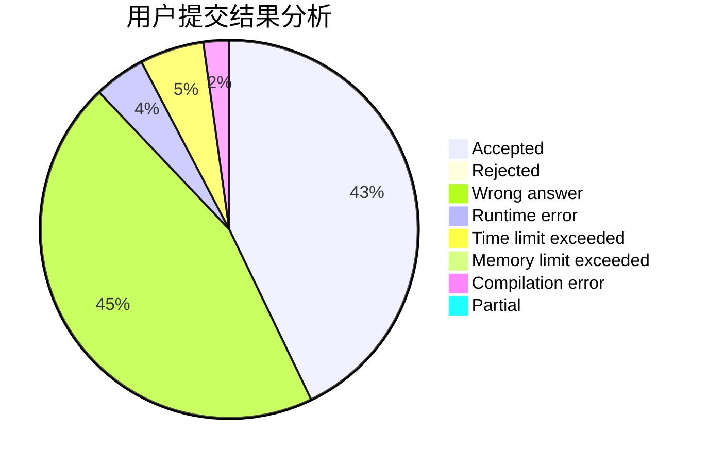
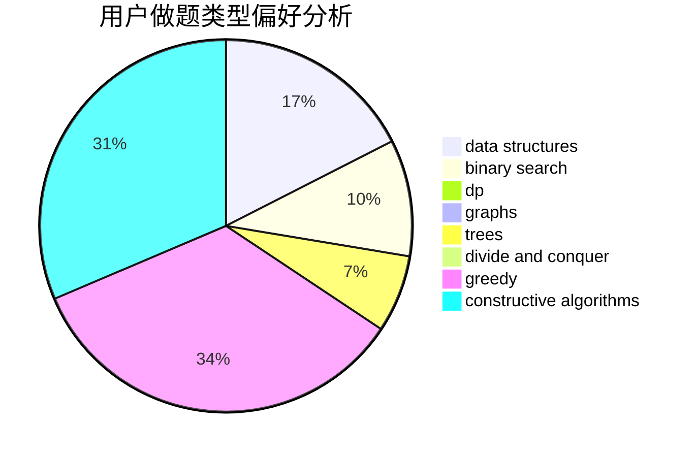
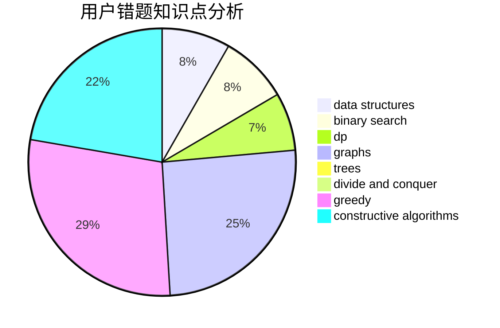

# ExtraDevil

<!-- tabs:start -->

#### **用户提交结果分析**

#### **用户做题类型偏好分析**

#### **用户错题知识点分析**

<!-- tabs:end -->
# 推荐题目
[466A](https://codeforces.com/contest/466/problem/A)		implementation		  
[1082F](https://codeforces.com/contest/1082/problem/F)		dp,
                        strings,
                        trees		  
[612C](https://codeforces.com/contest/612/problem/C)		data structures,
                        expression parsing,
                        math		  
[1401D](https://codeforces.com/contest/1401/problem/D)		dfs and similar,
                        dp,
                        greedy,
                        implementation,
                        math,
                        number theory,
                        sortings,
                        trees		  
[1012C](https://codeforces.com/contest/1012/problem/C)		dp		  
[839A](https://codeforces.com/contest/839/problem/A)		implementation		  
[364E](https://codeforces.com/contest/364/problem/E)		divide and conquer,
                        two pointers		  
[771D](https://codeforces.com/contest/771/problem/D)		dp		  
[838F](https://codeforces.com/contest/838/problem/F)		nan		  
[735D](https://codeforces.com/contest/735/problem/D)		math,
                        number theory		  
