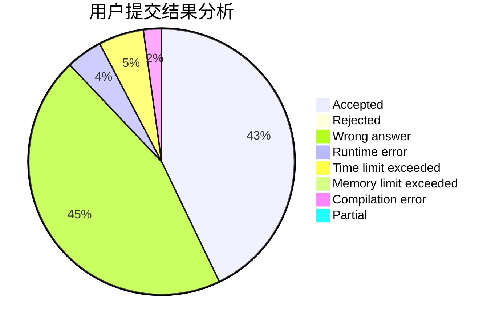
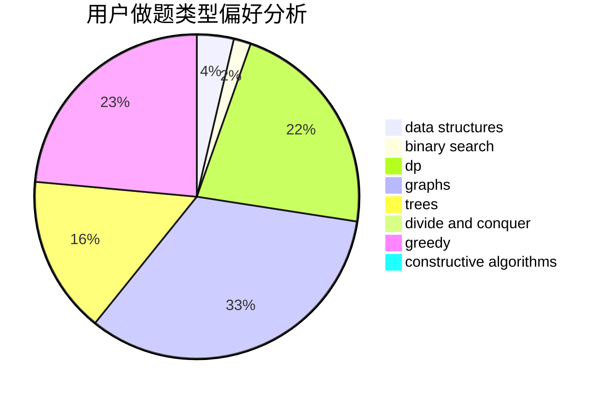
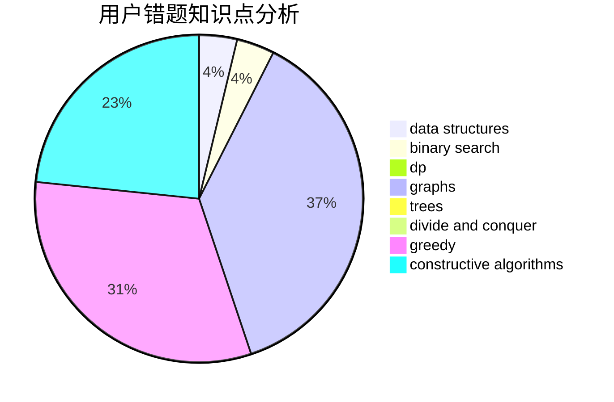

# ExtraDevil

<!-- tabs:start -->

#### **用户提交结果分析**

#### **用户做题类型偏好分析**

#### **用户错题知识点分析**

<!-- tabs:end -->
# 推荐题目
[485A](https://codeforces.com/contest/485/problem/A)		implementation,
                        math,
                        matrices		  
[1083B](https://codeforces.com/contest/1083/problem/B)		greedy,
                        strings		  
[631E](https://codeforces.com/contest/631/problem/E)		data structures,
                        dp,
                        geometry		  
[1411G](https://codeforces.com/contest/1411/problem/G)		bitmasks,
                        games,
                        math,
                        matrices		  
[1013A](https://codeforces.com/contest/1013/problem/A)		math		  
[858A](https://codeforces.com/contest/858/problem/A)		brute force,
                        math,
                        number theory		  
[392B](https://codeforces.com/contest/392/problem/B)		dp		  
[791C](https://codeforces.com/contest/791/problem/C)		dsu,graphs,sortings,trees		  
[856F](https://codeforces.com/contest/856/problem/F)		greedy		  
[757B](https://codeforces.com/contest/757/problem/B)		greedy,
                        math,
                        number theory		  
