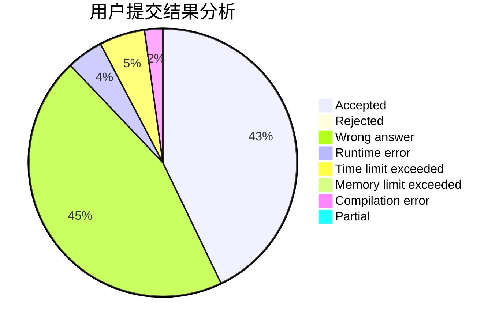
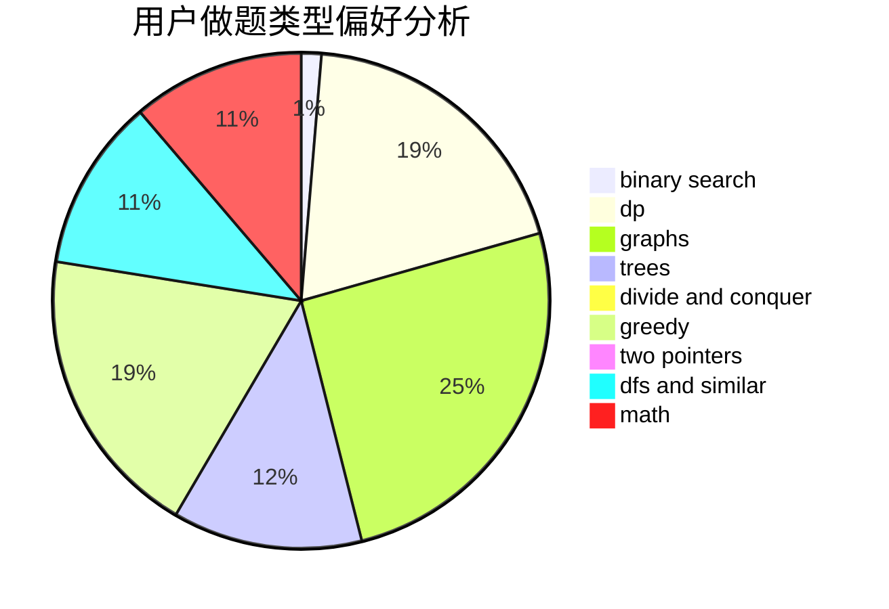

# ExtraDevil

<!-- tabs:start -->

#### **用户提交结果分析**

#### **用户做题类型偏好分析**

<!-- tabs:end -->
# 推荐题目
[485A](https://codeforces.com/contest/485/problem/A)
[1083B](https://codeforces.com/contest/1083/problem/B)
[631E](https://codeforces.com/contest/631/problem/E)
[1411G](https://codeforces.com/contest/1411/problem/G)
[1013A](https://codeforces.com/contest/1013/problem/A)
[858A](https://codeforces.com/contest/858/problem/A)
[392B](https://codeforces.com/contest/392/problem/B)
[791C](https://codeforces.com/contest/791/problem/C)
[856F](https://codeforces.com/contest/856/problem/F)
[757B](https://codeforces.com/contest/757/problem/B)
