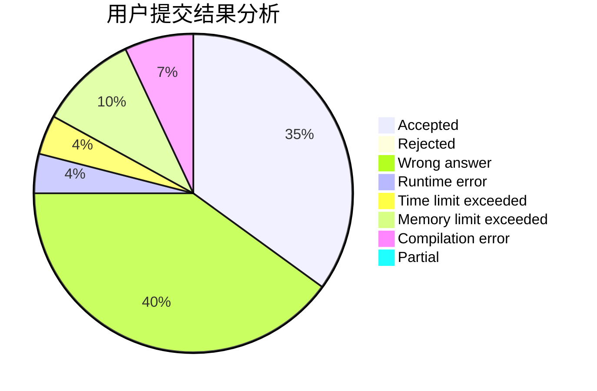
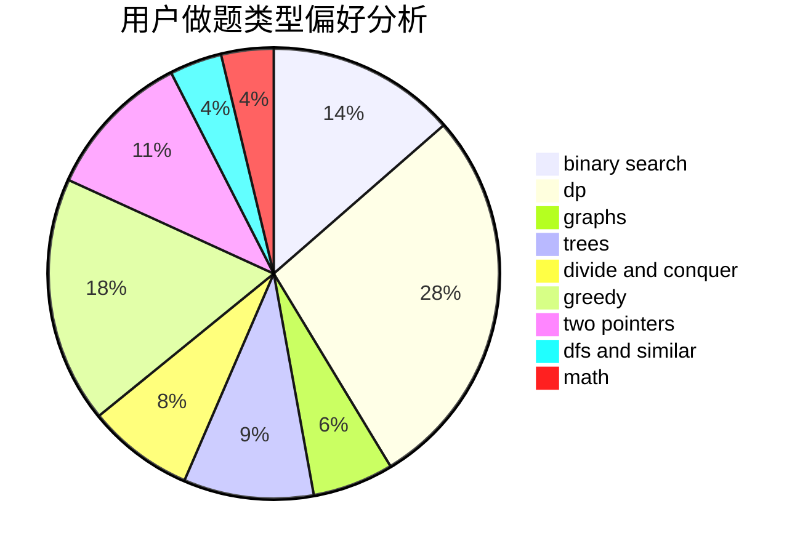

# Ez3qwq

<!-- tabs:start -->

#### **用户提交结果分析**

#### **用户做题类型偏好分析**

<!-- tabs:end -->
# 推荐题目
[1349B](https://codeforces.com/contest/1349/problem/B)
[1164M](https://codeforces.com/contest/1164/problem/M)
[246D](https://codeforces.com/contest/246/problem/D)
[464E](https://codeforces.com/contest/464/problem/E)
[1482D](https://codeforces.com/contest/1482/problem/D)
[705A](https://codeforces.com/contest/705/problem/A)
[514B](https://codeforces.com/contest/514/problem/B)
[1342F](https://codeforces.com/contest/1342/problem/F)
[1051D](https://codeforces.com/contest/1051/problem/D)
[254B](https://codeforces.com/contest/254/problem/B)
