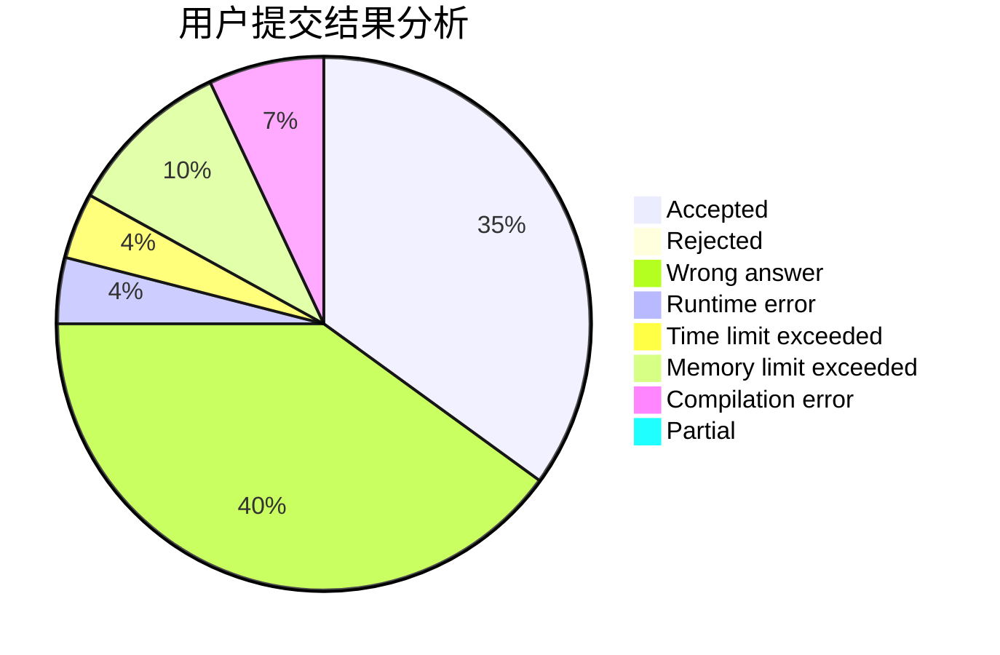
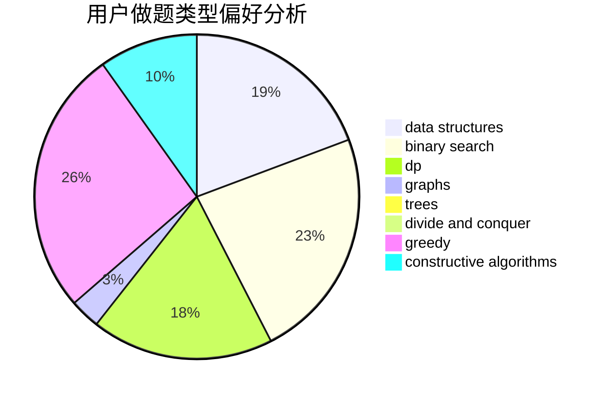
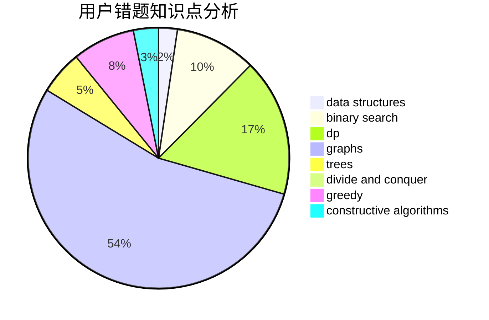

# Ez3qwq

<!-- tabs:start -->

#### **用户提交结果分析**

#### **用户做题类型偏好分析**

#### **用户错题知识点分析**

<!-- tabs:end -->
# 推荐题目
[1342D](https://codeforces.com/contest/1342/problem/D)		binary search,
                        constructive algorithms,
                        data structures,
                        greedy,
                        sortings,
                        two pointers		  
[1162E](https://codeforces.com/contest/1162/problem/E)		dsu,graphs,sortings,trees		  
[228D](https://codeforces.com/contest/228/problem/D)		data structures		  
[445A](https://codeforces.com/contest/445/problem/A)		dfs and similar,
                        implementation		  
[1473G](https://codeforces.com/contest/1473/problem/G)		combinatorics,
                        dp,
                        fft,
                        math		  
[681B](https://codeforces.com/contest/681/problem/B)		brute force		  
[494A](https://codeforces.com/contest/494/problem/A)		greedy		  
[1335E2](https://codeforces.com/contest/1335E/problem/2)		brute force,
                        data structures,
                        dp,
                        two pointers		  
[1051A](https://codeforces.com/contest/1051/problem/A)		greedy,
                        implementation,
                        strings		  
[232C](https://codeforces.com/contest/232/problem/C)		constructive algorithms,
                        divide and conquer,
                        dp,
                        graphs,
                        shortest paths		  
