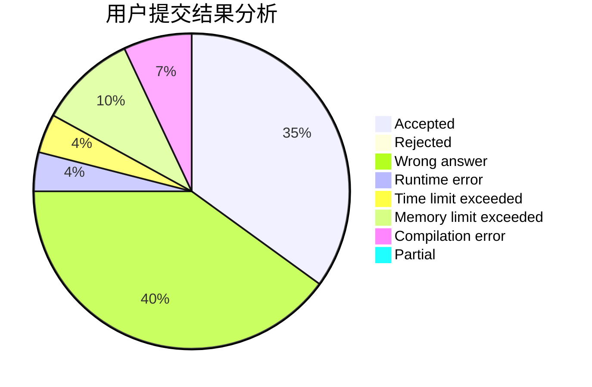
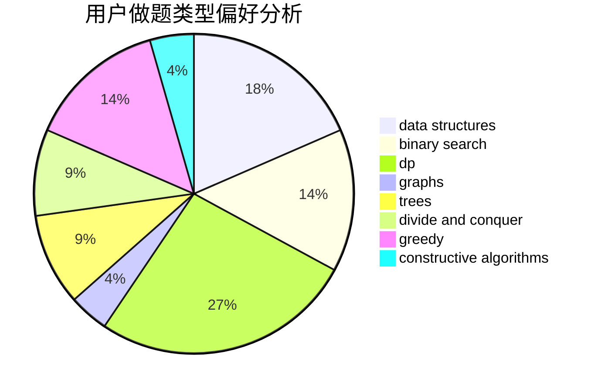
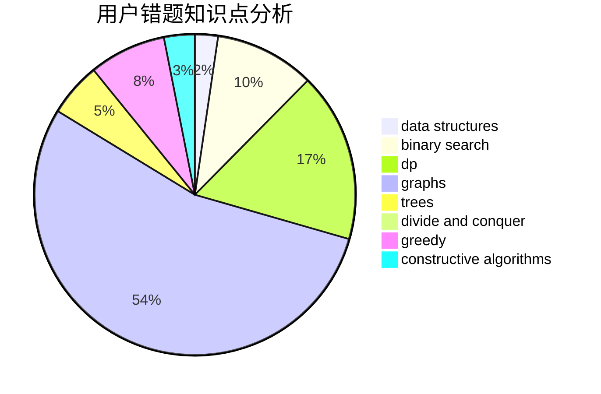

# Ez3qwq

<!-- tabs:start -->

#### **用户提交结果分析**

#### **用户做题类型偏好分析**

#### **用户错题知识点分析**

<!-- tabs:end -->
# 推荐题目
[1349B](https://codeforces.com/contest/1349/problem/B)		constructive algorithms,
                        greedy,
                        math		  
[1164M](https://codeforces.com/contest/1164/problem/M)		dsu,graphs,sortings,trees		  
[246D](https://codeforces.com/contest/246/problem/D)		brute force,
                        dfs and similar,
                        graphs		  
[464E](https://codeforces.com/contest/464/problem/E)		data structures,
                        graphs,
                        shortest paths		  
[1482D](https://codeforces.com/contest/1482/problem/D)		data structures,
                        dsu,
                        implementation,
                        shortest paths		  
[705A](https://codeforces.com/contest/705/problem/A)		implementation		  
[514B](https://codeforces.com/contest/514/problem/B)		brute force,
                        data structures,
                        geometry,
                        implementation,
                        math		  
[1342F](https://codeforces.com/contest/1342/problem/F)		bitmasks,
                        brute force,
                        dp		  
[1051D](https://codeforces.com/contest/1051/problem/D)		bitmasks,
                        dp		  
[254B](https://codeforces.com/contest/254/problem/B)		brute force,
                        implementation		  
