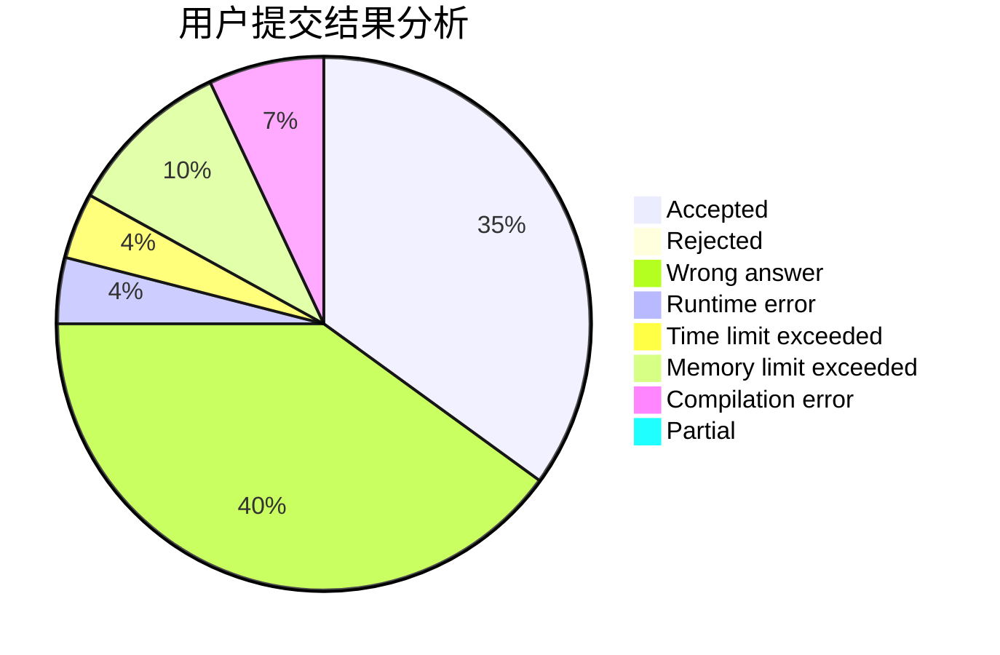
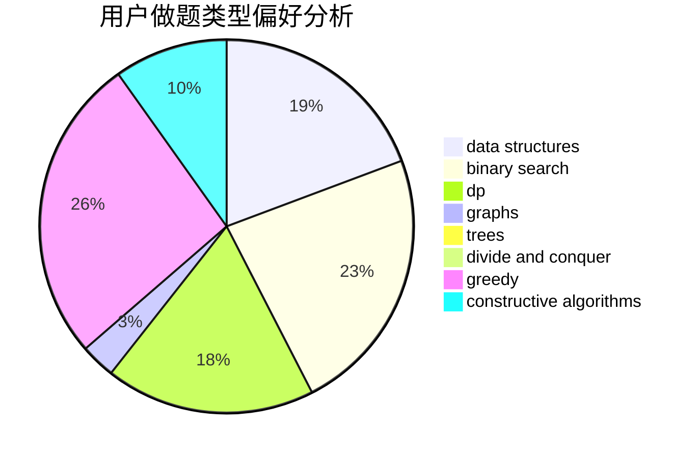
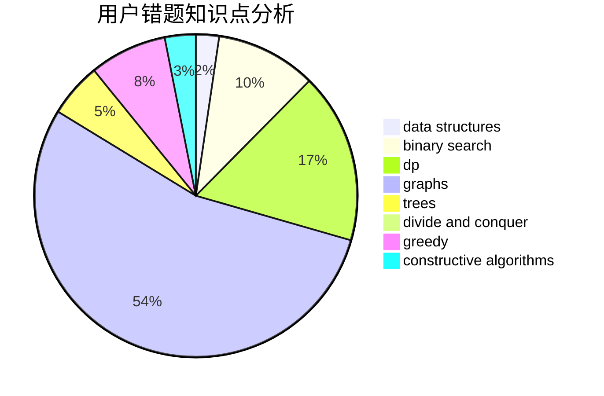

# Ez3qwq
<!-- tabs:start -->
#### **用户提交结果分析**

#### **用户做题类型偏好分析**

#### **用户错题知识点分析**

<!-- tabs:end -->
# 推荐题目
[Zigzag](http://codeforces.com/problemset/problem/228/D)		data structures		  
[Thanos Nim](https://codeforces.com/contest/1162/problem/E)		games		  
[DZY Loves Chessboard](http://codeforces.com/problemset/problem/445/A)		dfs and similar,
                        implementation		  
[Treasure](http://codeforces.com/problemset/problem/494/A)		greedy		  
[Mystic Carvings](http://codeforces.com/problemset/problem/297/E)		data structures		  
[Rectangular Game](http://codeforces.com/problemset/problem/177/B2)		number theory		  
[Economy Game](http://codeforces.com/problemset/problem/681/B)		brute force		  
[Tiles](http://codeforces.com/problemset/problem/1473/G)		combinatorics,
                        dp,
                        fft,
                        math		  
[Santa Claus and Robot](http://codeforces.com/problemset/problem/748/C)		constructive algorithms,
                        math		  
[Two permutations](http://codeforces.com/problemset/problem/323/C)		data structures		  
<!-- tabs:start -->
#### **data structures**
[Zigzag](http://codeforces.com/problemset/problem/228/D)		data structures		  
[Thanos Nim](http://codeforces.com/problemset/problem/297/E)		data structures		  
[DZY Loves Chessboard](http://codeforces.com/problemset/problem/323/C)		data structures		  
[Treasure](http://codeforces.com/problemset/problem/1335/E2)		brute force,
                        data structures,
                        dp,
                        two pointers		  
[Mystic Carvings](http://codeforces.com/problemset/problem/1167/E)		binary search,
                        combinatorics,
                        data structures,
                        two pointers		  
[Rectangular Game](http://codeforces.com/problemset/problem/1342/D)		binary search,
                        constructive algorithms,
                        data structures,
                        greedy,
                        sortings,
                        two pointers		  
[Economy Game](http://codeforces.com/problemset/problem/1290/A)		brute force,
                        data structures,
                        implementation		  
[Tiles](http://codeforces.com/problemset/problem/1106/D)		data structures,
                        dfs and similar,
                        graphs,
                        greedy,
                        shortest paths		  
[Santa Claus and Robot](http://codeforces.com/problemset/problem/235/C)		data structures,
                        string suffix structures,
                        strings		  
[Two permutations](http://codeforces.com/problemset/problem/1492/C)		binary search,
                        data structures,
                        dp,
                        greedy,
                        two pointers		  
#### **binary search**
[Zigzag](http://codeforces.com/problemset/problem/1167/E)		binary search,
                        combinatorics,
                        data structures,
                        two pointers		  
[Thanos Nim](http://codeforces.com/problemset/problem/1007/C)		binary search,
                        interactive		  
[DZY Loves Chessboard](http://codeforces.com/problemset/problem/1342/D)		binary search,
                        constructive algorithms,
                        data structures,
                        greedy,
                        sortings,
                        two pointers		  
[Treasure](http://codeforces.com/problemset/problem/1016/E)		binary search,
                        geometry		  
[Mystic Carvings](http://codeforces.com/problemset/problem/1492/C)		binary search,
                        data structures,
                        dp,
                        greedy,
                        two pointers		  
[Rectangular Game](http://codeforces.com/problemset/problem/1463/D)		binary search,
                        constructive algorithms,
                        greedy,
                        two pointers		  
[Economy Game](http://codeforces.com/problemset/problem/1490/G)		binary search,
                        data structures,
                        math		  
[Tiles](http://codeforces.com/problemset/problem/1479/D)		binary search,
                        bitmasks,
                        brute force,
                        data structures,
                        probabilities,
                        trees		  
[Santa Claus and Robot](http://codeforces.com/problemset/problem/1436/E)		binary search,
                        data structures,
                        two pointers		  
[Two permutations](http://codeforces.com/problemset/problem/1461/D)		binary search,
                        brute force,
                        data structures,
                        divide and conquer,
                        implementation,
                        sortings		  
#### **dp**
[Zigzag](http://codeforces.com/problemset/problem/1473/G)		combinatorics,
                        dp,
                        fft,
                        math		  
[Thanos Nim](http://codeforces.com/problemset/problem/232/C)		constructive algorithms,
                        divide and conquer,
                        dp,
                        graphs,
                        shortest paths		  
[DZY Loves Chessboard](http://codeforces.com/problemset/problem/1335/E2)		brute force,
                        data structures,
                        dp,
                        two pointers		  
[Treasure](http://codeforces.com/problemset/problem/839/D)		combinatorics,
                        dp,
                        math,
                        number theory		  
[Mystic Carvings](http://codeforces.com/problemset/problem/598/E)		brute force,
                        dp		  
[Rectangular Game](http://codeforces.com/problemset/problem/1029/E)		dp,
                        graphs,
                        greedy		  
[Economy Game](http://codeforces.com/problemset/problem/839/C)		dfs and similar,
                        dp,
                        graphs,
                        probabilities,
                        trees		  
[Tiles](https://codeforces.com/contest/1337/problem/C)		dfs and similar,
                        dp,
                        greedy,
                        sortings,
                        trees		  
[Santa Claus and Robot](http://codeforces.com/problemset/problem/768/D)		dp,
                        math,
                        probabilities		  
[Two permutations](http://codeforces.com/problemset/problem/1198/D)		dp		  
#### **graph**
[Zigzag](http://codeforces.com/problemset/problem/232/C)		constructive algorithms,
                        divide and conquer,
                        dp,
                        graphs,
                        shortest paths		  
[Thanos Nim](http://codeforces.com/problemset/problem/1029/E)		dp,
                        graphs,
                        greedy		  
[DZY Loves Chessboard](http://codeforces.com/problemset/problem/839/C)		dfs and similar,
                        dp,
                        graphs,
                        probabilities,
                        trees		  
[Treasure](http://codeforces.com/problemset/problem/1106/D)		data structures,
                        dfs and similar,
                        graphs,
                        greedy,
                        shortest paths		  
[Mystic Carvings](http://codeforces.com/problemset/problem/1487/C)		brute force,
                        constructive algorithms,
                        dfs and similar,
                        graphs,
                        greedy,
                        implementation,
                        math		  
[Rectangular Game](http://codeforces.com/problemset/problem/1437/C)		dp,
                        flows,
                        graph matchings,
                        greedy,
                        math,
                        sortings		  
[Economy Game](http://codeforces.com/problemset/problem/1470/D)		constructive algorithms,
                        dfs and similar,
                        graph matchings,
                        graphs,
                        greedy		  
[Tiles](http://codeforces.com/problemset/problem/1476/C)		dp,
                        graphs,
                        greedy		  
[Santa Claus and Robot](http://codeforces.com/problemset/problem/1304/D)		constructive algorithms,
                        graphs,
                        greedy,
                        two pointers		  
[Two permutations](http://codeforces.com/problemset/problem/1475/C)		combinatorics,
                        graphs,
                        math		  
#### **trees**
[Zigzag](http://codeforces.com/problemset/problem/839/C)		dfs and similar,
                        dp,
                        graphs,
                        probabilities,
                        trees		  
[Thanos Nim](https://codeforces.com/contest/1337/problem/C)		dfs and similar,
                        dp,
                        greedy,
                        sortings,
                        trees		  
[DZY Loves Chessboard](http://codeforces.com/problemset/problem/1479/D)		binary search,
                        bitmasks,
                        brute force,
                        data structures,
                        probabilities,
                        trees		  
[Treasure](http://codeforces.com/problemset/problem/1511/C)		brute force,
                        data structures,
                        implementation,
                        trees		  
[Mystic Carvings](http://codeforces.com/problemset/problem/1499/F)		combinatorics,
                        dfs and similar,
                        dp,
                        trees		  
[Rectangular Game](http://codeforces.com/problemset/problem/1491/E)		brute force,
                        dfs and similar,
                        divide and conquer,
                        number theory,
                        trees		  
[Economy Game](http://codeforces.com/problemset/problem/1466/D)		data structures,
                        greedy,
                        sortings,
                        trees		  
[Tiles](http://codeforces.com/problemset/problem/1495/D)		combinatorics,
                        dfs and similar,
                        graphs,
                        math,
                        shortest paths,
                        trees		  
[Santa Claus and Robot](http://codeforces.com/problemset/problem/1303/G)		data structures,
                        divide and conquer,
                        geometry,
                        trees		  
[Two permutations](http://codeforces.com/problemset/problem/1454/E)		combinatorics,
                        dfs and similar,
                        graphs,
                        trees		  
#### **divide and conquer**
[Zigzag](http://codeforces.com/problemset/problem/232/C)		constructive algorithms,
                        divide and conquer,
                        dp,
                        graphs,
                        shortest paths		  
[Thanos Nim](http://codeforces.com/problemset/problem/1461/D)		binary search,
                        brute force,
                        data structures,
                        divide and conquer,
                        implementation,
                        sortings		  
[DZY Loves Chessboard](http://codeforces.com/problemset/problem/1466/G)		combinatorics,
                        divide and conquer,
                        hashing,
                        math,
                        string suffix structures,
                        strings		  
[Treasure](http://codeforces.com/problemset/problem/1490/D)		dfs and similar,
                        divide and conquer,
                        implementation		  
[Mystic Carvings](https://codeforces.com/contest/1483/problem/C)		data structures,
                        divide and conquer,
                        dp		  
[Rectangular Game](http://codeforces.com/problemset/problem/1491/E)		brute force,
                        dfs and similar,
                        divide and conquer,
                        number theory,
                        trees		  
[Economy Game](http://codeforces.com/problemset/problem/1303/G)		data structures,
                        divide and conquer,
                        geometry,
                        trees		  
[Tiles](http://codeforces.com/problemset/problem/1494/D)		constructive algorithms,
                        data structures,
                        dfs and similar,
                        divide and conquer,
                        dsu,
                        greedy,
                        sortings,
                        trees		  
[Santa Claus and Robot](http://codeforces.com/problemset/problem/1482/E)		data structures,
                        divide and conquer,
                        dp		  
[Two permutations](http://codeforces.com/problemset/problem/566/C)		dfs and similar,
                        divide and conquer,
                        trees		  
#### **greedy**
[Zigzag](http://codeforces.com/problemset/problem/494/A)		greedy		  
[Thanos Nim](http://codeforces.com/problemset/problem/282/B)		greedy,
                        math		  
[DZY Loves Chessboard](http://codeforces.com/problemset/problem/839/B)		brute force,
                        greedy,
                        implementation		  
[Treasure](http://codeforces.com/problemset/problem/1342/D)		binary search,
                        constructive algorithms,
                        data structures,
                        greedy,
                        sortings,
                        two pointers		  
[Mystic Carvings](http://codeforces.com/problemset/problem/1051/A)		greedy,
                        implementation,
                        strings		  
[Rectangular Game](http://codeforces.com/problemset/problem/1029/E)		dp,
                        graphs,
                        greedy		  
[Economy Game](http://codeforces.com/problemset/problem/1503/A)		constructive algorithms,
                        greedy		  
[Tiles](http://codeforces.com/problemset/problem/1106/D)		data structures,
                        dfs and similar,
                        graphs,
                        greedy,
                        shortest paths		  
[Santa Claus and Robot](https://codeforces.com/contest/1337/problem/C)		dfs and similar,
                        dp,
                        greedy,
                        sortings,
                        trees		  
[Two permutations](http://codeforces.com/problemset/problem/1418/B)		greedy,
                        sortings		  
#### **constructive algorithms**
[Zigzag](http://codeforces.com/problemset/problem/748/C)		constructive algorithms,
                        math		  
[Thanos Nim](http://codeforces.com/problemset/problem/232/C)		constructive algorithms,
                        divide and conquer,
                        dp,
                        graphs,
                        shortest paths		  
[DZY Loves Chessboard](http://codeforces.com/problemset/problem/1342/D)		binary search,
                        constructive algorithms,
                        data structures,
                        greedy,
                        sortings,
                        two pointers		  
[Treasure](http://codeforces.com/problemset/problem/1503/A)		constructive algorithms,
                        greedy		  
[Mystic Carvings](http://codeforces.com/problemset/problem/1254/B2)		constructive algorithms,
                        greedy,
                        math,
                        number theory,
                        ternary search,
                        two pointers		  
[Rectangular Game](http://codeforces.com/problemset/problem/1513/E)		combinatorics,
                        constructive algorithms,
                        math,
                        sortings		  
[Economy Game](http://codeforces.com/problemset/problem/1493/A)		constructive algorithms,
                        greedy		  
[Tiles](http://codeforces.com/problemset/problem/1463/D)		binary search,
                        constructive algorithms,
                        greedy,
                        two pointers		  
[Santa Claus and Robot](https://codeforces.com/contest/1456/problem/B)		bitmasks,
                        brute force,
                        constructive algorithms		  
[Two permutations](http://codeforces.com/problemset/problem/1492/D)		bitmasks,
                        constructive algorithms,
                        greedy,
                        math		  
#### **sortings**
[Zigzag](http://codeforces.com/problemset/problem/1342/D)		binary search,
                        constructive algorithms,
                        data structures,
                        greedy,
                        sortings,
                        two pointers		  
[Thanos Nim](http://codeforces.com/problemset/problem/792/A)		implementation,
                        sortings		  
[DZY Loves Chessboard](https://codeforces.com/contest/1337/problem/C)		dfs and similar,
                        dp,
                        greedy,
                        sortings,
                        trees		  
[Treasure](http://codeforces.com/problemset/problem/1418/B)		greedy,
                        sortings		  
[Mystic Carvings](http://codeforces.com/problemset/problem/1513/E)		combinatorics,
                        constructive algorithms,
                        math,
                        sortings		  
[Rectangular Game](https://codeforces.com/contest/1496/problem/C)		geometry,
                        greedy,
                        math,
                        sortings		  
[Economy Game](http://codeforces.com/problemset/problem/1495/A)		geometry,
                        greedy,
                        math,
                        sortings		  
[Tiles](http://codeforces.com/problemset/problem/1497/A)		brute force,
                        data structures,
                        greedy,
                        sortings		  
[Santa Claus and Robot](http://codeforces.com/problemset/problem/1427/A)		math,
                        sortings		  
[Two permutations](http://codeforces.com/problemset/problem/1461/D)		binary search,
                        brute force,
                        data structures,
                        divide and conquer,
                        implementation,
                        sortings		  
<!-- tabs:end -->
