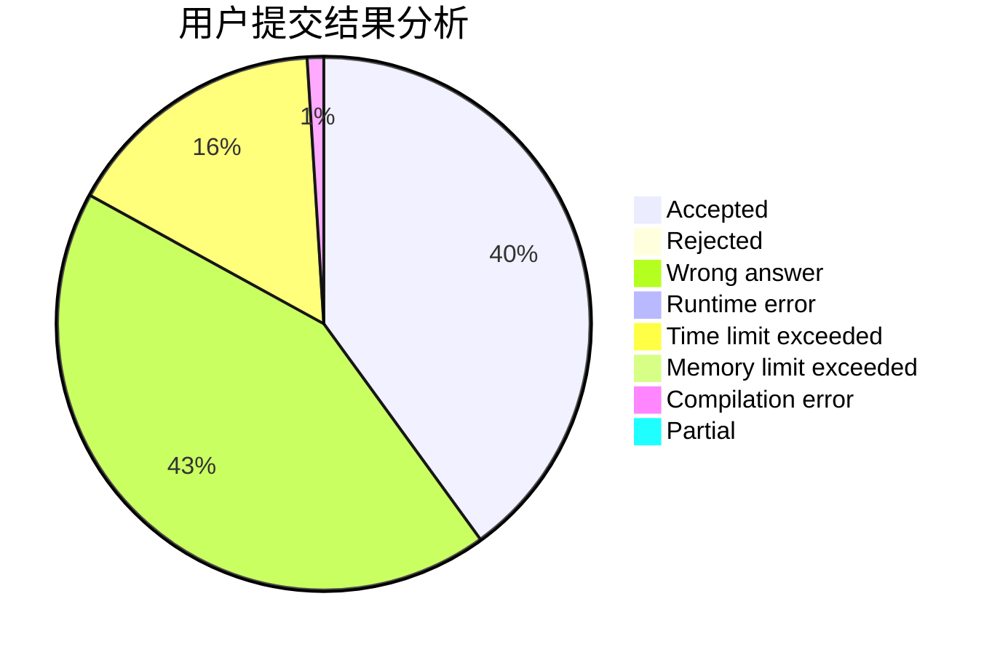
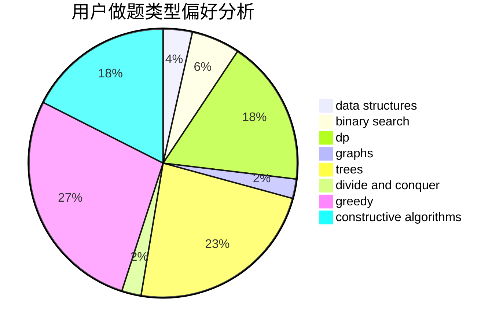

# F-2018

<!-- tabs:start -->

#### **用户提交结果分析**

#### **用户做题类型偏好分析**

#### **用户错题知识点分析**

<!-- tabs:end -->
# 推荐题目
[1183F](https://codeforces.com/contest/1183/problem/F)		brute force,
                        math,
                        sortings		  
[713E](https://codeforces.com/contest/713/problem/E)		binary search,
                        dp		  
[1423K](https://codeforces.com/contest/1423/problem/K)		binary search,
                        math,
                        number theory,
                        two pointers		  
[339A](https://codeforces.com/contest/339/problem/A)		greedy,
                        implementation,
                        sortings,
                        strings		  
[407B](https://codeforces.com/contest/407/problem/B)		dp,
                        implementation		  
[839E](https://codeforces.com/contest/839/problem/E)		brute force,
                        graphs,
                        math,
                        meet-in-the-middle		  
[1087B](https://codeforces.com/contest/1087/problem/B)		dsu,graphs,sortings,trees		  
[567B](https://codeforces.com/contest/567/problem/B)		implementation		  
[83B](https://codeforces.com/contest/83/problem/B)		binary search,
                        math,
                        sortings		  
[765F](https://codeforces.com/contest/765/problem/F)		data structures		  
