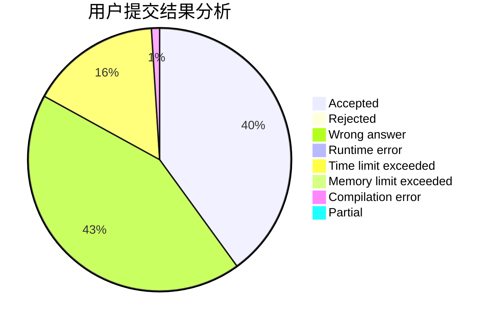
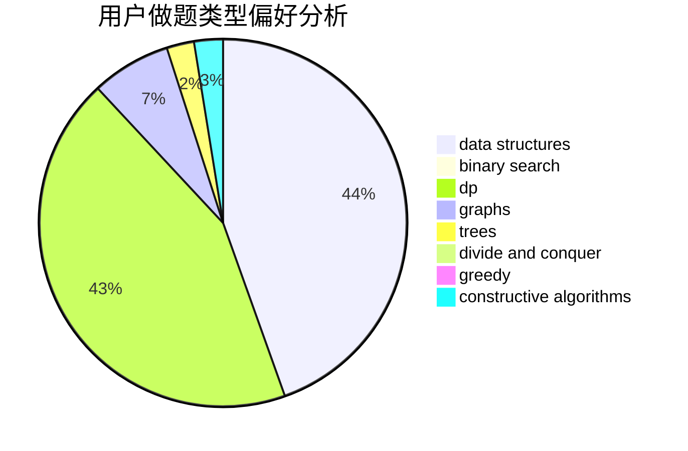

# F-2018

<!-- tabs:start -->

#### **用户提交结果分析**

#### **用户做题类型偏好分析**

#### **用户错题知识点分析**

<!-- tabs:end -->
# 推荐题目
[1186D](https://codeforces.com/contest/1186/problem/D)		constructive algorithms,
                        greedy,
                        math		  
[732E](https://codeforces.com/contest/732/problem/E)		greedy,
                        sortings		  
[1432A](https://codeforces.com/contest/1432/problem/A)		dsu,graphs,sortings,trees		  
[364E](https://codeforces.com/contest/364/problem/E)		divide and conquer,
                        two pointers		  
[436A](https://codeforces.com/contest/436/problem/A)		greedy		  
[859B](https://codeforces.com/contest/859/problem/B)		brute force,
                        geometry,
                        math		  
[1087E](https://codeforces.com/contest/1087/problem/E)		dsu,graphs,sortings,trees		  
[586F](https://codeforces.com/contest/586/problem/F)		dsu,graphs,sortings,trees		  
[859C](https://codeforces.com/contest/859/problem/C)		dp,
                        games		  
[785B](https://codeforces.com/contest/785/problem/B)		greedy,
                        sortings		  
