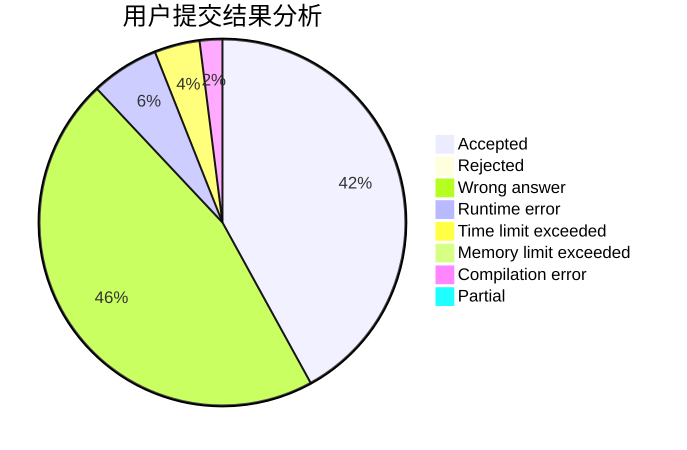
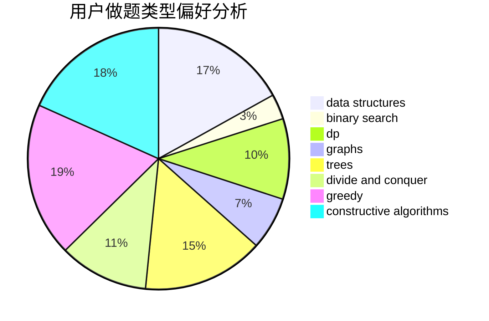
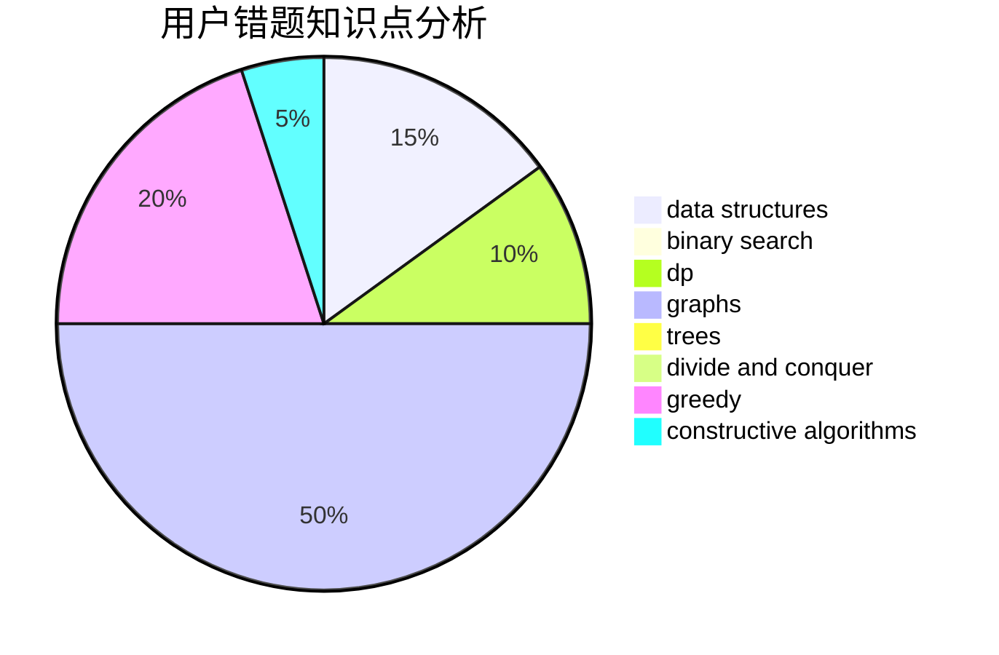

# F0_0H
<!-- tabs:start -->
#### **用户提交结果分析**

#### **用户做题类型偏好分析**

#### **用户错题知识点分析**

<!-- tabs:end -->
# 推荐题目
[Mike and Shortcuts](http://codeforces.com/problemset/problem/689/B)		dfs and similar,
                        graphs,
                        greedy,
                        shortest paths		  
[Print a 1337-string...](http://codeforces.com/problemset/problem/1202/D)		combinatorics,
                        constructive algorithms,
                        math,
                        strings		  
[After Training](http://codeforces.com/problemset/problem/195/B)		data structures,
                        implementation,
                        math		  
[Hills](http://codeforces.com/problemset/problem/1012/C)		dp		  
[Leha and Function](http://codeforces.com/problemset/problem/840/A)		combinatorics,
                        greedy,
                        math,
                        number theory,
                        sortings		  
[Chess Championship](http://codeforces.com/problemset/problem/736/E)		constructive algorithms,
                        flows,
                        greedy,
                        math		  
[Yellow Cards](http://codeforces.com/problemset/problem/1215/A)		greedy,
                        implementation,
                        math		  
[Two Rival Students](http://codeforces.com/problemset/problem/1257/A)		greedy,
                        math		  
[LCS Again](http://codeforces.com/problemset/problem/578/D)		dp,
                        greedy		  
[Plus and xor](http://codeforces.com/problemset/problem/76/D)		dp,
                        greedy,
                        math		  
<!-- tabs:start -->
#### **data structures**
[Mike and Shortcuts](http://codeforces.com/problemset/problem/195/B)		data structures,
                        implementation,
                        math		  
[Print a 1337-string...](http://codeforces.com/problemset/problem/650/D)		binary search,
                        data structures,
                        dp,
                        hashing		  
[After Training](http://codeforces.com/problemset/problem/840/B)		constructive algorithms,
                        data structures,
                        dfs and similar,
                        dp,
                        graphs		  
[Hills](http://codeforces.com/problemset/problem/570/C)		constructive algorithms,
                        data structures,
                        implementation		  
[Leha and Function](http://codeforces.com/problemset/problem/650/A)		data structures,
                        geometry,
                        math		  
[Chess Championship](http://codeforces.com/problemset/problem/741/E)		data structures,
                        string suffix structures		  
[Yellow Cards](http://codeforces.com/problemset/problem/525/D)		constructive algorithms,
                        data structures,
                        graphs,
                        greedy,
                        shortest paths		  
[Two Rival Students](http://codeforces.com/problemset/problem/1041/D)		binary search,
                        data structures,
                        two pointers		  
[LCS Again](http://codeforces.com/problemset/problem/840/D)		data structures,
                        probabilities		  
[Plus and xor](http://codeforces.com/problemset/problem/1506/D)		constructive algorithms,
                        data structures,
                        greedy		  
#### **binary search**
[Mike and Shortcuts](http://codeforces.com/problemset/problem/650/D)		binary search,
                        data structures,
                        dp,
                        hashing		  
[Print a 1337-string...](http://codeforces.com/problemset/problem/1366/F)		binary search,
                        dp,
                        geometry,
                        graphs		  
[After Training](http://codeforces.com/problemset/problem/180/E)		binary search,
                        dp,
                        two pointers		  
[Hills](http://codeforces.com/problemset/problem/1354/C1)		binary search,
                        geometry,
                        math,
                        ternary search		  
[Leha and Function](http://codeforces.com/problemset/problem/1041/D)		binary search,
                        data structures,
                        two pointers		  
[Chess Championship](http://codeforces.com/problemset/problem/1476/F)		binary search,
                        data structures,
                        dp		  
[Yellow Cards](http://codeforces.com/problemset/problem/776/C)		binary search,
                        brute force,
                        data structures,
                        implementation,
                        math		  
[Two Rival Students](http://codeforces.com/problemset/problem/1492/C)		binary search,
                        data structures,
                        dp,
                        greedy,
                        two pointers		  
[LCS Again](http://codeforces.com/problemset/problem/1463/D)		binary search,
                        constructive algorithms,
                        greedy,
                        two pointers		  
[Plus and xor](http://codeforces.com/problemset/problem/1490/G)		binary search,
                        data structures,
                        math		  
#### **dp**
[Mike and Shortcuts](http://codeforces.com/problemset/problem/1012/C)		dp		  
[Print a 1337-string...](http://codeforces.com/problemset/problem/578/D)		dp,
                        greedy		  
[After Training](http://codeforces.com/problemset/problem/76/D)		dp,
                        greedy,
                        math		  
[Hills](http://codeforces.com/problemset/problem/703/E)		dp,
                        number theory		  
[Leha and Function](http://codeforces.com/problemset/problem/650/D)		binary search,
                        data structures,
                        dp,
                        hashing		  
[Chess Championship](http://codeforces.com/problemset/problem/840/B)		constructive algorithms,
                        data structures,
                        dfs and similar,
                        dp,
                        graphs		  
[Yellow Cards](http://codeforces.com/problemset/problem/840/C)		combinatorics,
                        dp		  
[Two Rival Students](http://codeforces.com/problemset/problem/1366/F)		binary search,
                        dp,
                        geometry,
                        graphs		  
[LCS Again](http://codeforces.com/problemset/problem/180/E)		binary search,
                        dp,
                        two pointers		  
[Plus and xor](http://codeforces.com/problemset/problem/1476/F)		binary search,
                        data structures,
                        dp		  
#### **graph**
[Mike and Shortcuts](http://codeforces.com/problemset/problem/689/B)		dfs and similar,
                        graphs,
                        greedy,
                        shortest paths		  
[Print a 1337-string...](http://codeforces.com/problemset/problem/840/B)		constructive algorithms,
                        data structures,
                        dfs and similar,
                        dp,
                        graphs		  
[After Training](http://codeforces.com/problemset/problem/1366/F)		binary search,
                        dp,
                        geometry,
                        graphs		  
[Hills](http://codeforces.com/problemset/problem/525/D)		constructive algorithms,
                        data structures,
                        graphs,
                        greedy,
                        shortest paths		  
[Leha and Function](http://codeforces.com/problemset/problem/1383/F)		flows,
                        graphs		  
[Chess Championship](http://codeforces.com/problemset/problem/1487/C)		brute force,
                        constructive algorithms,
                        dfs and similar,
                        graphs,
                        greedy,
                        implementation,
                        math		  
[Yellow Cards](http://codeforces.com/problemset/problem/1437/C)		dp,
                        flows,
                        graph matchings,
                        greedy,
                        math,
                        sortings		  
[Two Rival Students](http://codeforces.com/problemset/problem/1470/D)		constructive algorithms,
                        dfs and similar,
                        graph matchings,
                        graphs,
                        greedy		  
[LCS Again](http://codeforces.com/problemset/problem/1476/C)		dp,
                        graphs,
                        greedy		  
[Plus and xor](http://codeforces.com/problemset/problem/1304/D)		constructive algorithms,
                        graphs,
                        greedy,
                        two pointers		  
#### **trees**
[Mike and Shortcuts](https://codeforces.com/contest/1074/problem/B)		dfs and similar,
                        interactive,
                        trees		  
[Print a 1337-string...](http://codeforces.com/problemset/problem/840/E)		trees		  
[After Training](http://codeforces.com/problemset/problem/1479/D)		binary search,
                        bitmasks,
                        brute force,
                        data structures,
                        probabilities,
                        trees		  
[Hills](http://codeforces.com/problemset/problem/1511/C)		brute force,
                        data structures,
                        implementation,
                        trees		  
[Leha and Function](http://codeforces.com/problemset/problem/1499/F)		combinatorics,
                        dfs and similar,
                        dp,
                        trees		  
[Chess Championship](http://codeforces.com/problemset/problem/1491/E)		brute force,
                        dfs and similar,
                        divide and conquer,
                        number theory,
                        trees		  
[Yellow Cards](http://codeforces.com/problemset/problem/1466/D)		data structures,
                        greedy,
                        sortings,
                        trees		  
[Two Rival Students](http://codeforces.com/problemset/problem/1495/D)		combinatorics,
                        dfs and similar,
                        graphs,
                        math,
                        shortest paths,
                        trees		  
[LCS Again](http://codeforces.com/problemset/problem/1303/G)		data structures,
                        divide and conquer,
                        geometry,
                        trees		  
[Plus and xor](http://codeforces.com/problemset/problem/1454/E)		combinatorics,
                        dfs and similar,
                        graphs,
                        trees		  
#### **divide and conquer**
[Mike and Shortcuts](http://codeforces.com/problemset/problem/1461/D)		binary search,
                        brute force,
                        data structures,
                        divide and conquer,
                        implementation,
                        sortings		  
[Print a 1337-string...](http://codeforces.com/problemset/problem/1466/G)		combinatorics,
                        divide and conquer,
                        hashing,
                        math,
                        string suffix structures,
                        strings		  
[After Training](http://codeforces.com/problemset/problem/1490/D)		dfs and similar,
                        divide and conquer,
                        implementation		  
[Hills](https://codeforces.com/contest/1483/problem/C)		data structures,
                        divide and conquer,
                        dp		  
[Leha and Function](http://codeforces.com/problemset/problem/1491/E)		brute force,
                        dfs and similar,
                        divide and conquer,
                        number theory,
                        trees		  
[Chess Championship](http://codeforces.com/problemset/problem/1303/G)		data structures,
                        divide and conquer,
                        geometry,
                        trees		  
[Yellow Cards](http://codeforces.com/problemset/problem/1494/D)		constructive algorithms,
                        data structures,
                        dfs and similar,
                        divide and conquer,
                        dsu,
                        greedy,
                        sortings,
                        trees		  
[Two Rival Students](http://codeforces.com/problemset/problem/1482/E)		data structures,
                        divide and conquer,
                        dp		  
[LCS Again](http://codeforces.com/problemset/problem/566/C)		dfs and similar,
                        divide and conquer,
                        trees		  
[Plus and xor](http://codeforces.com/problemset/problem/1428/F)		binary search,
                        data structures,
                        divide and conquer,
                        dp,
                        two pointers		  
#### **greedy**
[Mike and Shortcuts](http://codeforces.com/problemset/problem/689/B)		dfs and similar,
                        graphs,
                        greedy,
                        shortest paths		  
[Print a 1337-string...](http://codeforces.com/problemset/problem/840/A)		combinatorics,
                        greedy,
                        math,
                        number theory,
                        sortings		  
[After Training](http://codeforces.com/problemset/problem/736/E)		constructive algorithms,
                        flows,
                        greedy,
                        math		  
[Hills](http://codeforces.com/problemset/problem/1215/A)		greedy,
                        implementation,
                        math		  
[Leha and Function](http://codeforces.com/problemset/problem/1257/A)		greedy,
                        math		  
[Chess Championship](http://codeforces.com/problemset/problem/578/D)		dp,
                        greedy		  
[Yellow Cards](http://codeforces.com/problemset/problem/76/D)		dp,
                        greedy,
                        math		  
[Two Rival Students](http://codeforces.com/problemset/problem/226/B)		greedy		  
[LCS Again](http://codeforces.com/problemset/problem/1000/B)		greedy		  
[Plus and xor](http://codeforces.com/problemset/problem/525/D)		constructive algorithms,
                        data structures,
                        graphs,
                        greedy,
                        shortest paths		  
#### **constructive algorithms**
[Mike and Shortcuts](http://codeforces.com/problemset/problem/1202/D)		combinatorics,
                        constructive algorithms,
                        math,
                        strings		  
[Print a 1337-string...](http://codeforces.com/problemset/problem/736/E)		constructive algorithms,
                        flows,
                        greedy,
                        math		  
[After Training](http://codeforces.com/problemset/problem/1136/C)		constructive algorithms,
                        sortings		  
[Hills](http://codeforces.com/problemset/problem/316/F3)		constructive algorithms,
                        dfs and similar,
                        implementation		  
[Leha and Function](http://codeforces.com/problemset/problem/840/B)		constructive algorithms,
                        data structures,
                        dfs and similar,
                        dp,
                        graphs		  
[Chess Championship](http://codeforces.com/problemset/problem/570/C)		constructive algorithms,
                        data structures,
                        implementation		  
[Yellow Cards](http://codeforces.com/problemset/problem/1450/C2)		constructive algorithms,
                        math		  
[Two Rival Students](http://codeforces.com/problemset/problem/525/D)		constructive algorithms,
                        data structures,
                        graphs,
                        greedy,
                        shortest paths		  
[LCS Again](http://codeforces.com/problemset/problem/1506/D)		constructive algorithms,
                        data structures,
                        greedy		  
[Plus and xor](http://codeforces.com/problemset/problem/1493/A)		constructive algorithms,
                        greedy		  
#### **sortings**
[Mike and Shortcuts](http://codeforces.com/problemset/problem/840/A)		combinatorics,
                        greedy,
                        math,
                        number theory,
                        sortings		  
[Print a 1337-string...](http://codeforces.com/problemset/problem/1155/A)		implementation,
                        sortings,
                        strings		  
[After Training](http://codeforces.com/problemset/problem/1136/C)		constructive algorithms,
                        sortings		  
[Hills](http://codeforces.com/problemset/problem/1296/D)		greedy,
                        sortings		  
[Leha and Function](https://codeforces.com/contest/1496/problem/C)		geometry,
                        greedy,
                        math,
                        sortings		  
[Chess Championship](http://codeforces.com/problemset/problem/1495/A)		geometry,
                        greedy,
                        math,
                        sortings		  
[Yellow Cards](http://codeforces.com/problemset/problem/1497/A)		brute force,
                        data structures,
                        greedy,
                        sortings		  
[Two Rival Students](http://codeforces.com/problemset/problem/1427/A)		math,
                        sortings		  
[LCS Again](http://codeforces.com/problemset/problem/1461/D)		binary search,
                        brute force,
                        data structures,
                        divide and conquer,
                        implementation,
                        sortings		  
[Plus and xor](http://codeforces.com/problemset/problem/1437/C)		dp,
                        flows,
                        graph matchings,
                        greedy,
                        math,
                        sortings		  
<!-- tabs:end -->
