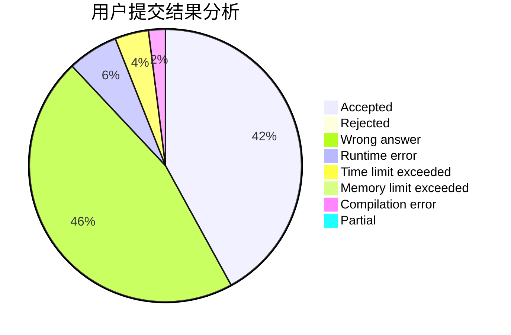
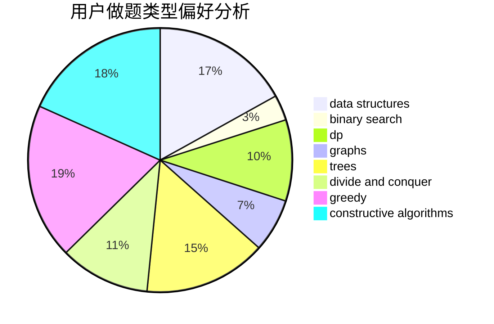
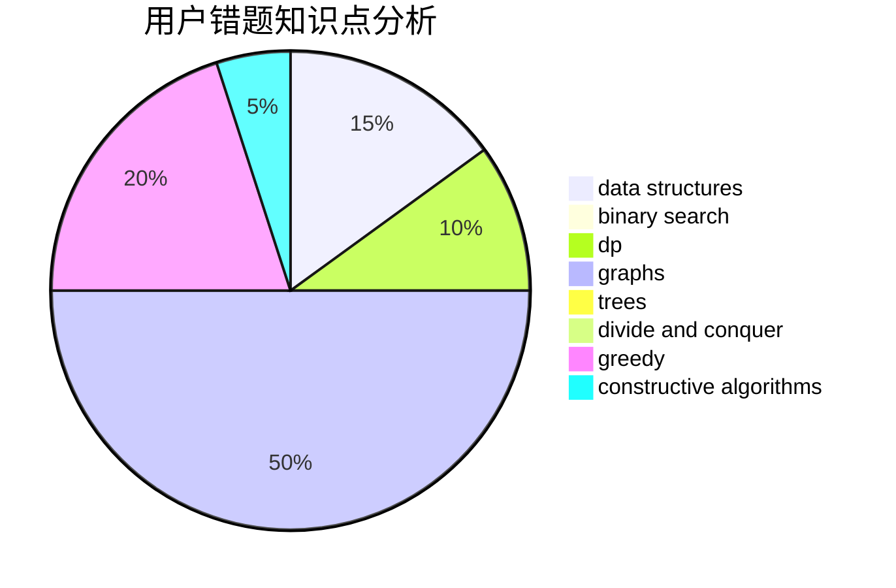

# F0_0H

<!-- tabs:start -->

#### **用户提交结果分析**

#### **用户做题类型偏好分析**

#### **用户错题知识点分析**

<!-- tabs:end -->
# 推荐题目
[1257A](https://codeforces.com/contest/1257/problem/A)		greedy,
                        math		  
[1202D](https://codeforces.com/contest/1202/problem/D)		combinatorics,
                        constructive algorithms,
                        math,
                        strings		  
[1366F](https://codeforces.com/contest/1366/problem/F)		binary search,
                        dp,
                        geometry,
                        graphs		  
[1369A](https://codeforces.com/contest/1369/problem/A)		geometry,
                        math		  
[1215A](https://codeforces.com/contest/1215/problem/A)		greedy,
                        implementation,
                        math		  
[195B](https://codeforces.com/contest/195/problem/B)		data structures,
                        implementation,
                        math		  
[840A](https://codeforces.com/contest/840/problem/A)		combinatorics,
                        greedy,
                        math,
                        number theory,
                        sortings		  
[1012C](https://codeforces.com/contest/1012/problem/C)		dp		  
[736E](https://codeforces.com/contest/736/problem/E)		constructive algorithms,
                        flows,
                        greedy,
                        math		  
[1136C](https://codeforces.com/contest/1136/problem/C)		constructive algorithms,
                        sortings		  
