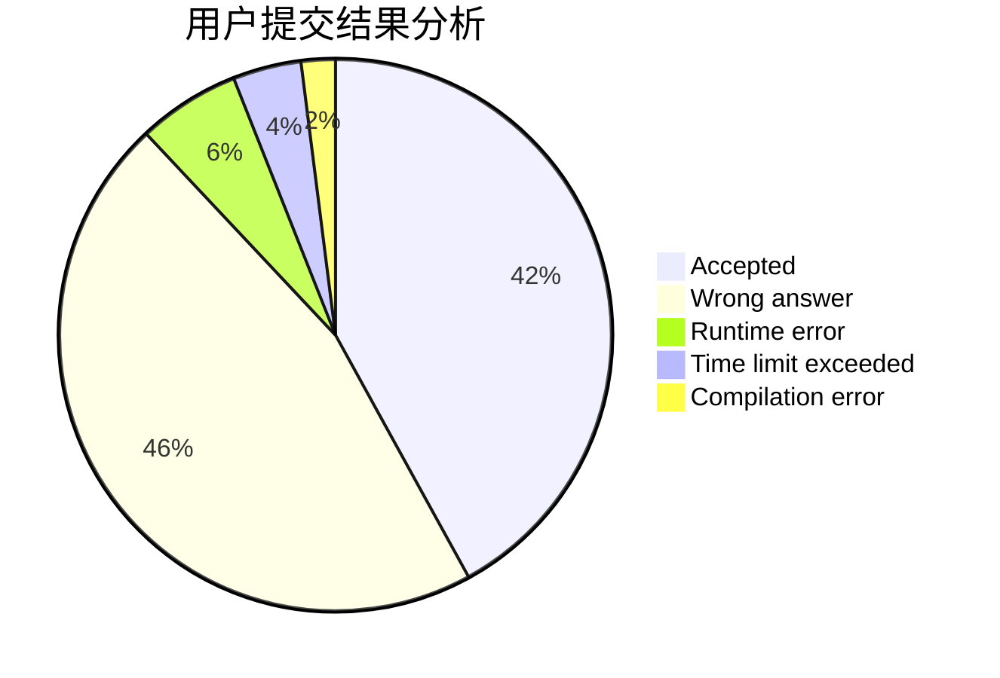
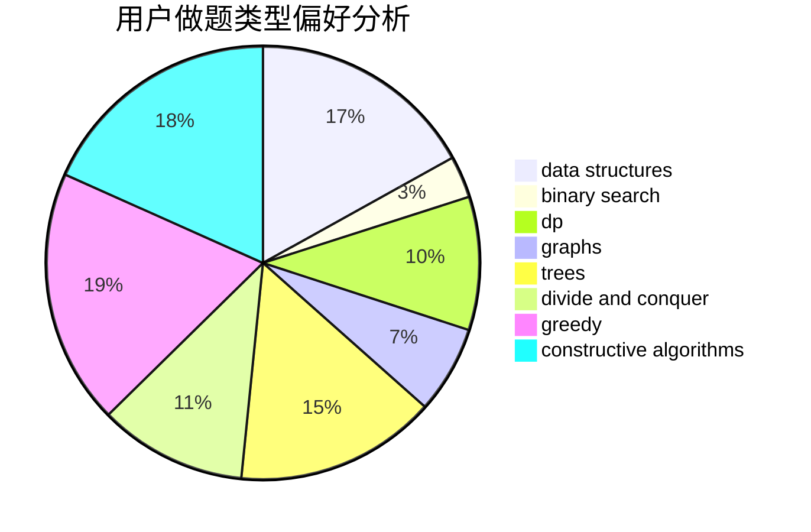
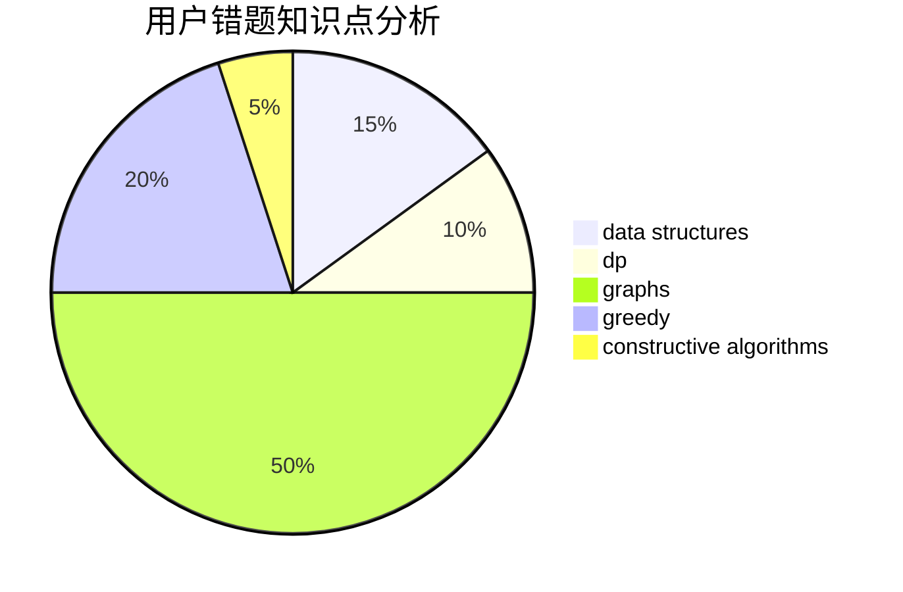

# F0_0H
<!-- tabs:start -->
#### **用户提交结果分析**

#### **用户做题类型偏好分析**

#### **用户错题知识点分析**

<!-- tabs:end -->
# 推荐题目
[Mike and Shortcuts](http://codeforces.com/problemset/problem/689/B)		dfs and similar,
                        graphs,
                        greedy,
                        shortest paths		  
[Print a 1337-string...](http://codeforces.com/problemset/problem/1202/D)		combinatorics,
                        constructive algorithms,
                        math,
                        strings		  
[After Training](http://codeforces.com/problemset/problem/195/B)		data structures,
                        implementation,
                        math		  
[Hills](http://codeforces.com/problemset/problem/1012/C)		dp		  
[Leha and Function](http://codeforces.com/problemset/problem/840/A)		combinatorics,
                        greedy,
                        math,
                        number theory,
                        sortings		  
[Chess Championship](http://codeforces.com/problemset/problem/736/E)		constructive algorithms,
                        flows,
                        greedy,
                        math		  
[Yellow Cards](http://codeforces.com/problemset/problem/1215/A)		greedy,
                        implementation,
                        math		  
[Two Rival Students](http://codeforces.com/problemset/problem/1257/A)		greedy,
                        math		  
[LCS Again](http://codeforces.com/problemset/problem/578/D)		dp,
                        greedy		  
[Plus and xor](http://codeforces.com/problemset/problem/76/D)		dp,
                        greedy,
                        math		  
<!-- tabs:start -->
#### **data structures**
[After Training](http://codeforces.com/problemset/problem/195/B)		data structures,
                        implementation,
                        math		  
[Zip-line](http://codeforces.com/problemset/problem/650/D)		binary search,
                        data structures,
                        dp,
                        hashing		  
[Leha and another game about graph](http://codeforces.com/problemset/problem/840/B)		constructive algorithms,
                        data structures,
                        dfs and similar,
                        dp,
                        graphs		  
[Replacement](http://codeforces.com/problemset/problem/570/C)		constructive algorithms,
                        data structures,
                        implementation		  
[Watchmen](http://codeforces.com/problemset/problem/650/A)		data structures,
                        geometry,
                        math		  
[Arpa’s abnormal DNA and Mehrdad’s deep interest](http://codeforces.com/problemset/problem/741/E)		data structures,
                        string suffix structures		  
[Arthur and Walls](http://codeforces.com/problemset/problem/525/D)		constructive algorithms,
                        data structures,
                        graphs,
                        greedy,
                        shortest paths		  
[Glider](http://codeforces.com/problemset/problem/1041/D)		binary search,
                        data structures,
                        two pointers		  
[Destiny](http://codeforces.com/problemset/problem/840/D)		data structures,
                        probabilities		  
[Epic Transformation](http://codeforces.com/problemset/problem/1506/D)		constructive algorithms,
                        data structures,
                        greedy		  
#### **binary search**
[Zip-line](http://codeforces.com/problemset/problem/650/D)		binary search,
                        data structures,
                        dp,
                        hashing		  
[Jog Around The Graph](http://codeforces.com/problemset/problem/1366/F)		binary search,
                        dp,
                        geometry,
                        graphs		  
[Cubes](http://codeforces.com/problemset/problem/180/E)		binary search,
                        dp,
                        two pointers		  
[Simple Polygon Embedding](http://codeforces.com/problemset/problem/1354/C1)		binary search,
                        geometry,
                        math,
                        ternary search		  
[Glider](http://codeforces.com/problemset/problem/1041/D)		binary search,
                        data structures,
                        two pointers		  
[Lanterns](http://codeforces.com/problemset/problem/1476/F)		binary search,
                        data structures,
                        dp		  
[Molly's Chemicals](http://codeforces.com/problemset/problem/776/C)		binary search,
                        brute force,
                        data structures,
                        implementation,
                        math		  
[Maximum width](http://codeforces.com/problemset/problem/1492/C)		binary search,
                        data structures,
                        dp,
                        greedy,
                        two pointers		  
[Pairs](http://codeforces.com/problemset/problem/1463/D)		binary search,
                        constructive algorithms,
                        greedy,
                        two pointers		  
[Old Floppy Drive](http://codeforces.com/problemset/problem/1490/G)		binary search,
                        data structures,
                        math		  
#### **dp**
[Hills](http://codeforces.com/problemset/problem/1012/C)		dp		  
[LCS Again](http://codeforces.com/problemset/problem/578/D)		dp,
                        greedy		  
[Plus and xor](http://codeforces.com/problemset/problem/76/D)		dp,
                        greedy,
                        math		  
[Mishka and Divisors](http://codeforces.com/problemset/problem/703/E)		dp,
                        number theory		  
[Zip-line](http://codeforces.com/problemset/problem/650/D)		binary search,
                        data structures,
                        dp,
                        hashing		  
[Leha and another game about graph](http://codeforces.com/problemset/problem/840/B)		constructive algorithms,
                        data structures,
                        dfs and similar,
                        dp,
                        graphs		  
[On the Bench](http://codeforces.com/problemset/problem/840/C)		combinatorics,
                        dp		  
[Jog Around The Graph](http://codeforces.com/problemset/problem/1366/F)		binary search,
                        dp,
                        geometry,
                        graphs		  
[Cubes](http://codeforces.com/problemset/problem/180/E)		binary search,
                        dp,
                        two pointers		  
[Lanterns](http://codeforces.com/problemset/problem/1476/F)		binary search,
                        data structures,
                        dp		  
#### **graph**
[Mike and Shortcuts](http://codeforces.com/problemset/problem/689/B)		dfs and similar,
                        graphs,
                        greedy,
                        shortest paths		  
[Leha and another game about graph](http://codeforces.com/problemset/problem/840/B)		constructive algorithms,
                        data structures,
                        dfs and similar,
                        dp,
                        graphs		  
[Jog Around The Graph](http://codeforces.com/problemset/problem/1366/F)		binary search,
                        dp,
                        geometry,
                        graphs		  
[Arthur and Walls](http://codeforces.com/problemset/problem/525/D)		constructive algorithms,
                        data structures,
                        graphs,
                        greedy,
                        shortest paths		  
[Special Edges](http://codeforces.com/problemset/problem/1383/F)		flows,
                        graphs		  
[Minimum Ties](http://codeforces.com/problemset/problem/1487/C)		brute force,
                        constructive algorithms,
                        dfs and similar,
                        graphs,
                        greedy,
                        implementation,
                        math		  
[Chef Monocarp](http://codeforces.com/problemset/problem/1437/C)		dp,
                        flows,
                        graph matchings,
                        greedy,
                        math,
                        sortings		  
[Strange Housing](http://codeforces.com/problemset/problem/1470/D)		constructive algorithms,
                        dfs and similar,
                        graph matchings,
                        graphs,
                        greedy		  
[Longest Simple Cycle](http://codeforces.com/problemset/problem/1476/C)		dp,
                        graphs,
                        greedy		  
[Shortest and Longest LIS](http://codeforces.com/problemset/problem/1304/D)		constructive algorithms,
                        graphs,
                        greedy,
                        two pointers		  
#### **trees**
[Intersecting Subtrees](https://codeforces.com/contest/1074/problem/B)		dfs and similar,
                        interactive,
                        trees		  
[In a Trap](http://codeforces.com/problemset/problem/840/E)		trees		  
[Odd Mineral Resource](http://codeforces.com/problemset/problem/1479/D)		binary search,
                        bitmasks,
                        brute force,
                        data structures,
                        probabilities,
                        trees		  
[Yet Another Card Deck](http://codeforces.com/problemset/problem/1511/C)		brute force,
                        data structures,
                        implementation,
                        trees		  
[Diameter Cuts](http://codeforces.com/problemset/problem/1499/F)		combinatorics,
                        dfs and similar,
                        dp,
                        trees		  
[Fib-tree](http://codeforces.com/problemset/problem/1491/E)		brute force,
                        dfs and similar,
                        divide and conquer,
                        number theory,
                        trees		  
[13th Labour of Heracles](http://codeforces.com/problemset/problem/1466/D)		data structures,
                        greedy,
                        sortings,
                        trees		  
[BFS Trees](http://codeforces.com/problemset/problem/1495/D)		combinatorics,
                        dfs and similar,
                        graphs,
                        math,
                        shortest paths,
                        trees		  
[Sum of Prefix Sums](http://codeforces.com/problemset/problem/1303/G)		data structures,
                        divide and conquer,
                        geometry,
                        trees		  
[Number of Simple Paths](http://codeforces.com/problemset/problem/1454/E)		combinatorics,
                        dfs and similar,
                        graphs,
                        trees		  
#### **divide and conquer**
[Divide and Summarize](http://codeforces.com/problemset/problem/1461/D)		binary search,
                        brute force,
                        data structures,
                        divide and conquer,
                        implementation,
                        sortings		  
[Song of the Sirens](http://codeforces.com/problemset/problem/1466/G)		combinatorics,
                        divide and conquer,
                        hashing,
                        math,
                        string suffix structures,
                        strings		  
[Permutation Transformation](http://codeforces.com/problemset/problem/1490/D)		dfs and similar,
                        divide and conquer,
                        implementation		  
[Skyline Photo](https://codeforces.com/contest/1483/problem/C)		data structures,
                        divide and conquer,
                        dp		  
[Fib-tree](http://codeforces.com/problemset/problem/1491/E)		brute force,
                        dfs and similar,
                        divide and conquer,
                        number theory,
                        trees		  
[Sum of Prefix Sums](http://codeforces.com/problemset/problem/1303/G)		data structures,
                        divide and conquer,
                        geometry,
                        trees		  
[Dogeforces](http://codeforces.com/problemset/problem/1494/D)		constructive algorithms,
                        data structures,
                        dfs and similar,
                        divide and conquer,
                        dsu,
                        greedy,
                        sortings,
                        trees		  
[Logistical Questions](http://codeforces.com/problemset/problem/566/C)		dfs and similar,
                        divide and conquer,
                        trees		  
[Fruit Sequences](http://codeforces.com/problemset/problem/1428/F)		binary search,
                        data structures,
                        divide and conquer,
                        dp,
                        two pointers		  
[Dr. Evil Underscores](http://codeforces.com/problemset/problem/1285/D)		bitmasks,
                        brute force,
                        dfs and similar,
                        divide and conquer,
                        dp,
                        greedy,
                        strings,
                        trees		  
#### **greedy**
[Mike and Shortcuts](http://codeforces.com/problemset/problem/689/B)		dfs and similar,
                        graphs,
                        greedy,
                        shortest paths		  
[Leha and Function](http://codeforces.com/problemset/problem/840/A)		combinatorics,
                        greedy,
                        math,
                        number theory,
                        sortings		  
[Chess Championship](http://codeforces.com/problemset/problem/736/E)		constructive algorithms,
                        flows,
                        greedy,
                        math		  
[Yellow Cards](http://codeforces.com/problemset/problem/1215/A)		greedy,
                        implementation,
                        math		  
[Two Rival Students](http://codeforces.com/problemset/problem/1257/A)		greedy,
                        math		  
[LCS Again](http://codeforces.com/problemset/problem/578/D)		dp,
                        greedy		  
[Plus and xor](http://codeforces.com/problemset/problem/76/D)		dp,
                        greedy,
                        math		  
[Naughty Stone Piles](http://codeforces.com/problemset/problem/226/B)		greedy		  
[Light It Up](http://codeforces.com/problemset/problem/1000/B)		greedy		  
[Arthur and Walls](http://codeforces.com/problemset/problem/525/D)		constructive algorithms,
                        data structures,
                        graphs,
                        greedy,
                        shortest paths		  
#### **constructive algorithms**
[Print a 1337-string...](http://codeforces.com/problemset/problem/1202/D)		combinatorics,
                        constructive algorithms,
                        math,
                        strings		  
[Chess Championship](http://codeforces.com/problemset/problem/736/E)		constructive algorithms,
                        flows,
                        greedy,
                        math		  
[Nastya Is Transposing Matrices](http://codeforces.com/problemset/problem/1136/C)		constructive algorithms,
                        sortings		  
[Suns and Rays](http://codeforces.com/problemset/problem/316/F3)		constructive algorithms,
                        dfs and similar,
                        implementation		  
[Leha and another game about graph](http://codeforces.com/problemset/problem/840/B)		constructive algorithms,
                        data structures,
                        dfs and similar,
                        dp,
                        graphs		  
[Replacement](http://codeforces.com/problemset/problem/570/C)		constructive algorithms,
                        data structures,
                        implementation		  
[Errich-Tac-Toe (Hard Version)](http://codeforces.com/problemset/problem/1450/C2)		constructive algorithms,
                        math		  
[Arthur and Walls](http://codeforces.com/problemset/problem/525/D)		constructive algorithms,
                        data structures,
                        graphs,
                        greedy,
                        shortest paths		  
[Epic Transformation](http://codeforces.com/problemset/problem/1506/D)		constructive algorithms,
                        data structures,
                        greedy		  
[Anti-knapsack](http://codeforces.com/problemset/problem/1493/A)		constructive algorithms,
                        greedy		  
#### **sortings**
[Leha and Function](http://codeforces.com/problemset/problem/840/A)		combinatorics,
                        greedy,
                        math,
                        number theory,
                        sortings		  
[Reverse a Substring](http://codeforces.com/problemset/problem/1155/A)		implementation,
                        sortings,
                        strings		  
[Nastya Is Transposing Matrices](http://codeforces.com/problemset/problem/1136/C)		constructive algorithms,
                        sortings		  
[Fight with Monsters](http://codeforces.com/problemset/problem/1296/D)		greedy,
                        sortings		  
[Diamond Miner](https://codeforces.com/contest/1496/problem/C)		geometry,
                        greedy,
                        math,
                        sortings		  
[Meximization](http://codeforces.com/problemset/problem/1497/A)		brute force,
                        data structures,
                        greedy,
                        sortings		  
[Avoiding Zero](http://codeforces.com/problemset/problem/1427/A)		math,
                        sortings		  
[Divide and Summarize](http://codeforces.com/problemset/problem/1461/D)		binary search,
                        brute force,
                        data structures,
                        divide and conquer,
                        implementation,
                        sortings		  
[Chef Monocarp](http://codeforces.com/problemset/problem/1437/C)		dp,
                        flows,
                        graph matchings,
                        greedy,
                        math,
                        sortings		  
[Replacing Elements](http://codeforces.com/problemset/problem/1473/A)		greedy,
                        implementation,
                        math,
                        sortings		  
<!-- tabs:end -->
