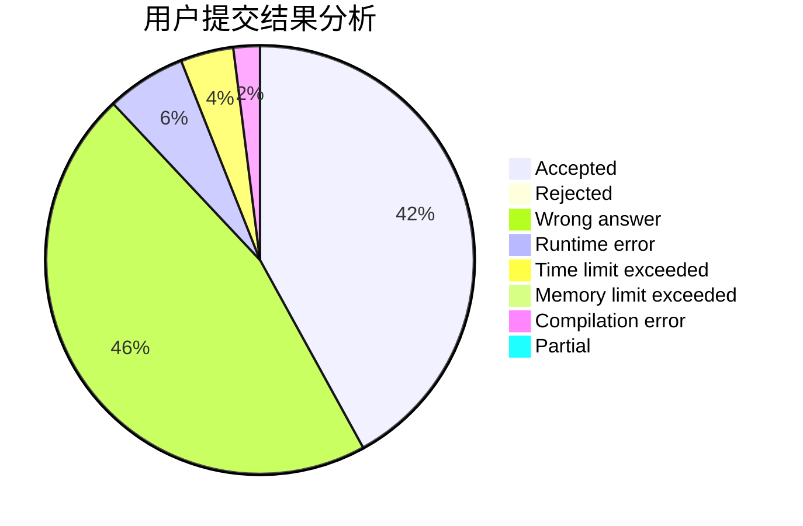
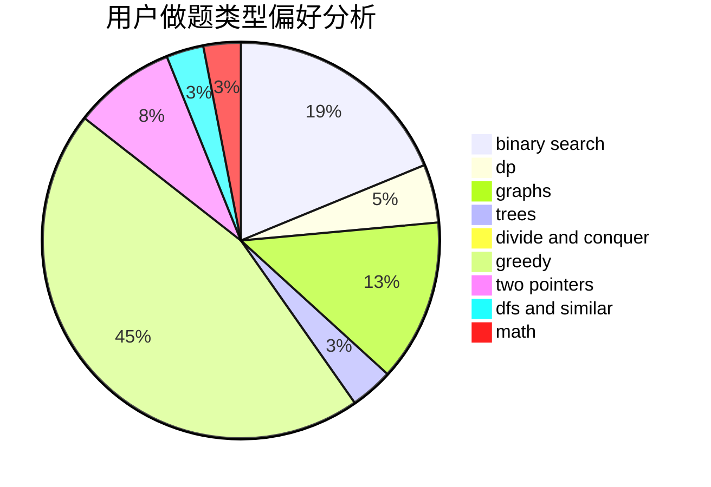

# F0_0H

<!-- tabs:start -->

#### **用户提交结果分析**

#### **用户做题类型偏好分析**

<!-- tabs:end -->
# 推荐题目
[1264A](https://codeforces.com/contest/1264/problem/A)
[1207B](https://codeforces.com/contest/1207/problem/B)
[1373E](https://codeforces.com/contest/1373/problem/E)
[1375I](https://codeforces.com/contest/1375/problem/I)
[1220E](https://codeforces.com/contest/1220/problem/E)
[218B](https://codeforces.com/contest/218/problem/B)
[859E](https://codeforces.com/contest/859/problem/E)
[1013A](https://codeforces.com/contest/1013/problem/A)
[758D](https://codeforces.com/contest/758/problem/D)
[1138E](https://codeforces.com/contest/1138/problem/E)
