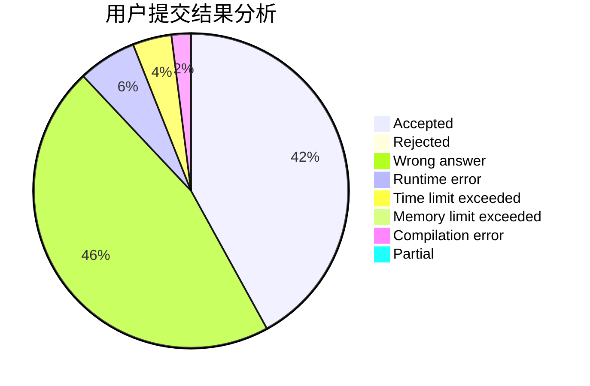
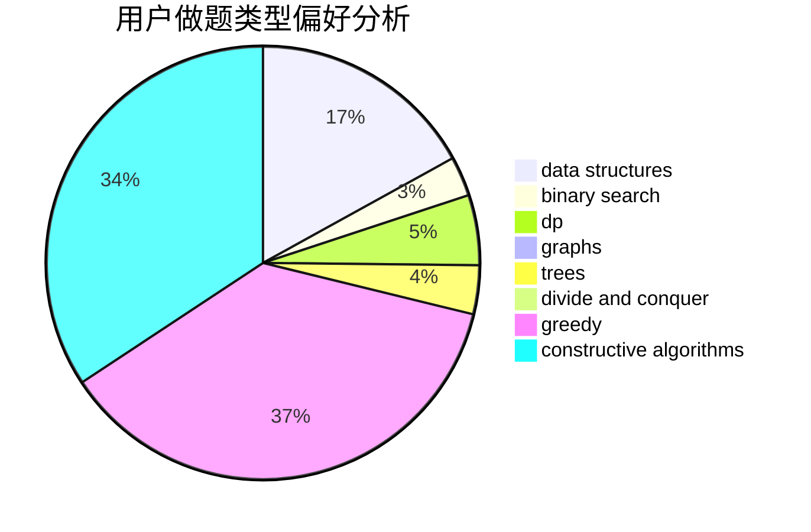
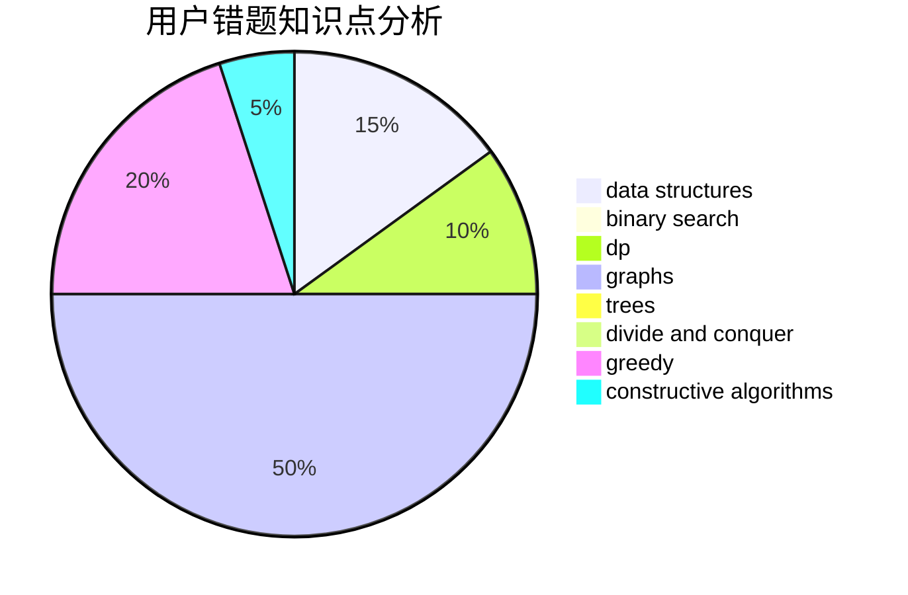

# F0_0H

<!-- tabs:start -->

#### **用户提交结果分析**

#### **用户做题类型偏好分析**

#### **用户错题知识点分析**

<!-- tabs:end -->
# 推荐题目
[1264A](https://codeforces.com/contest/1264/problem/A)		greedy,
                        implementation		  
[1207B](https://codeforces.com/contest/1207/problem/B)		constructive algorithms,
                        greedy,
                        implementation		  
[1373E](https://codeforces.com/contest/1373/problem/E)		brute force,
                        constructive algorithms,
                        dp,
                        greedy		  
[1375I](https://codeforces.com/contest/1375/problem/I)		geometry,
                        math,
                        matrices,
                        number theory		  
[1220E](https://codeforces.com/contest/1220/problem/E)		dfs and similar,
                        dp,
                        dsu,
                        graphs,
                        greedy,
                        trees		  
[218B](https://codeforces.com/contest/218/problem/B)		implementation		  
[859E](https://codeforces.com/contest/859/problem/E)		combinatorics,
                        dfs and similar,
                        dsu,
                        graphs,
                        trees		  
[1013A](https://codeforces.com/contest/1013/problem/A)		math		  
[758D](https://codeforces.com/contest/758/problem/D)		constructive algorithms,
                        dp,
                        greedy,
                        math,
                        strings		  
[1138E](https://codeforces.com/contest/1138/problem/E)		dsu,graphs,sortings,trees		  
