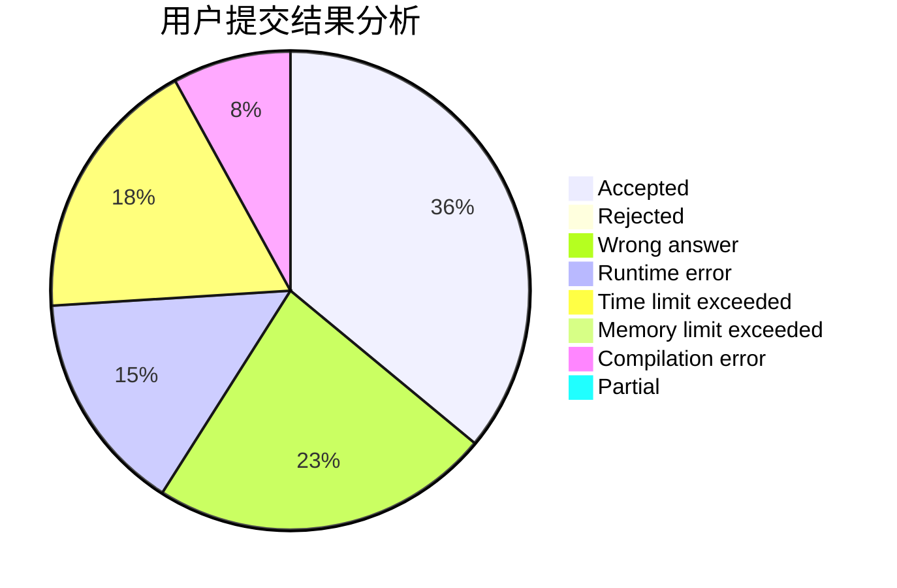
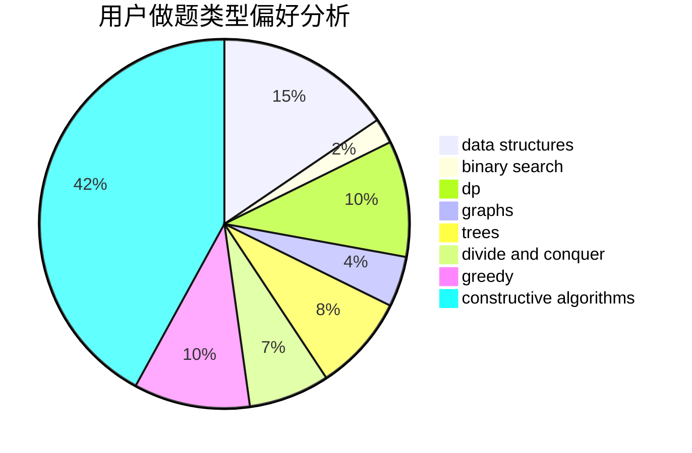
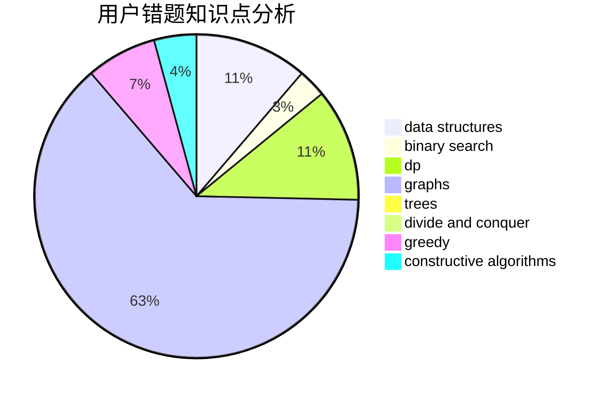

# F99_ll_H21

<!-- tabs:start -->

#### **用户提交结果分析**

#### **用户做题类型偏好分析**

#### **用户错题知识点分析**

<!-- tabs:end -->
# 推荐题目
[1340D](https://codeforces.com/contest/1340/problem/D)		constructive algorithms,
                        dfs and similar,
                        graphs,
                        trees		  
[860B](https://codeforces.com/contest/860/problem/B)		dsu,graphs,sortings,trees		  
[520A](https://codeforces.com/contest/520/problem/A)		implementation,
                        strings		  
[1292E](https://codeforces.com/contest/1292/problem/E)		constructive algorithms,
                        greedy,
                        interactive,
                        math		  
[1060D](https://codeforces.com/contest/1060/problem/D)		greedy,
                        math		  
[13783](https://codeforces.com/contest/1378/problem/3)		dsu,graphs,sortings,trees		  
[700B](https://codeforces.com/contest/700/problem/B)		dfs and similar,
                        dp,
                        graphs,
                        trees		  
[13042](https://codeforces.com/contest/1304/problem/2)		dsu,graphs,sortings,trees		  
[1090A](https://codeforces.com/contest/1090/problem/A)		greedy		  
[845A](https://codeforces.com/contest/845/problem/A)		implementation,
                        sortings		  
