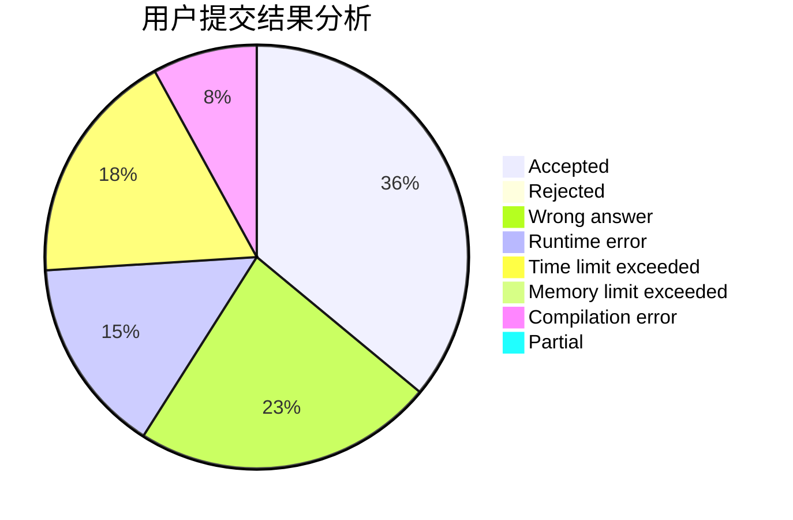
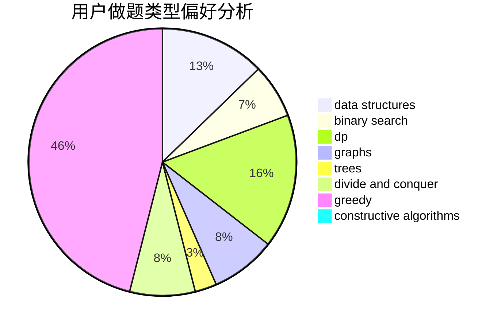
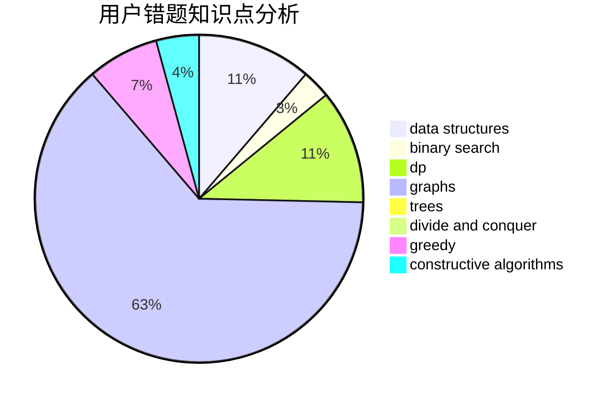

# F99_ll_H21

<!-- tabs:start -->

#### **用户提交结果分析**

#### **用户做题类型偏好分析**

#### **用户错题知识点分析**

<!-- tabs:end -->
# 推荐题目
[1333E](https://codeforces.com/contest/1333/problem/E)		brute force,
                        constructive algorithms		  
[841B](https://codeforces.com/contest/841/problem/B)		games,
                        math		  
[4A](https://codeforces.com/contest/4/problem/A)		brute force,
                        math		  
[1285D](https://codeforces.com/contest/1285/problem/D)		bitmasks,
                        brute force,
                        dfs and similar,
                        divide and conquer,
                        dp,
                        greedy,
                        strings,
                        trees		  
[1060A](https://codeforces.com/contest/1060/problem/A)		brute force		  
[1370A](https://codeforces.com/contest/1370/problem/A)		greedy,
                        implementation,
                        math,
                        number theory		  
[676B](https://codeforces.com/contest/676/problem/B)		implementation,
                        math,
                        math		  
[1296F](https://codeforces.com/contest/1296/problem/F)		constructive algorithms,
                        dfs and similar,
                        greedy,
                        sortings,
                        trees		  
[1089L](https://codeforces.com/contest/1089/problem/L)		nan		  
[825E](https://codeforces.com/contest/825/problem/E)		data structures,
                        dfs and similar,
                        graphs,
                        greedy		  
