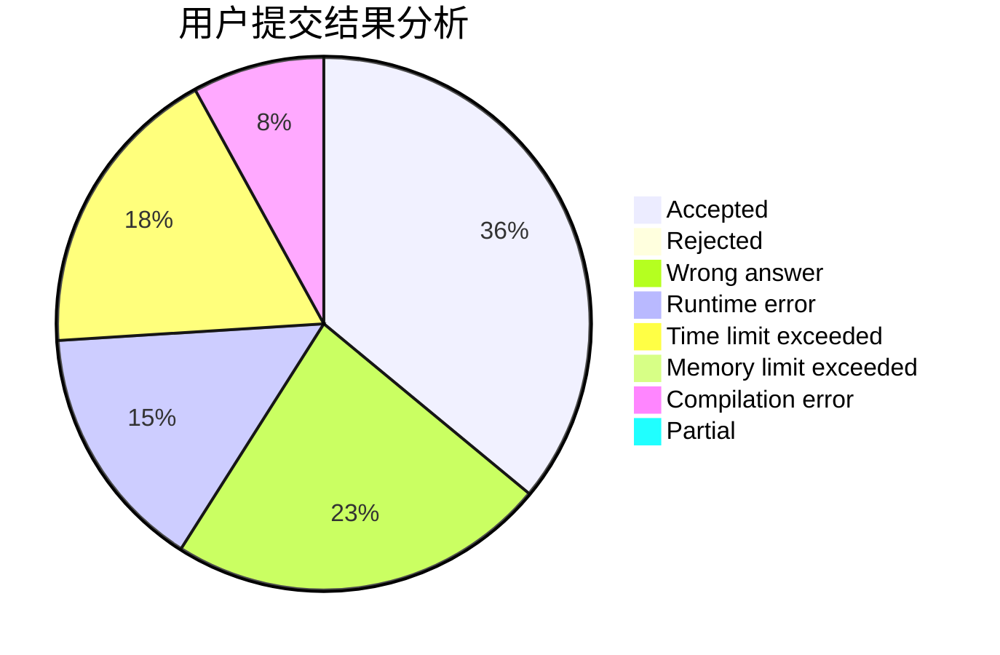
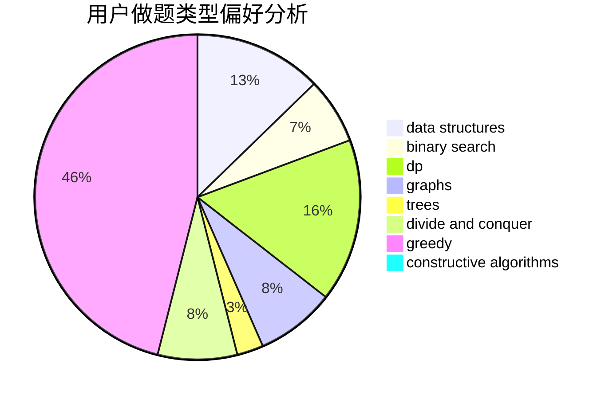
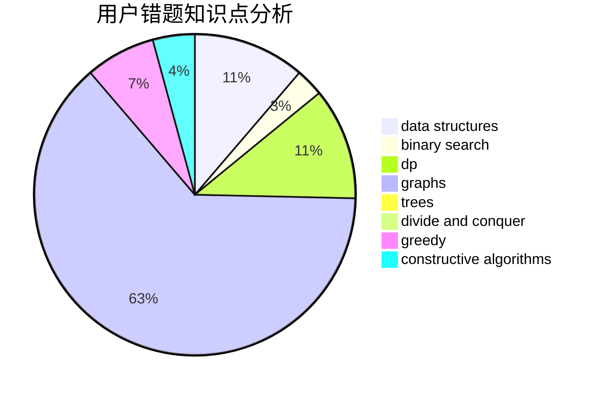

# F99_ll_H21
<!-- tabs:start -->
#### **用户提交结果分析**

#### **用户做题类型偏好分析**

#### **用户错题知识点分析**

<!-- tabs:end -->
# 推荐题目
[Watermelon](http://codeforces.com/problemset/problem/4/A)		brute force,
                        math		  
[Road to 1600](http://codeforces.com/problemset/problem/1333/E)		brute force,
                        constructive algorithms		  
[Godsend](http://codeforces.com/problemset/problem/841/B)		games,
                        math		  
[Phone Numbers](http://codeforces.com/problemset/problem/1060/A)		brute force		  
[Berland Beauty](http://codeforces.com/problemset/problem/1296/F)		constructive algorithms,
                        dfs and similar,
                        greedy,
                        sortings,
                        trees		  
[Minimal Labels](http://codeforces.com/problemset/problem/825/E)		data structures,
                        dfs and similar,
                        graphs,
                        greedy		  
[Stadium and Games](http://codeforces.com/problemset/problem/325/B)		binary search,
                        math		  
[Store](http://codeforces.com/problemset/problem/1010/E)		data structures		  
[Useful Edges](http://codeforces.com/problemset/problem/1482/F)		graphs,
                        shortest paths		  
[Pyramid of Glasses](http://codeforces.com/problemset/problem/676/B)		implementation,
                        math,
                        math		  
<!-- tabs:start -->
#### **data structures**
[Watermelon](http://codeforces.com/problemset/problem/825/E)		data structures,
                        dfs and similar,
                        graphs,
                        greedy		  
[Road to 1600](http://codeforces.com/problemset/problem/1010/E)		data structures		  
[Godsend](http://codeforces.com/problemset/problem/1017/G)		data structures		  
[Phone Numbers](http://codeforces.com/problemset/problem/362/C)		data structures,
                        dp,
                        implementation,
                        math		  
[Berland Beauty](http://codeforces.com/problemset/problem/1426/D)		constructive algorithms,
                        data structures,
                        greedy,
                        sortings		  
[Minimal Labels](http://codeforces.com/problemset/problem/1492/C)		binary search,
                        data structures,
                        dp,
                        greedy,
                        two pointers		  
[Stadium and Games](http://codeforces.com/problemset/problem/1490/G)		binary search,
                        data structures,
                        math		  
[Store](http://codeforces.com/problemset/problem/1479/D)		binary search,
                        bitmasks,
                        brute force,
                        data structures,
                        probabilities,
                        trees		  
[Useful Edges](http://codeforces.com/problemset/problem/1497/A)		brute force,
                        data structures,
                        greedy,
                        sortings		  
[Pyramid of Glasses](http://codeforces.com/problemset/problem/1491/C)		brute force,
                        data structures,
                        dp,
                        greedy,
                        implementation		  
#### **binary search**
[Watermelon](http://codeforces.com/problemset/problem/325/B)		binary search,
                        math		  
[Road to 1600](http://codeforces.com/problemset/problem/1492/C)		binary search,
                        data structures,
                        dp,
                        greedy,
                        two pointers		  
[Godsend](http://codeforces.com/problemset/problem/1463/D)		binary search,
                        constructive algorithms,
                        greedy,
                        two pointers		  
[Phone Numbers](http://codeforces.com/problemset/problem/1490/G)		binary search,
                        data structures,
                        math		  
[Berland Beauty](http://codeforces.com/problemset/problem/1479/D)		binary search,
                        bitmasks,
                        brute force,
                        data structures,
                        probabilities,
                        trees		  
[Minimal Labels](http://codeforces.com/problemset/problem/1436/E)		binary search,
                        data structures,
                        two pointers		  
[Stadium and Games](http://codeforces.com/problemset/problem/1461/D)		binary search,
                        brute force,
                        data structures,
                        divide and conquer,
                        implementation,
                        sortings		  
[Store](http://codeforces.com/problemset/problem/1493/C)		binary search,
                        brute force,
                        constructive algorithms,
                        greedy,
                        strings		  
[Useful Edges](http://codeforces.com/problemset/problem/1487/D)		binary search,
                        brute force,
                        math,
                        number theory		  
[Pyramid of Glasses](http://codeforces.com/problemset/problem/1486/B)		binary search,
                        geometry,
                        shortest paths,
                        sortings		  
#### **dp**
[Watermelon](http://codeforces.com/problemset/problem/754/C)		brute force,
                        constructive algorithms,
                        dp,
                        implementation,
                        strings		  
[Road to 1600](https://codeforces.com/contest/816/problem/E)		brute force,
                        dp,
                        trees		  
[Godsend](http://codeforces.com/problemset/problem/1285/D)		bitmasks,
                        brute force,
                        dfs and similar,
                        divide and conquer,
                        dp,
                        greedy,
                        strings,
                        trees		  
[Phone Numbers](http://codeforces.com/problemset/problem/362/C)		data structures,
                        dp,
                        implementation,
                        math		  
[Berland Beauty](http://codeforces.com/problemset/problem/1492/C)		binary search,
                        data structures,
                        dp,
                        greedy,
                        two pointers		  
[Minimal Labels](https://codeforces.com/contest/1457/problem/C)		brute force,
                        dp,
                        implementation		  
[Stadium and Games](http://codeforces.com/problemset/problem/1491/C)		brute force,
                        data structures,
                        dp,
                        greedy,
                        implementation		  
[Store](http://codeforces.com/problemset/problem/1437/C)		dp,
                        flows,
                        graph matchings,
                        greedy,
                        math,
                        sortings		  
[Useful Edges](http://codeforces.com/problemset/problem/1499/B)		brute force,
                        dp,
                        greedy,
                        implementation		  
[Pyramid of Glasses](http://codeforces.com/problemset/problem/1491/D)		bitmasks,
                        constructive algorithms,
                        dp,
                        greedy,
                        math		  
#### **graph**
[Watermelon](http://codeforces.com/problemset/problem/825/E)		data structures,
                        dfs and similar,
                        graphs,
                        greedy		  
[Road to 1600](http://codeforces.com/problemset/problem/1482/F)		graphs,
                        shortest paths		  
[Godsend](http://codeforces.com/problemset/problem/193/A)		constructive algorithms,
                        graphs,
                        trees		  
[Phone Numbers](http://codeforces.com/problemset/problem/1487/C)		brute force,
                        constructive algorithms,
                        dfs and similar,
                        graphs,
                        greedy,
                        implementation,
                        math		  
[Berland Beauty](http://codeforces.com/problemset/problem/1437/C)		dp,
                        flows,
                        graph matchings,
                        greedy,
                        math,
                        sortings		  
[Minimal Labels](http://codeforces.com/problemset/problem/1470/D)		constructive algorithms,
                        dfs and similar,
                        graph matchings,
                        graphs,
                        greedy		  
[Stadium and Games](http://codeforces.com/problemset/problem/1476/C)		dp,
                        graphs,
                        greedy		  
[Store](http://codeforces.com/problemset/problem/1304/D)		constructive algorithms,
                        graphs,
                        greedy,
                        two pointers		  
[Useful Edges](http://codeforces.com/problemset/problem/1475/C)		combinatorics,
                        graphs,
                        math		  
[Pyramid of Glasses](http://codeforces.com/problemset/problem/553/E)		dp,
                        fft,
                        graphs,
                        math,
                        probabilities		  
#### **trees**
[Watermelon](http://codeforces.com/problemset/problem/1296/F)		constructive algorithms,
                        dfs and similar,
                        greedy,
                        sortings,
                        trees		  
[Road to 1600](https://codeforces.com/contest/816/problem/E)		brute force,
                        dp,
                        trees		  
[Godsend](http://codeforces.com/problemset/problem/1285/D)		bitmasks,
                        brute force,
                        dfs and similar,
                        divide and conquer,
                        dp,
                        greedy,
                        strings,
                        trees		  
[Phone Numbers](http://codeforces.com/problemset/problem/193/A)		constructive algorithms,
                        graphs,
                        trees		  
[Berland Beauty](http://codeforces.com/problemset/problem/1479/D)		binary search,
                        bitmasks,
                        brute force,
                        data structures,
                        probabilities,
                        trees		  
[Minimal Labels](http://codeforces.com/problemset/problem/1511/C)		brute force,
                        data structures,
                        implementation,
                        trees		  
[Stadium and Games](http://codeforces.com/problemset/problem/1499/F)		combinatorics,
                        dfs and similar,
                        dp,
                        trees		  
[Store](http://codeforces.com/problemset/problem/1491/E)		brute force,
                        dfs and similar,
                        divide and conquer,
                        number theory,
                        trees		  
[Useful Edges](http://codeforces.com/problemset/problem/1466/D)		data structures,
                        greedy,
                        sortings,
                        trees		  
[Pyramid of Glasses](http://codeforces.com/problemset/problem/1495/D)		combinatorics,
                        dfs and similar,
                        graphs,
                        math,
                        shortest paths,
                        trees		  
#### **divide and conquer**
[Watermelon](http://codeforces.com/problemset/problem/1285/D)		bitmasks,
                        brute force,
                        dfs and similar,
                        divide and conquer,
                        dp,
                        greedy,
                        strings,
                        trees		  
[Road to 1600](http://codeforces.com/problemset/problem/1461/D)		binary search,
                        brute force,
                        data structures,
                        divide and conquer,
                        implementation,
                        sortings		  
[Godsend](http://codeforces.com/problemset/problem/1466/G)		combinatorics,
                        divide and conquer,
                        hashing,
                        math,
                        string suffix structures,
                        strings		  
[Phone Numbers](http://codeforces.com/problemset/problem/1490/D)		dfs and similar,
                        divide and conquer,
                        implementation		  
[Berland Beauty](https://codeforces.com/contest/1483/problem/C)		data structures,
                        divide and conquer,
                        dp		  
[Minimal Labels](http://codeforces.com/problemset/problem/1491/E)		brute force,
                        dfs and similar,
                        divide and conquer,
                        number theory,
                        trees		  
[Stadium and Games](http://codeforces.com/problemset/problem/1303/G)		data structures,
                        divide and conquer,
                        geometry,
                        trees		  
[Store](http://codeforces.com/problemset/problem/1494/D)		constructive algorithms,
                        data structures,
                        dfs and similar,
                        divide and conquer,
                        dsu,
                        greedy,
                        sortings,
                        trees		  
[Useful Edges](http://codeforces.com/problemset/problem/1482/E)		data structures,
                        divide and conquer,
                        dp		  
[Pyramid of Glasses](http://codeforces.com/problemset/problem/566/C)		dfs and similar,
                        divide and conquer,
                        trees		  
#### **greedy**
[Watermelon](http://codeforces.com/problemset/problem/1296/F)		constructive algorithms,
                        dfs and similar,
                        greedy,
                        sortings,
                        trees		  
[Road to 1600](http://codeforces.com/problemset/problem/825/E)		data structures,
                        dfs and similar,
                        graphs,
                        greedy		  
[Godsend](http://codeforces.com/problemset/problem/1285/D)		bitmasks,
                        brute force,
                        dfs and similar,
                        divide and conquer,
                        dp,
                        greedy,
                        strings,
                        trees		  
[Phone Numbers](http://codeforces.com/problemset/problem/1370/A)		greedy,
                        implementation,
                        math,
                        number theory		  
[Berland Beauty](http://codeforces.com/problemset/problem/1292/E)		constructive algorithms,
                        greedy,
                        interactive,
                        math		  
[Minimal Labels](http://codeforces.com/problemset/problem/1426/D)		constructive algorithms,
                        data structures,
                        greedy,
                        sortings		  
[Stadium and Games](http://codeforces.com/problemset/problem/1293/B)		combinatorics,
                        greedy,
                        math		  
[Store](http://codeforces.com/problemset/problem/1492/C)		binary search,
                        data structures,
                        dp,
                        greedy,
                        two pointers		  
[Useful Edges](https://codeforces.com/contest/1496/problem/C)		geometry,
                        greedy,
                        math,
                        sortings		  
[Pyramid of Glasses](http://codeforces.com/problemset/problem/1493/A)		constructive algorithms,
                        greedy		  
#### **constructive algorithms**
[Watermelon](http://codeforces.com/problemset/problem/1333/E)		brute force,
                        constructive algorithms		  
[Road to 1600](http://codeforces.com/problemset/problem/1296/F)		constructive algorithms,
                        dfs and similar,
                        greedy,
                        sortings,
                        trees		  
[Godsend](http://codeforces.com/problemset/problem/754/C)		brute force,
                        constructive algorithms,
                        dp,
                        implementation,
                        strings		  
[Phone Numbers](http://codeforces.com/problemset/problem/1292/E)		constructive algorithms,
                        greedy,
                        interactive,
                        math		  
[Berland Beauty](http://codeforces.com/problemset/problem/1426/D)		constructive algorithms,
                        data structures,
                        greedy,
                        sortings		  
[Minimal Labels](http://codeforces.com/problemset/problem/193/A)		constructive algorithms,
                        graphs,
                        trees		  
[Stadium and Games](http://codeforces.com/problemset/problem/1493/A)		constructive algorithms,
                        greedy		  
[Store](http://codeforces.com/problemset/problem/1463/D)		binary search,
                        constructive algorithms,
                        greedy,
                        two pointers		  
[Useful Edges](https://codeforces.com/contest/1456/problem/B)		bitmasks,
                        brute force,
                        constructive algorithms		  
[Pyramid of Glasses](http://codeforces.com/problemset/problem/1492/D)		bitmasks,
                        constructive algorithms,
                        greedy,
                        math		  
#### **sortings**
[Watermelon](http://codeforces.com/problemset/problem/1296/F)		constructive algorithms,
                        dfs and similar,
                        greedy,
                        sortings,
                        trees		  
[Road to 1600](http://codeforces.com/problemset/problem/723/A)		implementation,
                        math,
                        sortings		  
[Godsend](http://codeforces.com/problemset/problem/1426/D)		constructive algorithms,
                        data structures,
                        greedy,
                        sortings		  
[Phone Numbers](https://codeforces.com/contest/1496/problem/C)		geometry,
                        greedy,
                        math,
                        sortings		  
[Berland Beauty](http://codeforces.com/problemset/problem/1495/A)		geometry,
                        greedy,
                        math,
                        sortings		  
[Minimal Labels](http://codeforces.com/problemset/problem/1497/A)		brute force,
                        data structures,
                        greedy,
                        sortings		  
[Stadium and Games](http://codeforces.com/problemset/problem/1427/A)		math,
                        sortings		  
[Store](http://codeforces.com/problemset/problem/1461/D)		binary search,
                        brute force,
                        data structures,
                        divide and conquer,
                        implementation,
                        sortings		  
[Useful Edges](http://codeforces.com/problemset/problem/1437/C)		dp,
                        flows,
                        graph matchings,
                        greedy,
                        math,
                        sortings		  
[Pyramid of Glasses](http://codeforces.com/problemset/problem/1473/A)		greedy,
                        implementation,
                        math,
                        sortings		  
<!-- tabs:end -->
