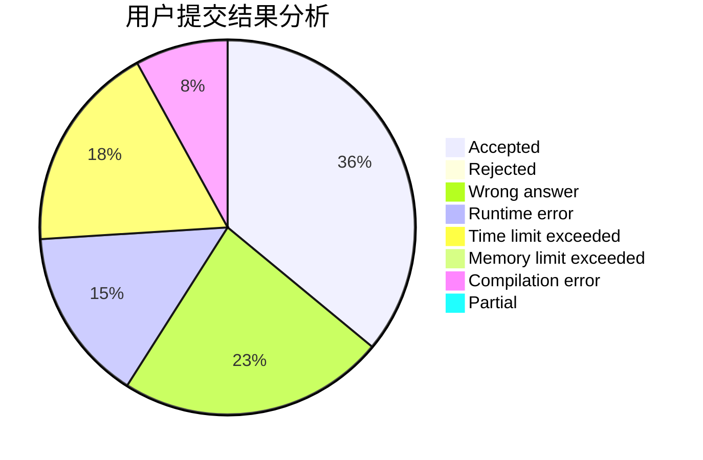
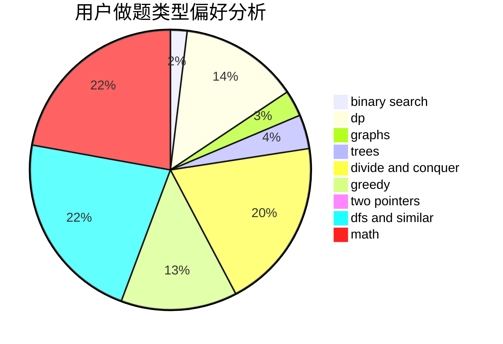

# F99_ll_H21

<!-- tabs:start -->

#### **用户提交结果分析**

#### **用户做题类型偏好分析**

<!-- tabs:end -->
# 推荐题目
[1340D](https://codeforces.com/contest/1340/problem/D)
[860B](https://codeforces.com/contest/860/problem/B)
[520A](https://codeforces.com/contest/520/problem/A)
[1292E](https://codeforces.com/contest/1292/problem/E)
[1060D](https://codeforces.com/contest/1060/problem/D)
[13783](https://codeforces.com/contest/1378/problem/3)
[700B](https://codeforces.com/contest/700/problem/B)
[13042](https://codeforces.com/contest/1304/problem/2)
[1090A](https://codeforces.com/contest/1090/problem/A)
[845A](https://codeforces.com/contest/845/problem/A)
