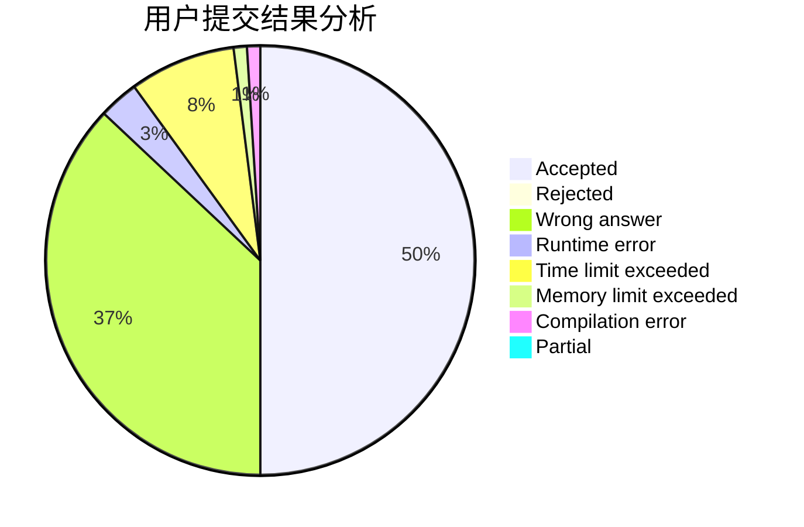
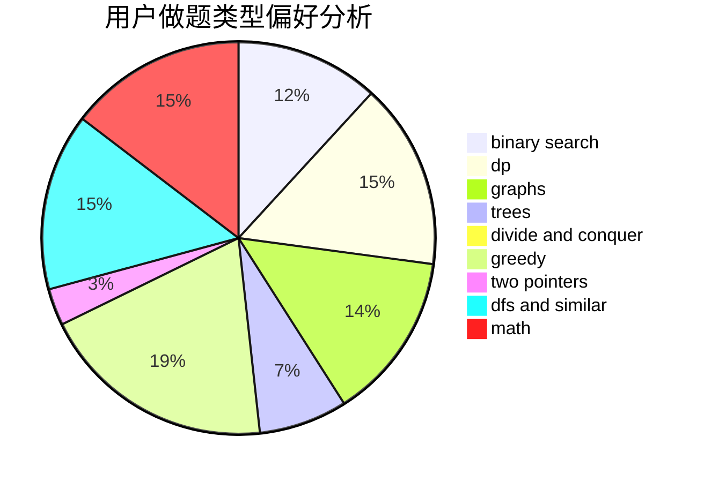

# FFFFFFFHHHHHHH

<!-- tabs:start -->

#### **用户提交结果分析**

#### **用户做题类型偏好分析**

<!-- tabs:end -->
# 推荐题目
[1436C](https://codeforces.com/contest/1436/problem/C)
[763A](https://codeforces.com/contest/763/problem/A)
[1200B](https://codeforces.com/contest/1200/problem/B)
[677C](https://codeforces.com/contest/677/problem/C)
[723B](https://codeforces.com/contest/723/problem/B)
[861A](https://codeforces.com/contest/861/problem/A)
[1110C](https://codeforces.com/contest/1110/problem/C)
[860D](https://codeforces.com/contest/860/problem/D)
[1325E](https://codeforces.com/contest/1325/problem/E)
[1240D](https://codeforces.com/contest/1240/problem/D)
