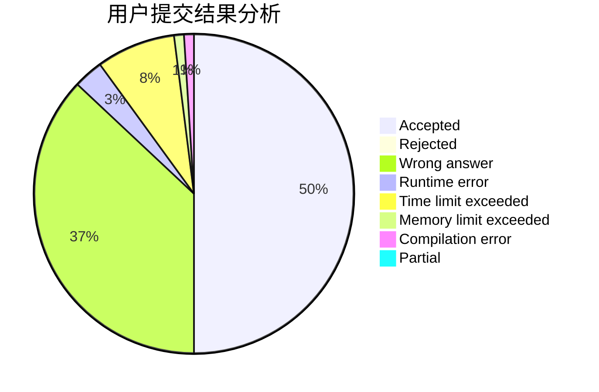
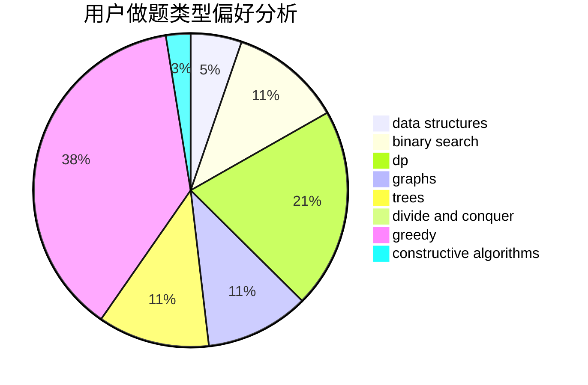
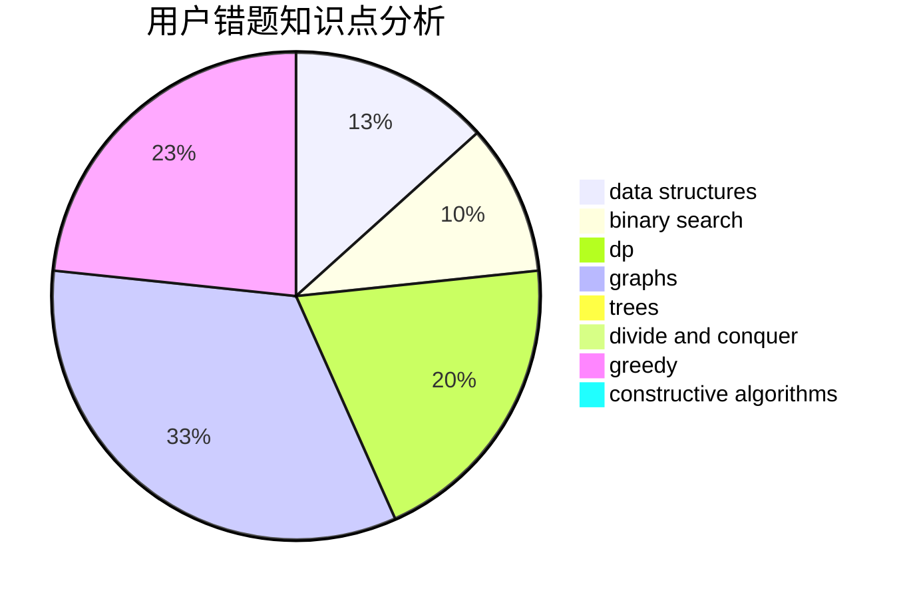

# FFFFFFFHHHHHHH

<!-- tabs:start -->

#### **用户提交结果分析**

#### **用户做题类型偏好分析**

#### **用户错题知识点分析**

<!-- tabs:end -->
# 推荐题目
[1436C](https://codeforces.com/contest/1436/problem/C)		binary search,
                        combinatorics		  
[763A](https://codeforces.com/contest/763/problem/A)		dfs and similar,
                        dp,
                        dsu,
                        graphs,
                        implementation,
                        trees		  
[1200B](https://codeforces.com/contest/1200/problem/B)		dp,
                        greedy		  
[677C](https://codeforces.com/contest/677/problem/C)		bitmasks,
                        combinatorics,
                        implementation,
                        strings		  
[723B](https://codeforces.com/contest/723/problem/B)		expression parsing,
                        implementation,
                        strings		  
[861A](https://codeforces.com/contest/861/problem/A)		dsu,graphs,sortings,trees		  
[1110C](https://codeforces.com/contest/1110/problem/C)		constructive algorithms,
                        math,
                        number theory		  
[860D](https://codeforces.com/contest/860/problem/D)		dsu,graphs,sortings,trees		  
[1325E](https://codeforces.com/contest/1325/problem/E)		brute force,
                        dfs and similar,
                        graphs,
                        number theory,
                        shortest paths		  
[1240D](https://codeforces.com/contest/1240/problem/D)		dsu,graphs,sortings,trees		  
