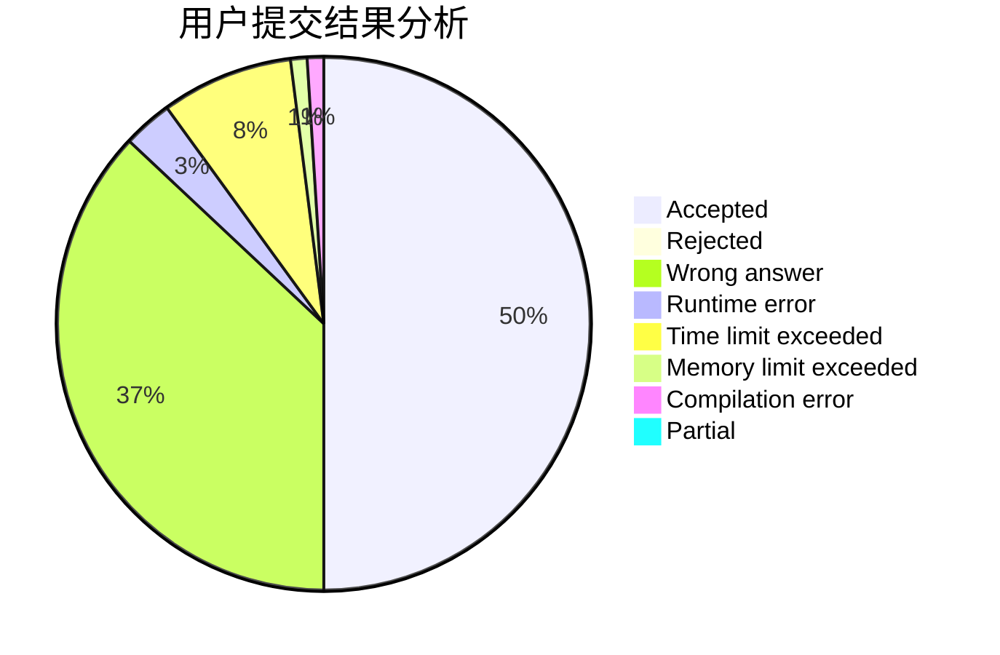
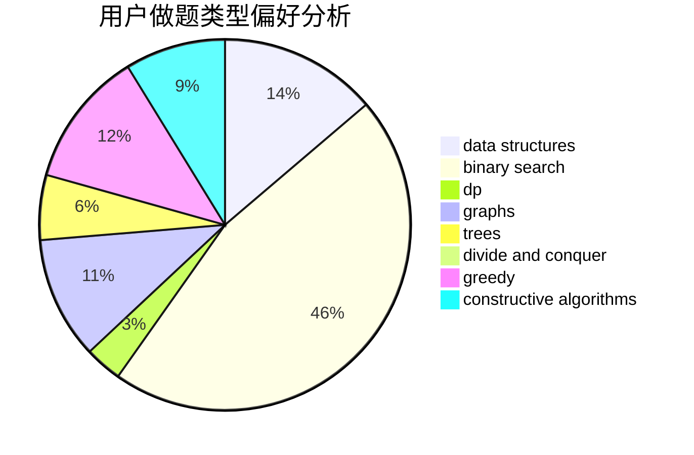
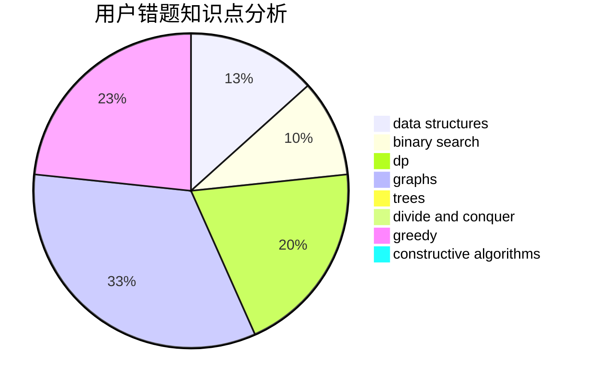

# FFFFFFFHHHHHHH
<!-- tabs:start -->
#### **用户提交结果分析**

#### **用户做题类型偏好分析**

#### **用户错题知识点分析**

<!-- tabs:end -->
# 推荐题目
[Xum](http://codeforces.com/problemset/problem/1427/E)		bitmasks,
                        constructive algorithms,
                        math,
                        matrices,
                        number theory		  
[Arpa's weak amphitheater and Mehrdad's valuable Hoses](https://codeforces.com/contest/742/problem/D)		dfs and similar,
                        dp,
                        dsu		  
[Cthulhu](http://codeforces.com/problemset/problem/103/B)		dfs and similar,
                        dsu,
                        graphs		  
[K-th Path](http://codeforces.com/problemset/problem/1196/F)		brute force,
                        constructive algorithms,
                        shortest paths,
                        sortings		  
[Periodical Numbers](http://codeforces.com/problemset/problem/215/E)		combinatorics,
                        dp,
                        number theory		  
[Bubble Cup hypothesis](https://codeforces.com/contest/1424/problem/I)		bitmasks,
                        constructive algorithms,
                        dp,
                        math		  
[Two Small Strings](http://codeforces.com/problemset/problem/1213/E)		brute force,
                        constructive algorithms		  
[Pasha and Pipe](http://codeforces.com/problemset/problem/518/F)		binary search,
                        brute force,
                        combinatorics,
                        dp,
                        implementation		  
[Vanya and Label](http://codeforces.com/problemset/problem/677/C)		bitmasks,
                        combinatorics,
                        implementation,
                        strings		  
[Bear and Up-Down](http://codeforces.com/problemset/problem/653/C)		brute force,
                        implementation		  
<!-- tabs:start -->
#### **data structures**
[Xum](https://codeforces.com/contest/841/problem/D)		constructive algorithms,
                        data structures,
                        dfs and similar,
                        dp,
                        graphs		  
[Arpa's weak amphitheater and Mehrdad's valuable Hoses](http://codeforces.com/problemset/problem/1251/E2)		binary search,
                        data structures,
                        greedy		  
[Cthulhu](http://codeforces.com/problemset/problem/796/C)		constructive algorithms,
                        data structures,
                        dp,
                        trees		  
[K-th Path](http://codeforces.com/problemset/problem/818/D)		data structures,
                        implementation		  
[Periodical Numbers](http://codeforces.com/problemset/problem/13/E)		data structures,
                        dsu		  
[Bubble Cup hypothesis](http://codeforces.com/problemset/problem/1213/F)		data structures,
                        dfs and similar,
                        dsu,
                        graphs,
                        greedy,
                        implementation,
                        strings		  
[Two Small Strings](http://codeforces.com/problemset/problem/547/E)		data structures,
                        string suffix structures,
                        strings,
                        trees		  
[Pasha and Pipe](http://codeforces.com/problemset/problem/61/E)		data structures,
                        trees		  
[Vanya and Label](http://codeforces.com/problemset/problem/150/E)		binary search,
                        data structures,
                        divide and conquer,
                        trees		  
[Bear and Up-Down](http://codeforces.com/problemset/problem/1329/C)		constructive algorithms,
                        data structures,
                        greedy,
                        implementation		  
#### **binary search**
[Xum](http://codeforces.com/problemset/problem/518/F)		binary search,
                        brute force,
                        combinatorics,
                        dp,
                        implementation		  
[Arpa's weak amphitheater and Mehrdad's valuable Hoses](https://codeforces.com/contest/1104/problem/D)		binary search,
                        constructive algorithms,
                        interactive		  
[Cthulhu](http://codeforces.com/problemset/problem/1251/E2)		binary search,
                        data structures,
                        greedy		  
[K-th Path](http://codeforces.com/problemset/problem/150/E)		binary search,
                        data structures,
                        divide and conquer,
                        trees		  
[Periodical Numbers](http://codeforces.com/problemset/problem/1500/E)		binary search,
                        data structures		  
[Bubble Cup hypothesis](http://codeforces.com/problemset/problem/1409/E)		binary search,
                        dp,
                        sortings,
                        two pointers		  
[Two Small Strings](http://codeforces.com/problemset/problem/1492/C)		binary search,
                        data structures,
                        dp,
                        greedy,
                        two pointers		  
[Pasha and Pipe](http://codeforces.com/problemset/problem/1463/D)		binary search,
                        constructive algorithms,
                        greedy,
                        two pointers		  
[Vanya and Label](http://codeforces.com/problemset/problem/1490/G)		binary search,
                        data structures,
                        math		  
[Bear and Up-Down](http://codeforces.com/problemset/problem/1479/D)		binary search,
                        bitmasks,
                        brute force,
                        data structures,
                        probabilities,
                        trees		  
#### **dp**
[Xum](https://codeforces.com/contest/742/problem/D)		dfs and similar,
                        dp,
                        dsu		  
[Arpa's weak amphitheater and Mehrdad's valuable Hoses](http://codeforces.com/problemset/problem/215/E)		combinatorics,
                        dp,
                        number theory		  
[Cthulhu](https://codeforces.com/contest/1424/problem/I)		bitmasks,
                        constructive algorithms,
                        dp,
                        math		  
[K-th Path](http://codeforces.com/problemset/problem/518/F)		binary search,
                        brute force,
                        combinatorics,
                        dp,
                        implementation		  
[Periodical Numbers](https://codeforces.com/contest/841/problem/D)		constructive algorithms,
                        data structures,
                        dfs and similar,
                        dp,
                        graphs		  
[Bubble Cup hypothesis](http://codeforces.com/problemset/problem/174/B)		dp,
                        greedy,
                        implementation		  
[Two Small Strings](http://codeforces.com/problemset/problem/796/C)		constructive algorithms,
                        data structures,
                        dp,
                        trees		  
[Pasha and Pipe](http://codeforces.com/problemset/problem/335/D)		brute force,
                        dp		  
[Vanya and Label](http://codeforces.com/problemset/problem/1307/C)		brute force,
                        dp,
                        math,
                        strings		  
[Bear and Up-Down](https://codeforces.com/contest/604/problem/C)		dp,
                        greedy,
                        math		  
#### **graph**
[Xum](http://codeforces.com/problemset/problem/103/B)		dfs and similar,
                        dsu,
                        graphs		  
[Arpa's weak amphitheater and Mehrdad's valuable Hoses](https://codeforces.com/contest/841/problem/D)		constructive algorithms,
                        data structures,
                        dfs and similar,
                        dp,
                        graphs		  
[Cthulhu](http://codeforces.com/problemset/problem/59/E)		graphs,
                        shortest paths		  
[K-th Path](http://codeforces.com/problemset/problem/1213/F)		data structures,
                        dfs and similar,
                        dsu,
                        graphs,
                        greedy,
                        implementation,
                        strings		  
[Periodical Numbers](http://codeforces.com/problemset/problem/1146/G)		dp,
                        flows,
                        graphs		  
[Bubble Cup hypothesis](http://codeforces.com/problemset/problem/704/B)		dp,
                        graphs,
                        greedy		  
[Two Small Strings](http://codeforces.com/problemset/problem/1487/C)		brute force,
                        constructive algorithms,
                        dfs and similar,
                        graphs,
                        greedy,
                        implementation,
                        math		  
[Pasha and Pipe](http://codeforces.com/problemset/problem/1437/C)		dp,
                        flows,
                        graph matchings,
                        greedy,
                        math,
                        sortings		  
[Vanya and Label](http://codeforces.com/problemset/problem/1470/D)		constructive algorithms,
                        dfs and similar,
                        graph matchings,
                        graphs,
                        greedy		  
[Bear and Up-Down](http://codeforces.com/problemset/problem/1476/C)		dp,
                        graphs,
                        greedy		  
#### **trees**
[Xum](http://codeforces.com/problemset/problem/796/C)		constructive algorithms,
                        data structures,
                        dp,
                        trees		  
[Arpa's weak amphitheater and Mehrdad's valuable Hoses](http://codeforces.com/problemset/problem/547/E)		data structures,
                        string suffix structures,
                        strings,
                        trees		  
[Cthulhu](http://codeforces.com/problemset/problem/61/E)		data structures,
                        trees		  
[K-th Path](http://codeforces.com/problemset/problem/150/E)		binary search,
                        data structures,
                        divide and conquer,
                        trees		  
[Periodical Numbers](http://codeforces.com/problemset/problem/1097/G)		combinatorics,
                        dp,
                        trees		  
[Bubble Cup hypothesis](http://codeforces.com/problemset/problem/1479/D)		binary search,
                        bitmasks,
                        brute force,
                        data structures,
                        probabilities,
                        trees		  
[Two Small Strings](http://codeforces.com/problemset/problem/1511/C)		brute force,
                        data structures,
                        implementation,
                        trees		  
[Pasha and Pipe](http://codeforces.com/problemset/problem/1499/F)		combinatorics,
                        dfs and similar,
                        dp,
                        trees		  
[Vanya and Label](http://codeforces.com/problemset/problem/1491/E)		brute force,
                        dfs and similar,
                        divide and conquer,
                        number theory,
                        trees		  
[Bear and Up-Down](http://codeforces.com/problemset/problem/1466/D)		data structures,
                        greedy,
                        sortings,
                        trees		  
#### **divide and conquer**
[Xum](http://codeforces.com/problemset/problem/150/E)		binary search,
                        data structures,
                        divide and conquer,
                        trees		  
[Arpa's weak amphitheater and Mehrdad's valuable Hoses](http://codeforces.com/problemset/problem/1461/D)		binary search,
                        brute force,
                        data structures,
                        divide and conquer,
                        implementation,
                        sortings		  
[Cthulhu](http://codeforces.com/problemset/problem/1466/G)		combinatorics,
                        divide and conquer,
                        hashing,
                        math,
                        string suffix structures,
                        strings		  
[K-th Path](http://codeforces.com/problemset/problem/1490/D)		dfs and similar,
                        divide and conquer,
                        implementation		  
[Periodical Numbers](https://codeforces.com/contest/1483/problem/C)		data structures,
                        divide and conquer,
                        dp		  
[Bubble Cup hypothesis](http://codeforces.com/problemset/problem/1491/E)		brute force,
                        dfs and similar,
                        divide and conquer,
                        number theory,
                        trees		  
[Two Small Strings](http://codeforces.com/problemset/problem/1303/G)		data structures,
                        divide and conquer,
                        geometry,
                        trees		  
[Pasha and Pipe](http://codeforces.com/problemset/problem/1494/D)		constructive algorithms,
                        data structures,
                        dfs and similar,
                        divide and conquer,
                        dsu,
                        greedy,
                        sortings,
                        trees		  
[Vanya and Label](http://codeforces.com/problemset/problem/1482/E)		data structures,
                        divide and conquer,
                        dp		  
[Bear and Up-Down](http://codeforces.com/problemset/problem/566/C)		dfs and similar,
                        divide and conquer,
                        trees		  
#### **greedy**
[Xum](http://codeforces.com/problemset/problem/174/B)		dp,
                        greedy,
                        implementation		  
[Arpa's weak amphitheater and Mehrdad's valuable Hoses](http://codeforces.com/problemset/problem/1251/E2)		binary search,
                        data structures,
                        greedy		  
[Cthulhu](https://codeforces.com/contest/604/problem/C)		dp,
                        greedy,
                        math		  
[K-th Path](https://codeforces.com/contest/841/problem/C)		combinatorics,
                        greedy,
                        math,
                        number theory,
                        sortings		  
[Periodical Numbers](http://codeforces.com/problemset/problem/1236/A)		brute force,
                        greedy,
                        math		  
[Bubble Cup hypothesis](http://codeforces.com/problemset/problem/1271/B)		greedy,
                        math		  
[Two Small Strings](http://codeforces.com/problemset/problem/1213/F)		data structures,
                        dfs and similar,
                        dsu,
                        graphs,
                        greedy,
                        implementation,
                        strings		  
[Pasha and Pipe](http://codeforces.com/problemset/problem/1329/C)		constructive algorithms,
                        data structures,
                        greedy,
                        implementation		  
[Vanya and Label](http://codeforces.com/problemset/problem/704/B)		dp,
                        graphs,
                        greedy		  
[Bear and Up-Down](http://codeforces.com/problemset/problem/1157/B)		greedy		  
#### **constructive algorithms**
[Xum](http://codeforces.com/problemset/problem/1427/E)		bitmasks,
                        constructive algorithms,
                        math,
                        matrices,
                        number theory		  
[Arpa's weak amphitheater and Mehrdad's valuable Hoses](http://codeforces.com/problemset/problem/1196/F)		brute force,
                        constructive algorithms,
                        shortest paths,
                        sortings		  
[Cthulhu](https://codeforces.com/contest/1424/problem/I)		bitmasks,
                        constructive algorithms,
                        dp,
                        math		  
[K-th Path](http://codeforces.com/problemset/problem/1213/E)		brute force,
                        constructive algorithms		  
[Periodical Numbers](https://codeforces.com/contest/841/problem/D)		constructive algorithms,
                        data structures,
                        dfs and similar,
                        dp,
                        graphs		  
[Bubble Cup hypothesis](https://codeforces.com/contest/1104/problem/D)		binary search,
                        constructive algorithms,
                        interactive		  
[Two Small Strings](http://codeforces.com/problemset/problem/796/C)		constructive algorithms,
                        data structures,
                        dp,
                        trees		  
[Pasha and Pipe](https://codeforces.com/contest/287/problem/C)		constructive algorithms,
                        math		  
[Vanya and Label](http://codeforces.com/problemset/problem/1329/C)		constructive algorithms,
                        data structures,
                        greedy,
                        implementation		  
[Bear and Up-Down](http://codeforces.com/problemset/problem/1503/B)		constructive algorithms,
                        games,
                        interactive		  
#### **sortings**
[Xum](http://codeforces.com/problemset/problem/1196/F)		brute force,
                        constructive algorithms,
                        shortest paths,
                        sortings		  
[Arpa's weak amphitheater and Mehrdad's valuable Hoses](https://codeforces.com/contest/841/problem/C)		combinatorics,
                        greedy,
                        math,
                        number theory,
                        sortings		  
[Cthulhu](http://codeforces.com/problemset/problem/598/C)		geometry,
                        sortings		  
[K-th Path](http://codeforces.com/problemset/problem/1080/F)		data structures,
                        interactive,
                        sortings		  
[Periodical Numbers](http://codeforces.com/problemset/problem/1396/D)		data structures,
                        sortings,
                        two pointers		  
[Bubble Cup hypothesis](http://codeforces.com/problemset/problem/1409/E)		binary search,
                        dp,
                        sortings,
                        two pointers		  
[Two Small Strings](https://codeforces.com/contest/1496/problem/C)		geometry,
                        greedy,
                        math,
                        sortings		  
[Pasha and Pipe](http://codeforces.com/problemset/problem/1495/A)		geometry,
                        greedy,
                        math,
                        sortings		  
[Vanya and Label](http://codeforces.com/problemset/problem/1497/A)		brute force,
                        data structures,
                        greedy,
                        sortings		  
[Bear and Up-Down](http://codeforces.com/problemset/problem/1427/A)		math,
                        sortings		  
<!-- tabs:end -->
