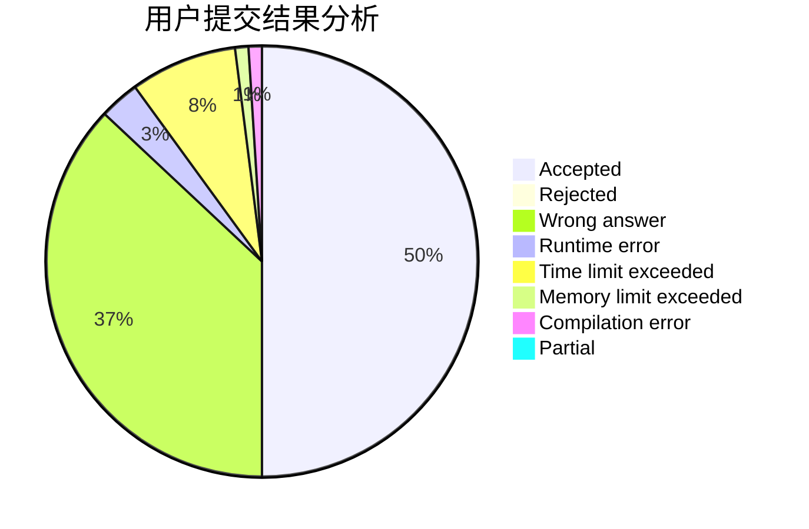
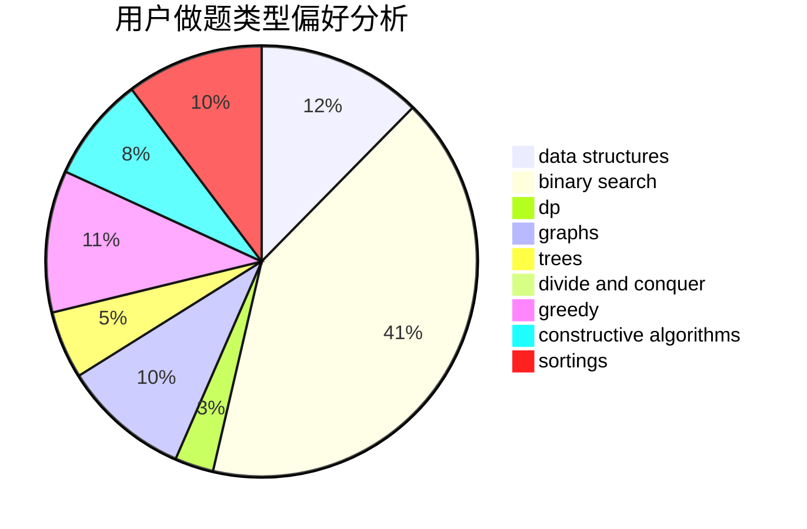
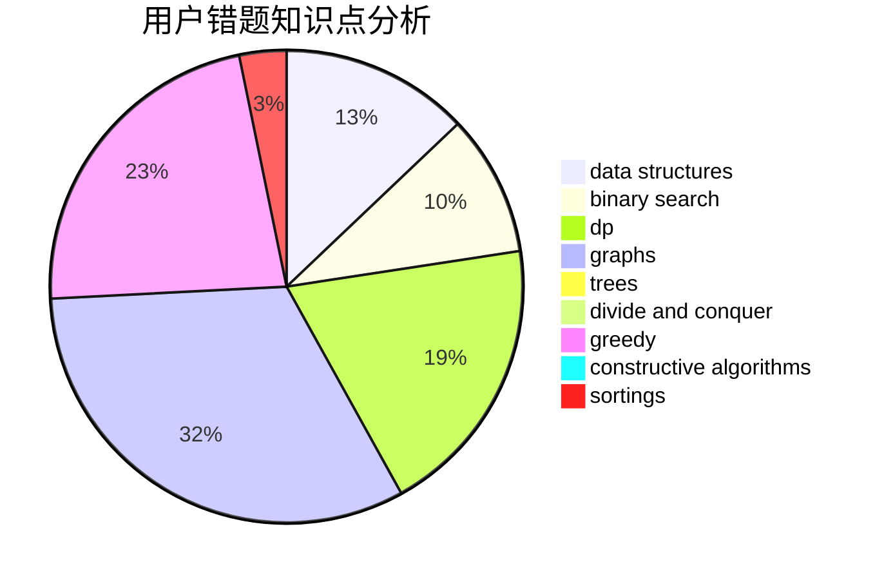

# FFFFFFFHHHHHHH
<!-- tabs:start -->
#### **用户提交结果分析**

#### **用户做题类型偏好分析**

#### **用户错题知识点分析**

<!-- tabs:end -->
# 推荐题目
[1427E](http://codeforces.com/problemset/problem/1427/E)		bitmasks,
                        constructive algorithms,
                        math,
                        matrices,
                        number theory		  
[742D](https://codeforces.com/contest/742/problem/D)		dfs and similar,
                        dp,
                        dsu		  
[103B](http://codeforces.com/problemset/problem/103/B)		dfs and similar,
                        dsu,
                        graphs		  
[1196F](http://codeforces.com/problemset/problem/1196/F)		brute force,
                        constructive algorithms,
                        shortest paths,
                        sortings		  
[215E](http://codeforces.com/problemset/problem/215/E)		combinatorics,
                        dp,
                        number theory		  
[1424I](https://codeforces.com/contest/1424/problem/I)		bitmasks,
                        constructive algorithms,
                        dp,
                        math		  
[1213E](http://codeforces.com/problemset/problem/1213/E)		brute force,
                        constructive algorithms		  
[518F](http://codeforces.com/problemset/problem/518/F)		binary search,
                        brute force,
                        combinatorics,
                        dp,
                        implementation		  
[677C](http://codeforces.com/problemset/problem/677/C)		bitmasks,
                        combinatorics,
                        implementation,
                        strings		  
[653C](http://codeforces.com/problemset/problem/653/C)		brute force,
                        implementation		  
<!-- tabs:start -->
#### **data structures**
[841D](https://codeforces.com/contest/841/problem/D)		constructive algorithms,
                        data structures,
                        dfs and similar,
                        dp,
                        graphs		  
[1251E2](http://codeforces.com/problemset/problem/1251/E2)		binary search,
                        data structures,
                        greedy		  
[796C](http://codeforces.com/problemset/problem/796/C)		constructive algorithms,
                        data structures,
                        dp,
                        trees		  
[818D](http://codeforces.com/problemset/problem/818/D)		data structures,
                        implementation		  
[13E](http://codeforces.com/problemset/problem/13/E)		data structures,
                        dsu		  
[1213F](http://codeforces.com/problemset/problem/1213/F)		data structures,
                        dfs and similar,
                        dsu,
                        graphs,
                        greedy,
                        implementation,
                        strings		  
[547E](http://codeforces.com/problemset/problem/547/E)		data structures,
                        string suffix structures,
                        strings,
                        trees		  
[61E](http://codeforces.com/problemset/problem/61/E)		data structures,
                        trees		  
[150E](http://codeforces.com/problemset/problem/150/E)		binary search,
                        data structures,
                        divide and conquer,
                        trees		  
[1329C](http://codeforces.com/problemset/problem/1329/C)		constructive algorithms,
                        data structures,
                        greedy,
                        implementation		  
#### **binary search**
[518F](http://codeforces.com/problemset/problem/518/F)		binary search,
                        brute force,
                        combinatorics,
                        dp,
                        implementation		  
[1104D](https://codeforces.com/contest/1104/problem/D)		binary search,
                        constructive algorithms,
                        interactive		  
[1251E2](http://codeforces.com/problemset/problem/1251/E2)		binary search,
                        data structures,
                        greedy		  
[150E](http://codeforces.com/problemset/problem/150/E)		binary search,
                        data structures,
                        divide and conquer,
                        trees		  
[1500E](http://codeforces.com/problemset/problem/1500/E)		binary search,
                        data structures		  
[1409E](http://codeforces.com/problemset/problem/1409/E)		binary search,
                        dp,
                        sortings,
                        two pointers		  
[1492C](http://codeforces.com/problemset/problem/1492/C)		binary search,
                        data structures,
                        dp,
                        greedy,
                        two pointers		  
[1463D](http://codeforces.com/problemset/problem/1463/D)		binary search,
                        constructive algorithms,
                        greedy,
                        two pointers		  
[1490G](http://codeforces.com/problemset/problem/1490/G)		binary search,
                        data structures,
                        math		  
[1479D](http://codeforces.com/problemset/problem/1479/D)		binary search,
                        bitmasks,
                        brute force,
                        data structures,
                        probabilities,
                        trees		  
#### **dp**
[742D](https://codeforces.com/contest/742/problem/D)		dfs and similar,
                        dp,
                        dsu		  
[215E](http://codeforces.com/problemset/problem/215/E)		combinatorics,
                        dp,
                        number theory		  
[1424I](https://codeforces.com/contest/1424/problem/I)		bitmasks,
                        constructive algorithms,
                        dp,
                        math		  
[518F](http://codeforces.com/problemset/problem/518/F)		binary search,
                        brute force,
                        combinatorics,
                        dp,
                        implementation		  
[841D](https://codeforces.com/contest/841/problem/D)		constructive algorithms,
                        data structures,
                        dfs and similar,
                        dp,
                        graphs		  
[174B](http://codeforces.com/problemset/problem/174/B)		dp,
                        greedy,
                        implementation		  
[796C](http://codeforces.com/problemset/problem/796/C)		constructive algorithms,
                        data structures,
                        dp,
                        trees		  
[335D](http://codeforces.com/problemset/problem/335/D)		brute force,
                        dp		  
[1307C](http://codeforces.com/problemset/problem/1307/C)		brute force,
                        dp,
                        math,
                        strings		  
[604C](https://codeforces.com/contest/604/problem/C)		dp,
                        greedy,
                        math		  
#### **graph**
[103B](http://codeforces.com/problemset/problem/103/B)		dfs and similar,
                        dsu,
                        graphs		  
[841D](https://codeforces.com/contest/841/problem/D)		constructive algorithms,
                        data structures,
                        dfs and similar,
                        dp,
                        graphs		  
[59E](http://codeforces.com/problemset/problem/59/E)		graphs,
                        shortest paths		  
[1213F](http://codeforces.com/problemset/problem/1213/F)		data structures,
                        dfs and similar,
                        dsu,
                        graphs,
                        greedy,
                        implementation,
                        strings		  
[1146G](http://codeforces.com/problemset/problem/1146/G)		dp,
                        flows,
                        graphs		  
[704B](http://codeforces.com/problemset/problem/704/B)		dp,
                        graphs,
                        greedy		  
[1487C](http://codeforces.com/problemset/problem/1487/C)		brute force,
                        constructive algorithms,
                        dfs and similar,
                        graphs,
                        greedy,
                        implementation,
                        math		  
[1437C](http://codeforces.com/problemset/problem/1437/C)		dp,
                        flows,
                        graph matchings,
                        greedy,
                        math,
                        sortings		  
[1470D](http://codeforces.com/problemset/problem/1470/D)		constructive algorithms,
                        dfs and similar,
                        graph matchings,
                        graphs,
                        greedy		  
[1476C](http://codeforces.com/problemset/problem/1476/C)		dp,
                        graphs,
                        greedy		  
#### **trees**
[796C](http://codeforces.com/problemset/problem/796/C)		constructive algorithms,
                        data structures,
                        dp,
                        trees		  
[547E](http://codeforces.com/problemset/problem/547/E)		data structures,
                        string suffix structures,
                        strings,
                        trees		  
[61E](http://codeforces.com/problemset/problem/61/E)		data structures,
                        trees		  
[150E](http://codeforces.com/problemset/problem/150/E)		binary search,
                        data structures,
                        divide and conquer,
                        trees		  
[1097G](http://codeforces.com/problemset/problem/1097/G)		combinatorics,
                        dp,
                        trees		  
[1479D](http://codeforces.com/problemset/problem/1479/D)		binary search,
                        bitmasks,
                        brute force,
                        data structures,
                        probabilities,
                        trees		  
[1511C](http://codeforces.com/problemset/problem/1511/C)		brute force,
                        data structures,
                        implementation,
                        trees		  
[1499F](http://codeforces.com/problemset/problem/1499/F)		combinatorics,
                        dfs and similar,
                        dp,
                        trees		  
[1491E](http://codeforces.com/problemset/problem/1491/E)		brute force,
                        dfs and similar,
                        divide and conquer,
                        number theory,
                        trees		  
[1466D](http://codeforces.com/problemset/problem/1466/D)		data structures,
                        greedy,
                        sortings,
                        trees		  
#### **divide and conquer**
[150E](http://codeforces.com/problemset/problem/150/E)		binary search,
                        data structures,
                        divide and conquer,
                        trees		  
[1461D](http://codeforces.com/problemset/problem/1461/D)		binary search,
                        brute force,
                        data structures,
                        divide and conquer,
                        implementation,
                        sortings		  
[1466G](http://codeforces.com/problemset/problem/1466/G)		combinatorics,
                        divide and conquer,
                        hashing,
                        math,
                        string suffix structures,
                        strings		  
[1490D](http://codeforces.com/problemset/problem/1490/D)		dfs and similar,
                        divide and conquer,
                        implementation		  
[1483C](https://codeforces.com/contest/1483/problem/C)		data structures,
                        divide and conquer,
                        dp		  
[1491E](http://codeforces.com/problemset/problem/1491/E)		brute force,
                        dfs and similar,
                        divide and conquer,
                        number theory,
                        trees		  
[1303G](http://codeforces.com/problemset/problem/1303/G)		data structures,
                        divide and conquer,
                        geometry,
                        trees		  
[1494D](http://codeforces.com/problemset/problem/1494/D)		constructive algorithms,
                        data structures,
                        dfs and similar,
                        divide and conquer,
                        dsu,
                        greedy,
                        sortings,
                        trees		  
[1482E](http://codeforces.com/problemset/problem/1482/E)		data structures,
                        divide and conquer,
                        dp		  
[566C](http://codeforces.com/problemset/problem/566/C)		dfs and similar,
                        divide and conquer,
                        trees		  
#### **greedy**
[174B](http://codeforces.com/problemset/problem/174/B)		dp,
                        greedy,
                        implementation		  
[1251E2](http://codeforces.com/problemset/problem/1251/E2)		binary search,
                        data structures,
                        greedy		  
[604C](https://codeforces.com/contest/604/problem/C)		dp,
                        greedy,
                        math		  
[841C](https://codeforces.com/contest/841/problem/C)		combinatorics,
                        greedy,
                        math,
                        number theory,
                        sortings		  
[1236A](http://codeforces.com/problemset/problem/1236/A)		brute force,
                        greedy,
                        math		  
[1271B](http://codeforces.com/problemset/problem/1271/B)		greedy,
                        math		  
[1213F](http://codeforces.com/problemset/problem/1213/F)		data structures,
                        dfs and similar,
                        dsu,
                        graphs,
                        greedy,
                        implementation,
                        strings		  
[1329C](http://codeforces.com/problemset/problem/1329/C)		constructive algorithms,
                        data structures,
                        greedy,
                        implementation		  
[704B](http://codeforces.com/problemset/problem/704/B)		dp,
                        graphs,
                        greedy		  
[1157B](http://codeforces.com/problemset/problem/1157/B)		greedy		  
#### **constructive algorithms**
[1427E](http://codeforces.com/problemset/problem/1427/E)		bitmasks,
                        constructive algorithms,
                        math,
                        matrices,
                        number theory		  
[1196F](http://codeforces.com/problemset/problem/1196/F)		brute force,
                        constructive algorithms,
                        shortest paths,
                        sortings		  
[1424I](https://codeforces.com/contest/1424/problem/I)		bitmasks,
                        constructive algorithms,
                        dp,
                        math		  
[1213E](http://codeforces.com/problemset/problem/1213/E)		brute force,
                        constructive algorithms		  
[841D](https://codeforces.com/contest/841/problem/D)		constructive algorithms,
                        data structures,
                        dfs and similar,
                        dp,
                        graphs		  
[1104D](https://codeforces.com/contest/1104/problem/D)		binary search,
                        constructive algorithms,
                        interactive		  
[796C](http://codeforces.com/problemset/problem/796/C)		constructive algorithms,
                        data structures,
                        dp,
                        trees		  
[287C](https://codeforces.com/contest/287/problem/C)		constructive algorithms,
                        math		  
[1329C](http://codeforces.com/problemset/problem/1329/C)		constructive algorithms,
                        data structures,
                        greedy,
                        implementation		  
[1503B](http://codeforces.com/problemset/problem/1503/B)		constructive algorithms,
                        games,
                        interactive		  
#### **sortings**
[1196F](http://codeforces.com/problemset/problem/1196/F)		brute force,
                        constructive algorithms,
                        shortest paths,
                        sortings		  
[841C](https://codeforces.com/contest/841/problem/C)		combinatorics,
                        greedy,
                        math,
                        number theory,
                        sortings		  
[598C](http://codeforces.com/problemset/problem/598/C)		geometry,
                        sortings		  
[1080F](http://codeforces.com/problemset/problem/1080/F)		data structures,
                        interactive,
                        sortings		  
[1396D](http://codeforces.com/problemset/problem/1396/D)		data structures,
                        sortings,
                        two pointers		  
[1409E](http://codeforces.com/problemset/problem/1409/E)		binary search,
                        dp,
                        sortings,
                        two pointers		  
[1496C](https://codeforces.com/contest/1496/problem/C)		geometry,
                        greedy,
                        math,
                        sortings		  
[1495A](http://codeforces.com/problemset/problem/1495/A)		geometry,
                        greedy,
                        math,
                        sortings		  
[1497A](http://codeforces.com/problemset/problem/1497/A)		brute force,
                        data structures,
                        greedy,
                        sortings		  
[1427A](http://codeforces.com/problemset/problem/1427/A)		math,
                        sortings		  
<!-- tabs:end -->
