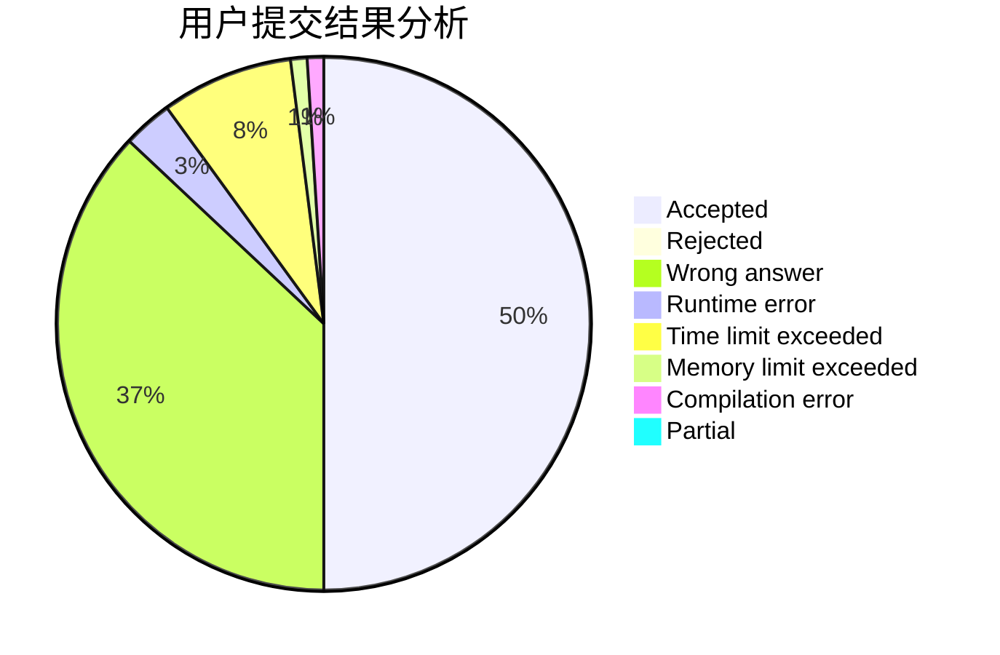
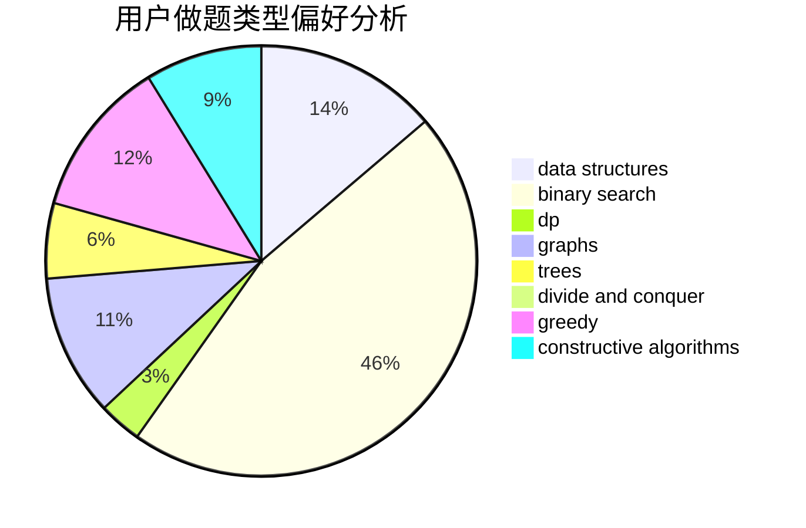
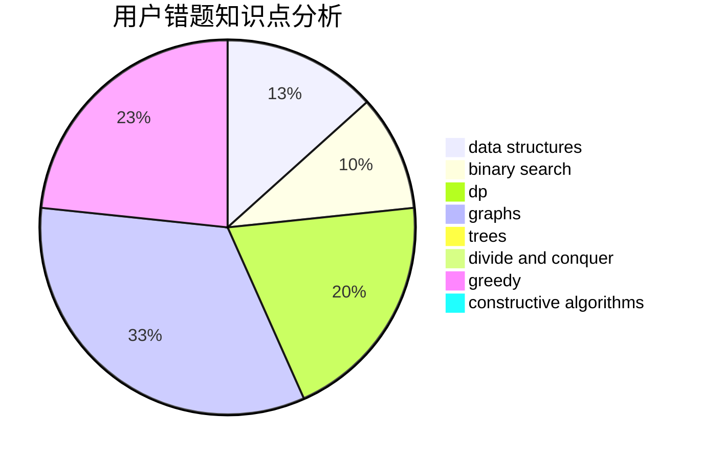

# FFFFFFFHHHHHHH
<!-- tabs:start -->
#### **用户提交结果分析**

#### **用户做题类型偏好分析**

#### **用户错题知识点分析**

<!-- tabs:end -->
# 推荐题目
[Xum](http://codeforces.com/problemset/problem/1427/E)		bitmasks,
                        constructive algorithms,
                        math,
                        matrices,
                        number theory		  
[Arpa's weak amphitheater and Mehrdad's valuable Hoses](https://codeforces.com/contest/742/problem/D)		dfs and similar,
                        dp,
                        dsu		  
[Cthulhu](http://codeforces.com/problemset/problem/103/B)		dfs and similar,
                        dsu,
                        graphs		  
[K-th Path](http://codeforces.com/problemset/problem/1196/F)		brute force,
                        constructive algorithms,
                        shortest paths,
                        sortings		  
[Periodical Numbers](http://codeforces.com/problemset/problem/215/E)		combinatorics,
                        dp,
                        number theory		  
[Bubble Cup hypothesis](https://codeforces.com/contest/1424/problem/I)		bitmasks,
                        constructive algorithms,
                        dp,
                        math		  
[Two Small Strings](http://codeforces.com/problemset/problem/1213/E)		brute force,
                        constructive algorithms		  
[Pasha and Pipe](http://codeforces.com/problemset/problem/518/F)		binary search,
                        brute force,
                        combinatorics,
                        dp,
                        implementation		  
[Vanya and Label](http://codeforces.com/problemset/problem/677/C)		bitmasks,
                        combinatorics,
                        implementation,
                        strings		  
[Bear and Up-Down](http://codeforces.com/problemset/problem/653/C)		brute force,
                        implementation		  
<!-- tabs:start -->
#### **data structures**
[Leha and another game about graph](https://codeforces.com/contest/841/problem/D)		constructive algorithms,
                        data structures,
                        dfs and similar,
                        dp,
                        graphs		  
[Voting (Hard Version)](http://codeforces.com/problemset/problem/1251/E2)		binary search,
                        data structures,
                        greedy		  
[Bank Hacking](http://codeforces.com/problemset/problem/796/C)		constructive algorithms,
                        data structures,
                        dp,
                        trees		  
[Multicolored Cars](http://codeforces.com/problemset/problem/818/D)		data structures,
                        implementation		  
[Holes](http://codeforces.com/problemset/problem/13/E)		data structures,
                        dsu		  
[Unstable String Sort](http://codeforces.com/problemset/problem/1213/F)		data structures,
                        dfs and similar,
                        dsu,
                        graphs,
                        greedy,
                        implementation,
                        strings		  
[Mike and Friends](http://codeforces.com/problemset/problem/547/E)		data structures,
                        string suffix structures,
                        strings,
                        trees		  
[Enemy is weak](http://codeforces.com/problemset/problem/61/E)		data structures,
                        trees		  
[Freezing with Style](http://codeforces.com/problemset/problem/150/E)		binary search,
                        data structures,
                        divide and conquer,
                        trees		  
[Drazil Likes Heap](http://codeforces.com/problemset/problem/1329/C)		constructive algorithms,
                        data structures,
                        greedy,
                        implementation		  
#### **binary search**
[Pasha and Pipe](http://codeforces.com/problemset/problem/518/F)		binary search,
                        brute force,
                        combinatorics,
                        dp,
                        implementation		  
[Game with modulo](https://codeforces.com/contest/1104/problem/D)		binary search,
                        constructive algorithms,
                        interactive		  
[Voting (Hard Version)](http://codeforces.com/problemset/problem/1251/E2)		binary search,
                        data structures,
                        greedy		  
[Freezing with Style](http://codeforces.com/problemset/problem/150/E)		binary search,
                        data structures,
                        divide and conquer,
                        trees		  
[Subset Trick](http://codeforces.com/problemset/problem/1500/E)		binary search,
                        data structures		  
[Two Platforms](http://codeforces.com/problemset/problem/1409/E)		binary search,
                        dp,
                        sortings,
                        two pointers		  
[Maximum width](http://codeforces.com/problemset/problem/1492/C)		binary search,
                        data structures,
                        dp,
                        greedy,
                        two pointers		  
[Pairs](http://codeforces.com/problemset/problem/1463/D)		binary search,
                        constructive algorithms,
                        greedy,
                        two pointers		  
[Old Floppy Drive](http://codeforces.com/problemset/problem/1490/G)		binary search,
                        data structures,
                        math		  
[Odd Mineral Resource](http://codeforces.com/problemset/problem/1479/D)		binary search,
                        bitmasks,
                        brute force,
                        data structures,
                        probabilities,
                        trees		  
#### **dp**
[Arpa's weak amphitheater and Mehrdad's valuable Hoses](https://codeforces.com/contest/742/problem/D)		dfs and similar,
                        dp,
                        dsu		  
[Periodical Numbers](http://codeforces.com/problemset/problem/215/E)		combinatorics,
                        dp,
                        number theory		  
[Bubble Cup hypothesis](https://codeforces.com/contest/1424/problem/I)		bitmasks,
                        constructive algorithms,
                        dp,
                        math		  
[Pasha and Pipe](http://codeforces.com/problemset/problem/518/F)		binary search,
                        brute force,
                        combinatorics,
                        dp,
                        implementation		  
[Leha and another game about graph](https://codeforces.com/contest/841/problem/D)		constructive algorithms,
                        data structures,
                        dfs and similar,
                        dp,
                        graphs		  
[File List](http://codeforces.com/problemset/problem/174/B)		dp,
                        greedy,
                        implementation		  
[Bank Hacking](http://codeforces.com/problemset/problem/796/C)		constructive algorithms,
                        data structures,
                        dp,
                        trees		  
[Rectangles and Square](http://codeforces.com/problemset/problem/335/D)		brute force,
                        dp		  
[Cow and Message](http://codeforces.com/problemset/problem/1307/C)		brute force,
                        dp,
                        math,
                        strings		  
[Alternative Thinking](https://codeforces.com/contest/604/problem/C)		dp,
                        greedy,
                        math		  
#### **graph**
[Cthulhu](http://codeforces.com/problemset/problem/103/B)		dfs and similar,
                        dsu,
                        graphs		  
[Leha and another game about graph](https://codeforces.com/contest/841/problem/D)		constructive algorithms,
                        data structures,
                        dfs and similar,
                        dp,
                        graphs		  
[Shortest Path](http://codeforces.com/problemset/problem/59/E)		graphs,
                        shortest paths		  
[Unstable String Sort](http://codeforces.com/problemset/problem/1213/F)		data structures,
                        dfs and similar,
                        dsu,
                        graphs,
                        greedy,
                        implementation,
                        strings		  
[Zoning Restrictions](http://codeforces.com/problemset/problem/1146/G)		dp,
                        flows,
                        graphs		  
[Ant Man](http://codeforces.com/problemset/problem/704/B)		dp,
                        graphs,
                        greedy		  
[Minimum Ties](http://codeforces.com/problemset/problem/1487/C)		brute force,
                        constructive algorithms,
                        dfs and similar,
                        graphs,
                        greedy,
                        implementation,
                        math		  
[Chef Monocarp](http://codeforces.com/problemset/problem/1437/C)		dp,
                        flows,
                        graph matchings,
                        greedy,
                        math,
                        sortings		  
[Strange Housing](http://codeforces.com/problemset/problem/1470/D)		constructive algorithms,
                        dfs and similar,
                        graph matchings,
                        graphs,
                        greedy		  
[Longest Simple Cycle](http://codeforces.com/problemset/problem/1476/C)		dp,
                        graphs,
                        greedy		  
#### **trees**
[Bank Hacking](http://codeforces.com/problemset/problem/796/C)		constructive algorithms,
                        data structures,
                        dp,
                        trees		  
[Mike and Friends](http://codeforces.com/problemset/problem/547/E)		data structures,
                        string suffix structures,
                        strings,
                        trees		  
[Enemy is weak](http://codeforces.com/problemset/problem/61/E)		data structures,
                        trees		  
[Freezing with Style](http://codeforces.com/problemset/problem/150/E)		binary search,
                        data structures,
                        divide and conquer,
                        trees		  
[Vladislav and a Great Legend](http://codeforces.com/problemset/problem/1097/G)		combinatorics,
                        dp,
                        trees		  
[Odd Mineral Resource](http://codeforces.com/problemset/problem/1479/D)		binary search,
                        bitmasks,
                        brute force,
                        data structures,
                        probabilities,
                        trees		  
[Yet Another Card Deck](http://codeforces.com/problemset/problem/1511/C)		brute force,
                        data structures,
                        implementation,
                        trees		  
[Diameter Cuts](http://codeforces.com/problemset/problem/1499/F)		combinatorics,
                        dfs and similar,
                        dp,
                        trees		  
[Fib-tree](http://codeforces.com/problemset/problem/1491/E)		brute force,
                        dfs and similar,
                        divide and conquer,
                        number theory,
                        trees		  
[13th Labour of Heracles](http://codeforces.com/problemset/problem/1466/D)		data structures,
                        greedy,
                        sortings,
                        trees		  
#### **divide and conquer**
[Freezing with Style](http://codeforces.com/problemset/problem/150/E)		binary search,
                        data structures,
                        divide and conquer,
                        trees		  
[Divide and Summarize](http://codeforces.com/problemset/problem/1461/D)		binary search,
                        brute force,
                        data structures,
                        divide and conquer,
                        implementation,
                        sortings		  
[Song of the Sirens](http://codeforces.com/problemset/problem/1466/G)		combinatorics,
                        divide and conquer,
                        hashing,
                        math,
                        string suffix structures,
                        strings		  
[Permutation Transformation](http://codeforces.com/problemset/problem/1490/D)		dfs and similar,
                        divide and conquer,
                        implementation		  
[Skyline Photo](https://codeforces.com/contest/1483/problem/C)		data structures,
                        divide and conquer,
                        dp		  
[Fib-tree](http://codeforces.com/problemset/problem/1491/E)		brute force,
                        dfs and similar,
                        divide and conquer,
                        number theory,
                        trees		  
[Sum of Prefix Sums](http://codeforces.com/problemset/problem/1303/G)		data structures,
                        divide and conquer,
                        geometry,
                        trees		  
[Dogeforces](http://codeforces.com/problemset/problem/1494/D)		constructive algorithms,
                        data structures,
                        dfs and similar,
                        divide and conquer,
                        dsu,
                        greedy,
                        sortings,
                        trees		  
[Logistical Questions](http://codeforces.com/problemset/problem/566/C)		dfs and similar,
                        divide and conquer,
                        trees		  
[Fruit Sequences](http://codeforces.com/problemset/problem/1428/F)		binary search,
                        data structures,
                        divide and conquer,
                        dp,
                        two pointers		  
#### **greedy**
[File List](http://codeforces.com/problemset/problem/174/B)		dp,
                        greedy,
                        implementation		  
[Voting (Hard Version)](http://codeforces.com/problemset/problem/1251/E2)		binary search,
                        data structures,
                        greedy		  
[Alternative Thinking](https://codeforces.com/contest/604/problem/C)		dp,
                        greedy,
                        math		  
[Leha and Function](https://codeforces.com/contest/841/problem/C)		combinatorics,
                        greedy,
                        math,
                        number theory,
                        sortings		  
[Stones](http://codeforces.com/problemset/problem/1236/A)		brute force,
                        greedy,
                        math		  
[Blocks](http://codeforces.com/problemset/problem/1271/B)		greedy,
                        math		  
[Unstable String Sort](http://codeforces.com/problemset/problem/1213/F)		data structures,
                        dfs and similar,
                        dsu,
                        graphs,
                        greedy,
                        implementation,
                        strings		  
[Drazil Likes Heap](http://codeforces.com/problemset/problem/1329/C)		constructive algorithms,
                        data structures,
                        greedy,
                        implementation		  
[Ant Man](http://codeforces.com/problemset/problem/704/B)		dp,
                        graphs,
                        greedy		  
[Long Number](http://codeforces.com/problemset/problem/1157/B)		greedy		  
#### **constructive algorithms**
[Xum](http://codeforces.com/problemset/problem/1427/E)		bitmasks,
                        constructive algorithms,
                        math,
                        matrices,
                        number theory		  
[K-th Path](http://codeforces.com/problemset/problem/1196/F)		brute force,
                        constructive algorithms,
                        shortest paths,
                        sortings		  
[Bubble Cup hypothesis](https://codeforces.com/contest/1424/problem/I)		bitmasks,
                        constructive algorithms,
                        dp,
                        math		  
[Two Small Strings](http://codeforces.com/problemset/problem/1213/E)		brute force,
                        constructive algorithms		  
[Leha and another game about graph](https://codeforces.com/contest/841/problem/D)		constructive algorithms,
                        data structures,
                        dfs and similar,
                        dp,
                        graphs		  
[Game with modulo](https://codeforces.com/contest/1104/problem/D)		binary search,
                        constructive algorithms,
                        interactive		  
[Bank Hacking](http://codeforces.com/problemset/problem/796/C)		constructive algorithms,
                        data structures,
                        dp,
                        trees		  
[Lucky Permutation](https://codeforces.com/contest/287/problem/C)		constructive algorithms,
                        math		  
[Drazil Likes Heap](http://codeforces.com/problemset/problem/1329/C)		constructive algorithms,
                        data structures,
                        greedy,
                        implementation		  
[3-Coloring](http://codeforces.com/problemset/problem/1503/B)		constructive algorithms,
                        games,
                        interactive		  
#### **sortings**
[K-th Path](http://codeforces.com/problemset/problem/1196/F)		brute force,
                        constructive algorithms,
                        shortest paths,
                        sortings		  
[Leha and Function](https://codeforces.com/contest/841/problem/C)		combinatorics,
                        greedy,
                        math,
                        number theory,
                        sortings		  
[Nearest vectors](http://codeforces.com/problemset/problem/598/C)		geometry,
                        sortings		  
[Katya and Segments Sets](http://codeforces.com/problemset/problem/1080/F)		data structures,
                        interactive,
                        sortings		  
[Rainbow Rectangles](http://codeforces.com/problemset/problem/1396/D)		data structures,
                        sortings,
                        two pointers		  
[Two Platforms](http://codeforces.com/problemset/problem/1409/E)		binary search,
                        dp,
                        sortings,
                        two pointers		  
[Diamond Miner](https://codeforces.com/contest/1496/problem/C)		geometry,
                        greedy,
                        math,
                        sortings		  
[Meximization](http://codeforces.com/problemset/problem/1497/A)		brute force,
                        data structures,
                        greedy,
                        sortings		  
[Avoiding Zero](http://codeforces.com/problemset/problem/1427/A)		math,
                        sortings		  
[Divide and Summarize](http://codeforces.com/problemset/problem/1461/D)		binary search,
                        brute force,
                        data structures,
                        divide and conquer,
                        implementation,
                        sortings		  
<!-- tabs:end -->
