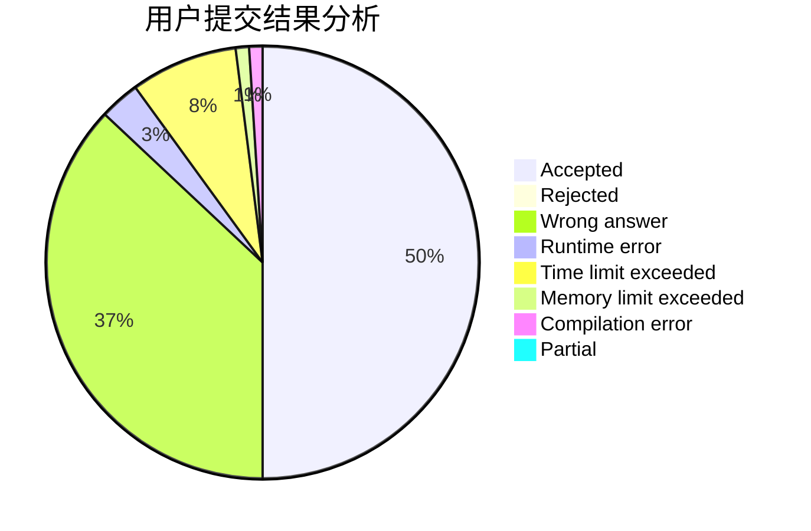
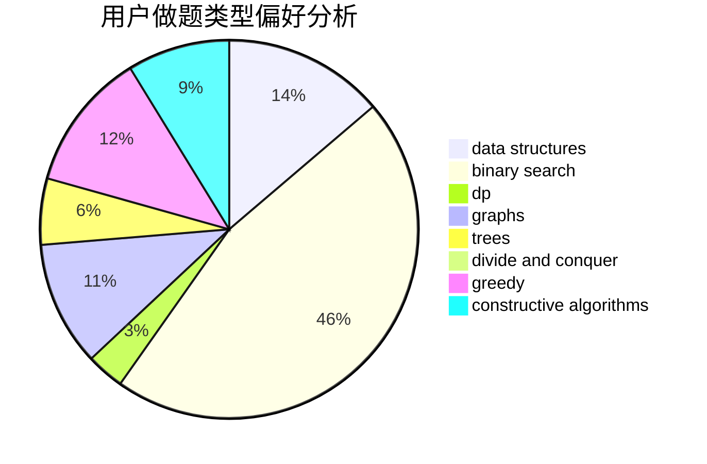
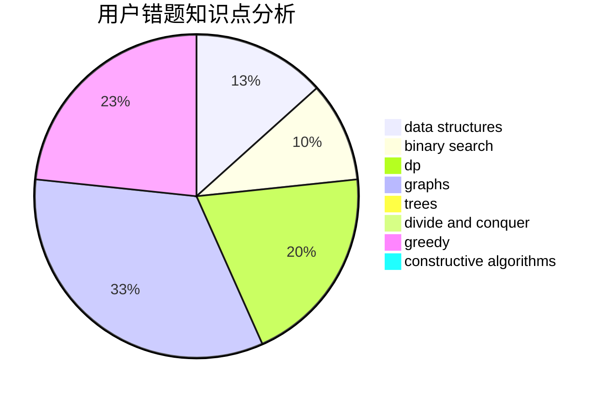

# FFFFFFFHHHHHHH

<!-- tabs:start -->

#### **用户提交结果分析**

#### **用户做题类型偏好分析**

#### **用户错题知识点分析**

<!-- tabs:end -->
# 推荐题目
[1427E](https://codeforces.com/contest/1427/problem/E)		bitmasks,
                        constructive algorithms,
                        math,
                        matrices,
                        number theory		  
[742D](https://codeforces.com/contest/742/problem/D)		dsu,graphs,sortings,trees		  
[1196F](https://codeforces.com/contest/1196/problem/F)		brute force,
                        constructive algorithms,
                        shortest paths,
                        sortings		  
[653C](https://codeforces.com/contest/653/problem/C)		brute force,
                        implementation		  
[704B](https://codeforces.com/contest/704/problem/B)		dp,
                        graphs,
                        greedy		  
[842B](https://codeforces.com/contest/842/problem/B)		geometry		  
[110A](https://codeforces.com/contest/110/problem/A)		implementation		  
[841D](https://codeforces.com/contest/841/problem/D)		dsu,graphs,sortings,trees		  
[1316A](https://codeforces.com/contest/1316/problem/A)		implementation		  
[1236A](https://codeforces.com/contest/1236/problem/A)		brute force,
                        greedy,
                        math		  
