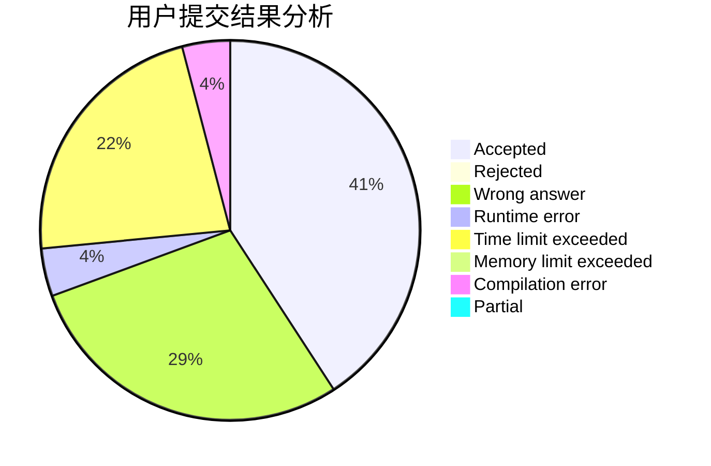
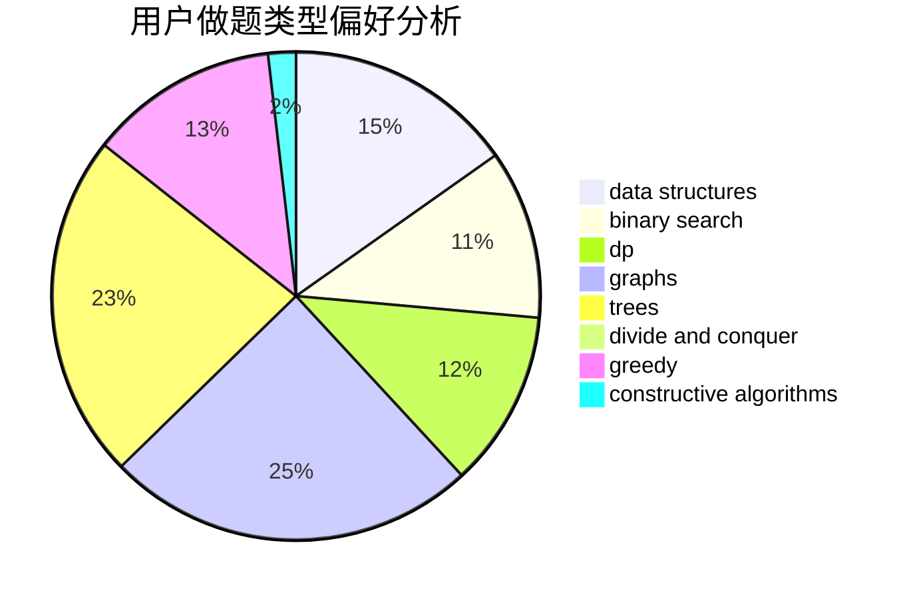
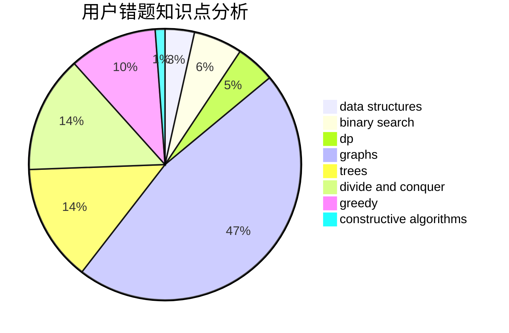

# FOOLISH_JUSTIN

<!-- tabs:start -->

#### **用户提交结果分析**

#### **用户做题类型偏好分析**

#### **用户错题知识点分析**

<!-- tabs:end -->
# 推荐题目
[1208F](https://codeforces.com/contest/1208/problem/F)		bitmasks,
                        dfs and similar,
                        dp,
                        greedy		  
[320B](https://codeforces.com/contest/320/problem/B)		dfs and similar,
                        graphs		  
[26D](https://codeforces.com/contest/26/problem/D)		combinatorics,
                        math,
                        probabilities		  
[1121C](https://codeforces.com/contest/1121/problem/C)		implementation		  
[1051D](https://codeforces.com/contest/1051/problem/D)		bitmasks,
                        dp		  
[1488H](https://codeforces.com/contest/1488/problem/H)		*special problem,
                        combinatorics,
                        data structures		  
[839E](https://codeforces.com/contest/839/problem/E)		brute force,
                        graphs,
                        math,
                        meet-in-the-middle		  
[1129C](https://codeforces.com/contest/1129/problem/C)		binary search,
                        data structures,
                        dp,
                        hashing,
                        sortings,
                        string suffix structures,
                        strings		  
[1221E](https://codeforces.com/contest/1221/problem/E)		games		  
[493E](https://codeforces.com/contest/493/problem/E)		math		  
