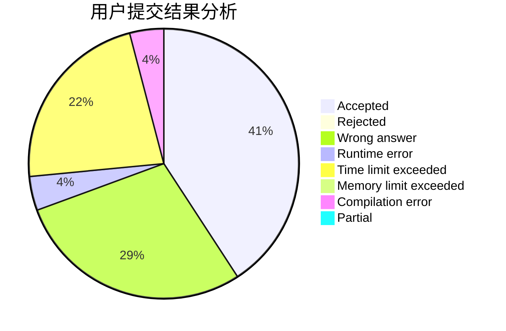
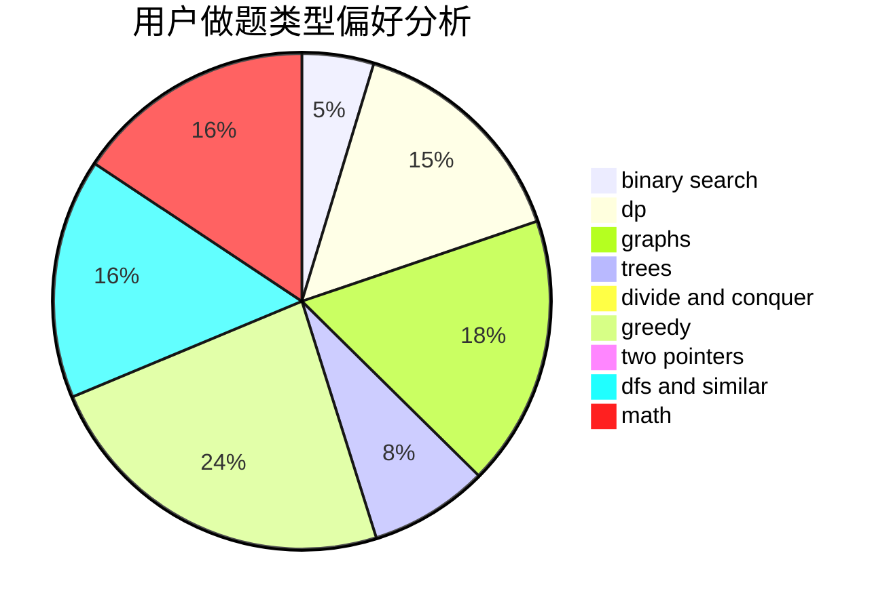

# FOOLISH_JUSTIN

<!-- tabs:start -->

#### **用户提交结果分析**

#### **用户做题类型偏好分析**

<!-- tabs:end -->
# 推荐题目
[1208F](https://codeforces.com/contest/1208/problem/F)
[320B](https://codeforces.com/contest/320/problem/B)
[26D](https://codeforces.com/contest/26/problem/D)
[1121C](https://codeforces.com/contest/1121/problem/C)
[1051D](https://codeforces.com/contest/1051/problem/D)
[1488H](https://codeforces.com/contest/1488/problem/H)
[839E](https://codeforces.com/contest/839/problem/E)
[1129C](https://codeforces.com/contest/1129/problem/C)
[1221E](https://codeforces.com/contest/1221/problem/E)
[493E](https://codeforces.com/contest/493/problem/E)
